# BurpSuite 完全指南

> 📅 整理时间：2026-07-18  
> 🎯 目标：掌握 BurpSuite 四大核心模块（Proxy/Repeater/Intruder/Decoder）  
> 🏠 环境：BurpSuite Professional v2023.10 + DVWA + 浏览器  
> 💼 适用：实习面试 / 初级渗透测试工程师

---

## 目录

- [一、BurpSuite 基础配置](#一burpsuite-基础配置)
- [二、Proxy 代理拦截](#二proxy-代理拦截)
- [三、Repeater 重放攻击](#三repeater-重放攻击)
- [四、Intruder 爆破攻击](#四intruder-爆破攻击)
- [五、Decoder 编码解码](#五decoder-编码解码)
- [六、面试高频问题](#六面试高频问题)

---

## 一、BurpSuite 基础配置

### 1.1 什么是 BurpSuite

**BurpSuite** 是 Web 渗透测试的**核心工具**，由 PortSwigger 开发，功能包括：
- 拦截和修改 HTTP/HTTPS 请求
- 自动化爆破（用户名、密码、目录、参数）
- 重放请求测试漏洞
- 编码解码、对比差异、插件扩展

### 1.2 版本区别

| 版本 | 功能 | 推荐度 |
|------|------|--------|
| **Community（社区版）** | 基础 Proxy + Repeater，无 Intruder 高级模式 | ⭐⭐⭐ |
| **Professional（专业版）** | 完整功能：Intruder 全模式、Scanner、插件 | ⭐⭐⭐⭐⭐ |
| **Enterprise（企业版）** | 自动化扫描 + CI/CD 集成 | ⭐⭐（面试用不到） |

> 你用的是 **Professional 版**，功能完整。

### 1.3 基础配置

#### 浏览器代理设置

| 设置项 | 值 |
|--------|-----|
| 代理地址 | `127.0.0.1` |
| 代理端口 | `8080`（BurpSuite 默认） |

**Chrome 设置：**
```
设置 → 系统 → 打开代理设置 → 局域网设置 → 勾选"为LAN使用代理服务器"
地址：127.0.0.1  端口：8080
```

**或安装 SwitchyOmega 插件：**
- 新建情景模式：Burp
- 代理服务器：HTTP `127.0.0.1:8080`
- 点击插件图标切换代理

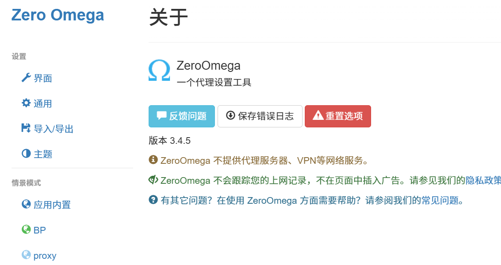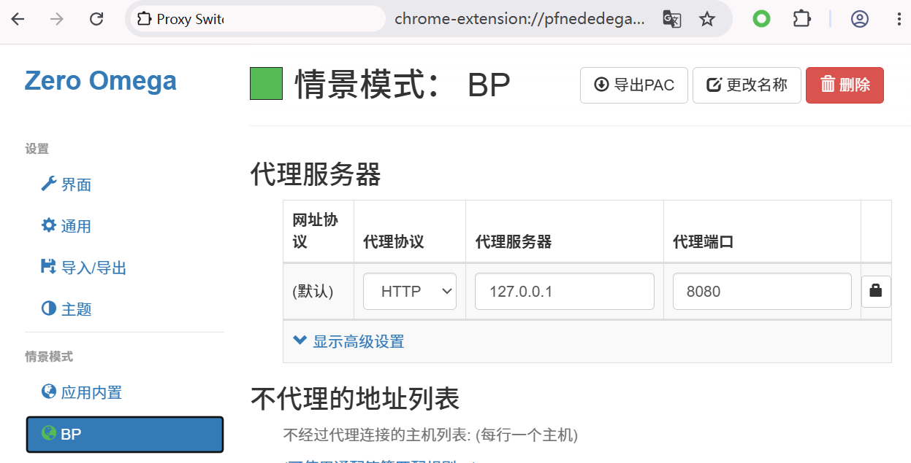

#### BurpSuite 证书安装（HTTPS 抓包）

1. BurpSuite → **Proxy → Options → Import/export CA certificate**
2. 导出 `cacert.der`
3. 浏览器导入证书：
   ```
   Chrome → 设置 → 隐私和安全 → 安全 → 管理证书 → 受信任的根证书颁发机构 → 导入
   ```
4. 重启浏览器

## 二、Proxy 代理拦截

### 2.1 核心功能

**Proxy** 是 BurpSuite 的**心脏**，所有其他模块都依赖它：
- 拦截浏览器发出的请求
- 查看、修改请求和响应
- 转发到 Repeater/Intruder/Scanner

### 2.2 界面说明

```
Proxy
├── Intercept          ← 拦截开关（Intercept is on/off）
├── HTTP history       ← 历史请求记录
├── WebSockets history ← WebSocket 记录
└── Options            ← 代理监听设置
```

### 2.3 实操：拦截 DVWA 登录请求

**步骤：**
1. BurpSuite → **Proxy → Intercept → Intercept is on**
2. 浏览器访问 DVWA 登录页
3. 输入用户名密码，点击 Login
4. BurpSuite 拦截到请求，显示：
   ```
   POST /login.php HTTP/1.1
   Host: 192.168.133.100:8002
   ...
   username=admin&password=password&Login=Login
   ```
5. **修改密码**：把 `password` 改成 `wrongpass`
6. 点击 **Forward** 放行
7. 浏览器显示登录失败

> 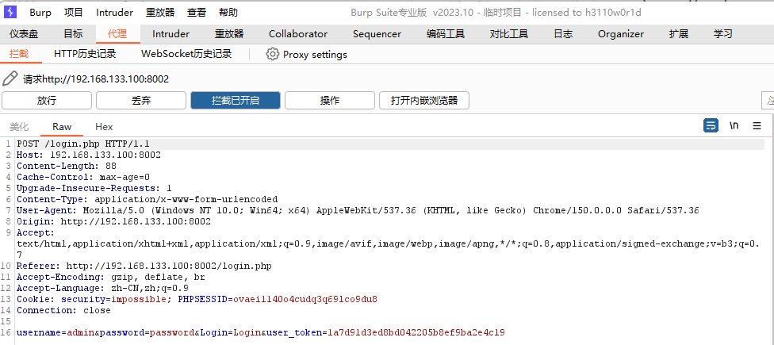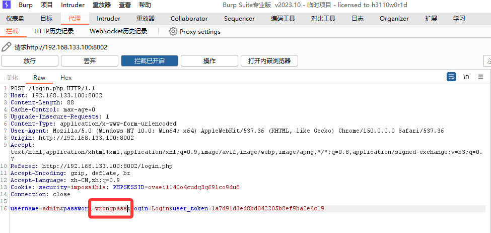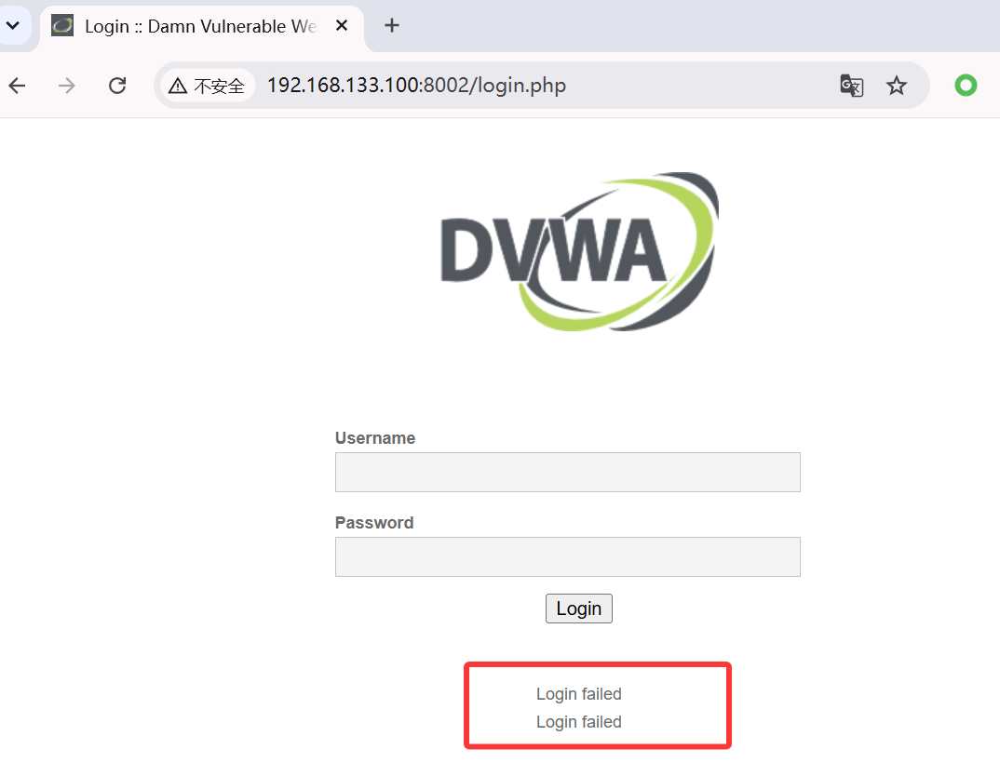

### 2.4 常用操作按钮

| 按钮 | 功能 | 快捷键 |
|------|------|--------|
| **Forward** | 放行当前请求 | Ctrl+F |
| **Drop** | 丢弃当前请求 | Ctrl+D |
| **Intercept is on/off** | 开启/关闭拦截 | Ctrl+T |
| **Action** | 发送到其他模块 | Ctrl+I（到 Intruder） |

### 2.5 HTTP History

拦截关闭后，所有请求仍会记录在历史中：
- 查看完整请求/响应

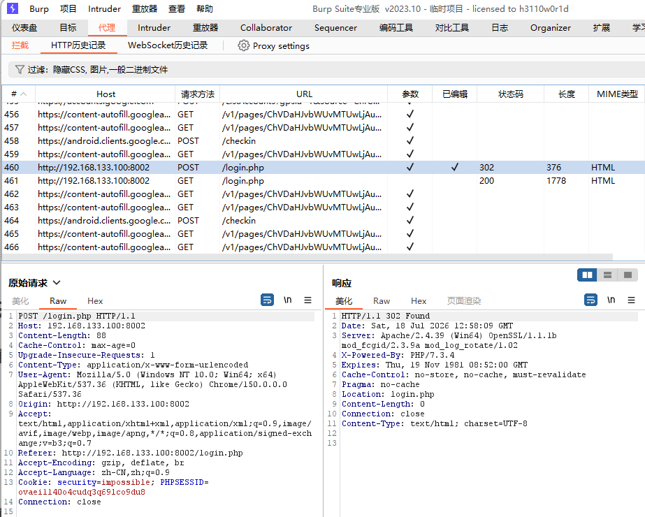

- 搜索特定 URL/参数

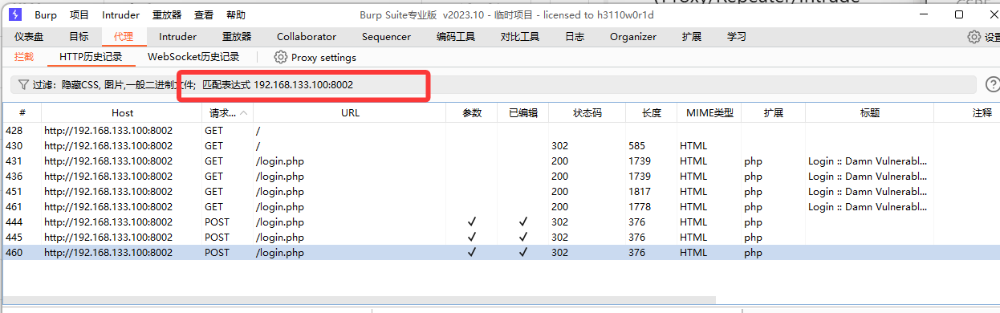

- 右键发送到 Repeater/Intruder

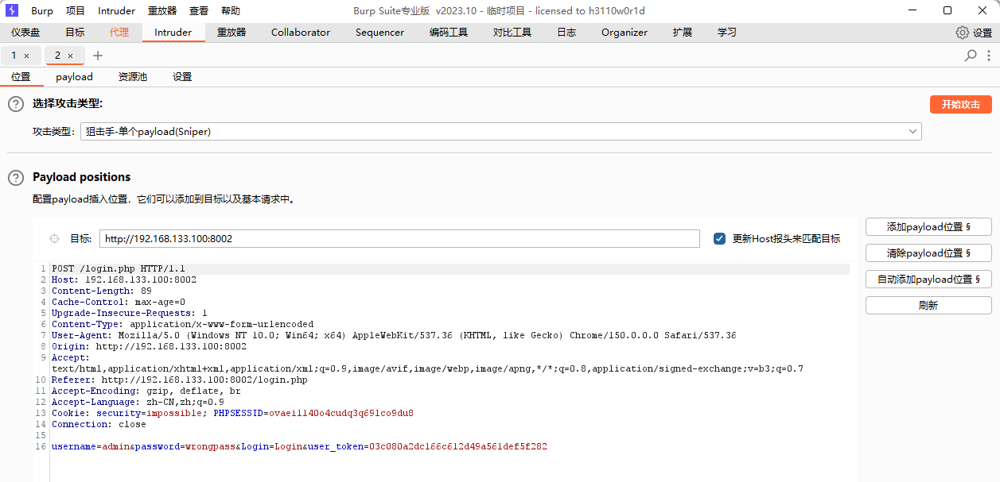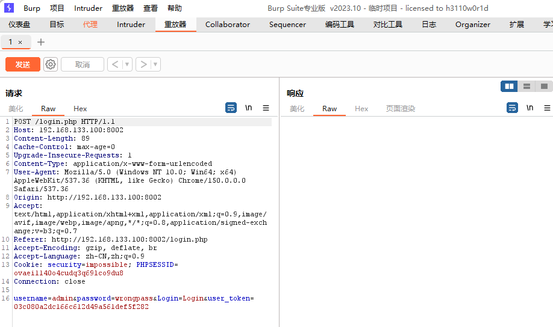

---

## 三、Repeater 重放攻击

### 3.1 核心功能

**Repeater** 用于**手动修改请求并重放**，测试漏洞：
- 修改参数值（如 SQL 注入测试 `id=1'`）
- 修改 Header（如 Cookie、User-Agent）
- 反复发送，观察响应差异

### 3.2 实操：DVWA SQL Injection 手工测试

**步骤：**
1. DVWA → SQL Injection → 输入 `1`，Submit

   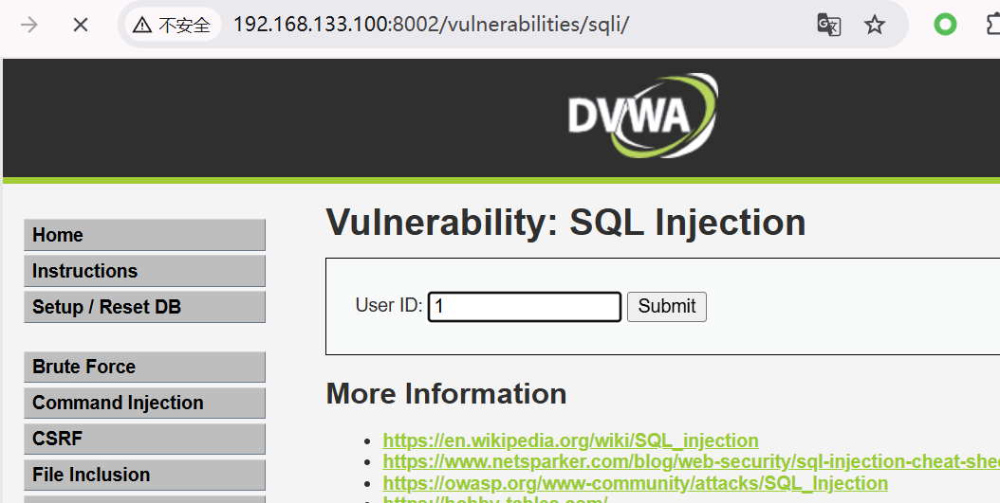

2. BurpSuite Proxy 拦截到请求

   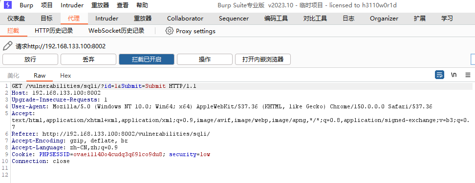

3. 右键 → **Send to Repeater**

4. 点击 **Repeater** 标签

   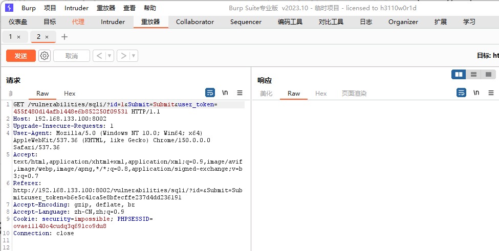

5. 修改 URL 参数：

   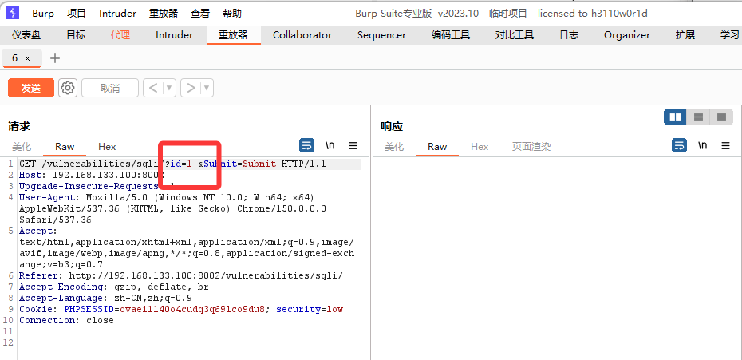

   ```
   #修改前
   GET /vulnerabilities/sqli/?id=1&Submit=Submit HTTP/1.1

   #修改后
   GET /vulnerabilities/sqli/?id=1'&Submit=Submit HTTP/1.1
   ```

6. 点击 **Send**

   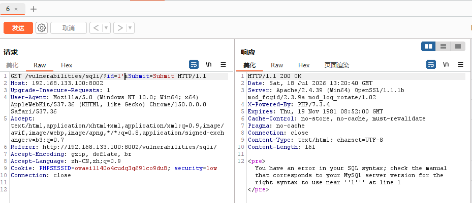

7. 右侧响应显示 SQL 报错：

   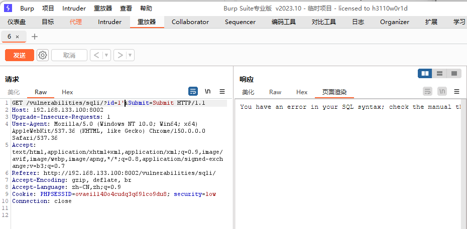

   ```
   You have an error in your SQL syntax...
   ```

8. 证明存在 SQL 注入

### 3.3 实操：修改 Cookie 测试越权

**步骤：**
1. 登录 DVWA 后，Repeater 中发送任意请求
2. 修改 Cookie 中的 `PHPSESSID` 为其他值
3. 点击 Send
4. 观察响应是否变化（如跳转到登录页）
5. 结果为响应空白

> 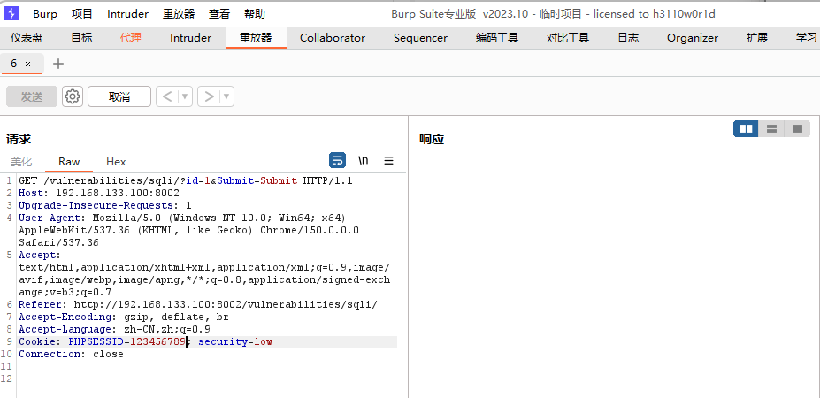

---

## 四、Intruder 爆破攻击

### 4.1 核心功能

**Intruder** 用于**自动化发送大量变体请求**，常见场景：
- 用户名/密码暴力破解
- 目录/文件枚举
- 参数 fuzz 测试
- 验证码爆破

### 4.2 Attack Type（攻击类型）

| 类型 | 说明 | 适用场景 |
|------|------|----------|
| **Sniper** | 单点狙击：一个 Payload set，逐个替换每个标记点 | 单参数 fuzz（如测试 `id` 参数） |
| **Battering ram** |  battering ram：一个 Payload set，同时替换所有标记点 | 多字段相同值（如用户名=密码） |
| **Pitchfork** | 叉子：多个 Payload set，一一对应组合 | 用户名+密码同时对应（如 admin/password） |
| **Cluster bomb** | 集束炸弹：多个 Payload set，笛卡尔积全组合 | 用户名字典 × 密码字典（最常用） |

> 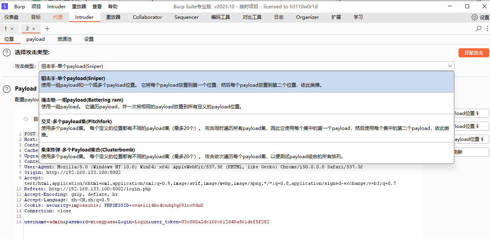

### 4.3 实操：Sniper 模式 fuzz 参数

**场景：** 测试 `id` 参数是否存在 SQL 注入

**步骤：**
1. DVWA SQL Injection，输入 `1`，BurpSuite 拦截

   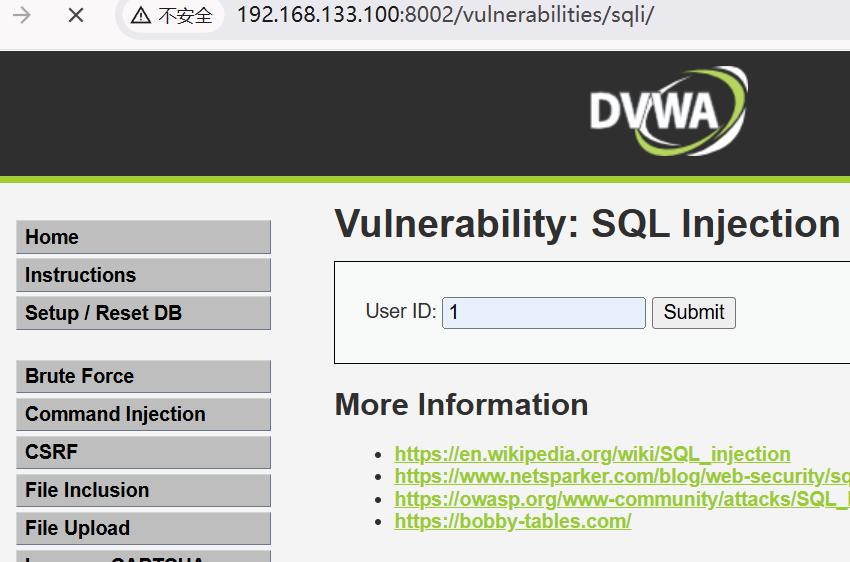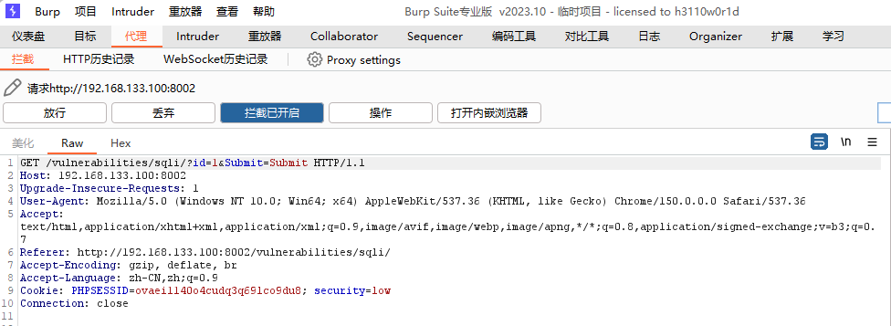

2. Send to Intruder

   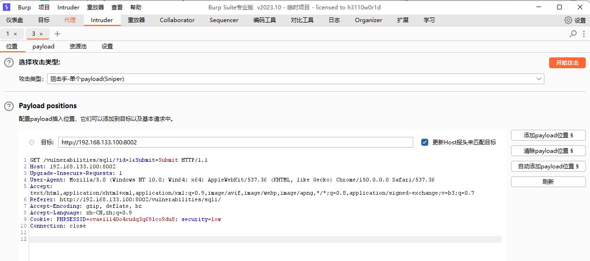

3. Positions：Clear § → 选中 `1` → Add §

   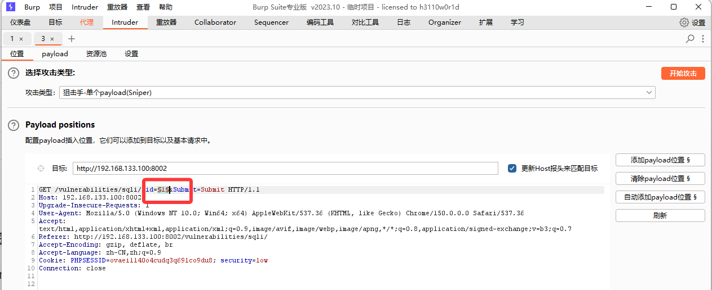

4. Attack type：**Sniper**

5. Payloads：加载 SQL 注入 Payload 列表：

   ```
   1'
   1"'
   1' OR '1'='1
   1' AND 1=1--+
   ```
   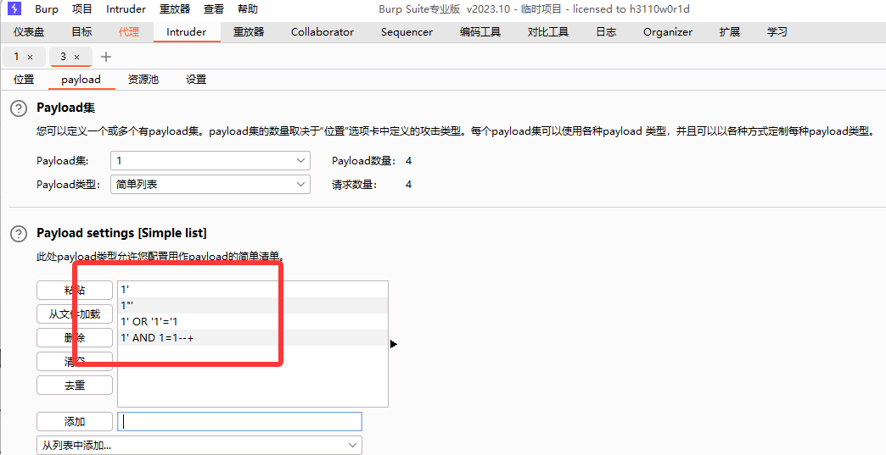

6. Start attack

7. 观察响应长度/状态码差异，找到报错的那条

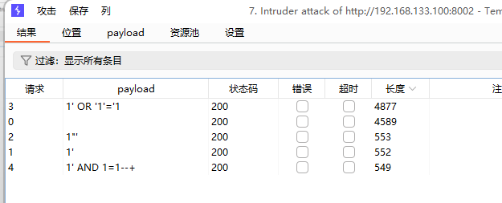

### 4.4 实操：Cluster bomb 爆破登录（逻辑漏洞部分已有）

**场景：** DVWA Brute Force Low 级别

**步骤：**
1. 拦截登录请求 → Send to Intruder
2. Positions：标记 username 和 password
3. Attack type：**Cluster bomb**
4. Payload set 1：用户名字典（admin, root, test...）
5. Payload set 2：密码字典（password, 123456, admin...）
6. Start attack
7. 找 Length 最大的那条 → admin/password

### 4.5 实操：Pitchfork 带 Token 爆破（逻辑漏洞部分已有）

**场景：** DVWA Brute Force High 级别（CSRF Token）

**步骤：**
1. 拦截请求 → Send to Intruder
2. 标记 username、password、user_token
3. Attack type：**Pitchfork**
4. Payload set 3：Recursive grep，提取 Token
5. Threads：1（Token 必须串行）
6. Start attack

---

## 五、Decoder 编码解码

### 5.1 核心功能

**Decoder** 用于**快速编码/解码数据**，常见场景：
- URL 编码：`%20` ↔ 空格
- Base64 编码：`YWRtaW4=` ↔ `admin`
- HTML 实体：`&lt;` ↔ `<`
- MD5/SHA 哈希
- 自定义编码链

### 5.2 界面说明

```
Decoder
├── 输入框    ← 粘贴需要编码/解码的数据
├── 编码按钮  ← URL-encode / Base64-encode / Hex-encode...
├── 解码按钮  ← URL-decode / Base64-decode / Hex-decode...
└── 输出框    ← 显示结果
```

### 5.3 实操：Base64 解码 JWT Token

**步骤：**
1. 复制 JWT Token 的 Payload 部分（中间那段）
   ```
   eyJhbGciOiJIUzI1NiIsInR5cCI6IkpXVCJ9   ← Header
   eyJ1c2VyIjoiYWRtaW4iLCJyb2xlIjoidXNlciJ9   ← Payload（复制这段）
   SflKxwRJSMeKKF2QT4fwpMeJf36POk6yJV_adQssw5c   ← Signature
   ```

2. BurpSuite → **Decoder**

   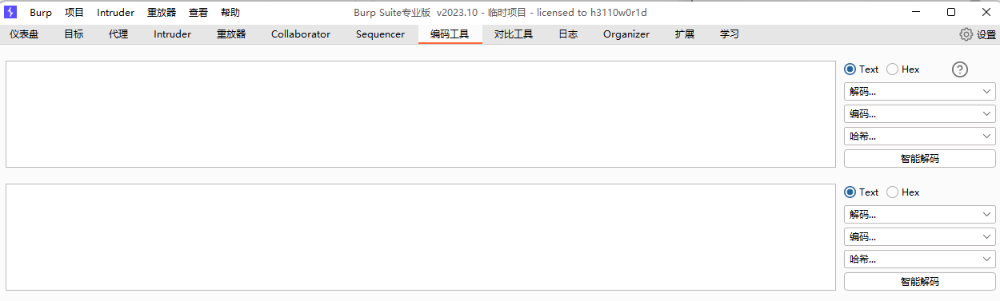

3. 粘贴 Payload 部分到输入框

4. 点击 **Base64-decode**

   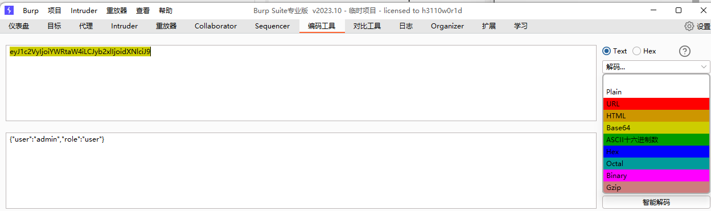

5. 输出框显示：

   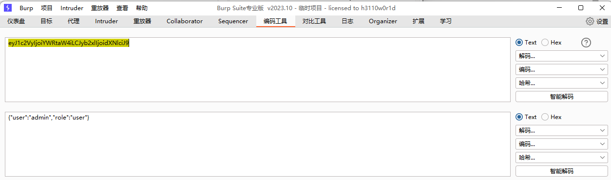

   ```json
   {"user":"admin","role":"user"}
   ```

6. 发现 role 字段，尝试改成 `admin` 再 Base64-encode

> 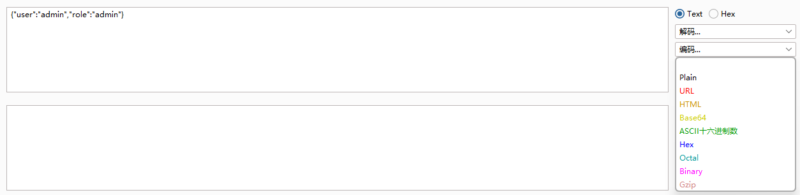
>
> 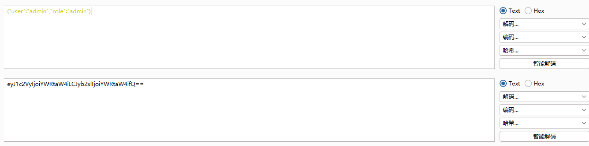
>
> ```
> eyJ1c2VyIjoiYWRtaW4iLCJyb2xlIjoiYWRtaW4ifQ==
> ```

### 5.4 实操：URL 编码特殊字符

**步骤：**
1. Decoder 输入框输入：`<script>alert(1)</script>`

2. 点击 **URL-encode**

   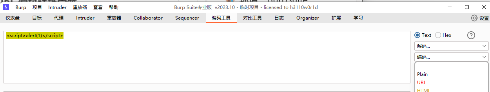

3. 输出：`%3c%73%63%72%69%70%74%3e%61%6c%65%72%74%28%31%29%3c%2f%73%63%72%69%70%74%3e`

   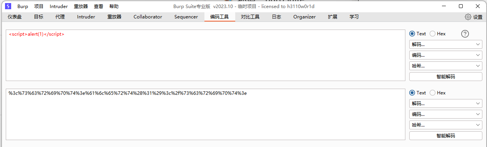

4. 用于构造 XSS Payload

---

## 六、面试高频问题

### Q1：BurpSuite 有哪些核心模块？

> BurpSuite 核心模块包括：Proxy（代理拦截）、Repeater（重放攻击）、Intruder（爆破攻击）、Decoder（编码解码）、Comparer（对比差异）、Sequencer（会话随机性分析）、Extender（插件扩展）。最常用的是 Proxy、Repeater、Intruder 和 Decoder。

### Q2：Intruder 的四种攻击类型有什么区别？

> Sniper 是单点狙击，一个 Payload set 逐个替换每个标记点，适合单参数 fuzz。Battering ram 是一个 Payload set 同时替换所有标记点。Pitchfork 是多个 Payload set 一一对应组合，适合用户名密码配对。Cluster bomb 是笛卡尔积全组合，适合用户名字典×密码字典的暴力破解。

### Q3：BurpSuite 怎么抓 HTTPS 包？

> 需要安装 BurpSuite 的 CA 证书。在 BurpSuite 中导出 CA 证书，然后在浏览器中导入到"受信任的根证书颁发机构"，重启浏览器后即可正常拦截 HTTPS 请求。

### Q4：Intruder 爆破时怎么找成功的那条？

> 主要看三个指标：Status（状态码，成功可能是 200/302，失败可能是 401/403）、Length（响应长度，成功和失败的页面内容不同，长度会有明显差异）、Response（响应内容，成功可能包含 Welcome，失败包含 error）。通常按 Length 排序，找异常的那条。

### Q5：Repeater 和 Intruder 的区别？

> Repeater 是手动重放，适合单次修改参数测试（如改一个 id 看响应）。Intruder 是自动化批量发送，适合大量变体测试（如跑字典、fuzz 参数）。Repeater 用于精准调试，Intruder 用于批量探测。

### Q6：DVWA High 级别的 Token 怎么爆破？

> 使用 Intruder 的 Pitchfork 模式，标记 username、password 和 user_token 三个点。Payload 3 使用 Recursive grep 类型，从页面响应中提取新的 Token。线程数设为 1，保证每次请求后都能获取新 Token。

---