# CSRF（跨站请求伪造）完全指南（面试版）

> 📅 整理时间：2026-07-16  
> 🎯 目标：掌握CSRF原理、与XSS区别、防御方法、DVWA全级别通关  
> 🏠 环境：DVWA + phpStudy  
> 💼 适用：实习面试 / 初级渗透测试工程师

---

## 目录

- [一、CSRF基础概念](#一csrf基础概念)
- [二、CSRF与XSS的区别](#二csrf与xss的区别)
- [三、DVWA实战：CSRF全级别](#三dvwa实战csrf全级别)
- [四、CSRF防御方法](#四csrf防御方法)
- [五、面试高频问题](#五面试高频问题)

---

## 一、CSRF基础概念

### 1.1 什么是CSRF

**定义：** 攻击者诱导已登录用户**自动发送**带有自身Cookie的请求，执行非预期操作（如改密码、转账、删文章）。

**核心：** 浏览器会自动携带目标网站的Cookie发送请求，攻击者利用这个"自动"特性。

### 1.2 攻击流程

```
用户登录银行网站A，Cookie保存在浏览器
    ↓
用户未退出，访问了攻击者的恶意网站B
    ↓
网站B的页面包含：
    ↓
浏览器自动携带A的Cookie，向A发送转账请求
    ↓
银行A以为是用户本人操作，执行转账
```

### 1.3 攻击条件

| 条件 | 说明 |
|------|------|
| 用户已登录目标网站 | Cookie有效 |
| 浏览器自动携带Cookie | 同源请求自动带Cookie |
| 目标网站未校验请求来源 | 无Token/Referer校验 |
| 攻击者知道请求的参数结构 | 能构造恶意URL/表单 |

---

## 二、CSRF与XSS的区别

| 对比项 | CSRF | XSS |
|--------|------|-----|
| **攻击目标** | 伪造用户请求 | 执行恶意脚本 |
| **是否需要脚本** | ❌ 不需要 | ✅ 需要 |
| **利用对象** | 用户Cookie（自动携带） | 用户浏览器（执行JS） |
| **攻击层面** | 应用层逻辑漏洞 | 客户端代码注入 |
| **典型危害** | 非授权操作（改密码、转账） | 窃取Cookie、钓鱼、键盘记录 |
| **防御重点** | Token、SameSite、Referer | 输入过滤、输出编码、CSP |

**一句话区别：**
> XSS是**攻击用户的浏览器**（让浏览器执行坏代码）；CSRF是**欺骗服务器**（让服务器以为是用户本人在操作）。

---

## 三、DVWA实战：CSRF全级别

### 3.1 Low级别

**安全设置：** DVWA Security → **Low**

**漏洞点：** 修改密码功能，无Token、无Referer校验。

**攻击Payload：**
```
http://192.168.133.100:8002/vulnerabilities/csrf/?password_new=hack123&password_conf=hack123&Change=Change
```

**攻击方式：**
1. 用户登录DVWA后，访问上述链接
2. 密码直接被修改为 `hack123`
3. 用户完全不知情

> 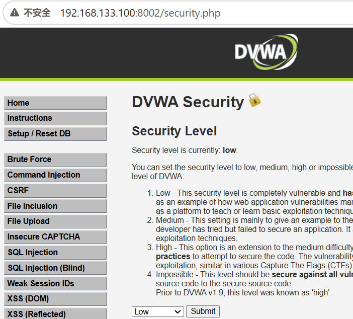
>
> 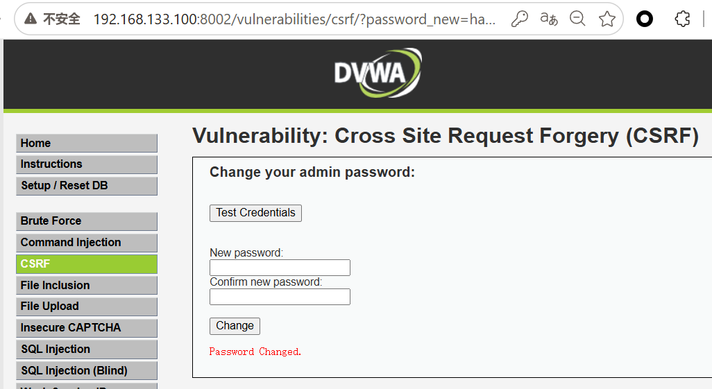
>
> *说明：直接构造恶意链接，访问后密码修改成功*

**后端代码：**
```php
<?php
$pass_new = $_GET['password_new'];
$pass_conf = $_GET['password_conf'];

if ($pass_new == $pass_conf) {
    $sql = "UPDATE users SET password='$pass_new' WHERE username='admin'";
    mysql_query($sql);
    echo "Password Changed";
}
?>
```

---

### 3.2 Medium级别

**安全设置：** DVWA Security → **Medium**

**新增防御：** 检查 `Referer` 头，要求请求来自本域名。

**绕过方法：** 用BurpSuite拦截请求，修改 `Referer` 头为DVWA域名。

**步骤：**
1. 正常修改密码，BurpSuite拦截
2. 把 `Referer` 改成包含目标域名的值：
   ```
   Referer: http://192.168.133.100:8002/
   ```
3. 放行请求，密码修改成功

> 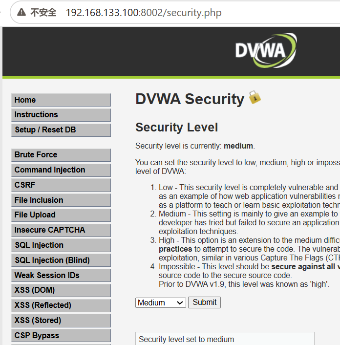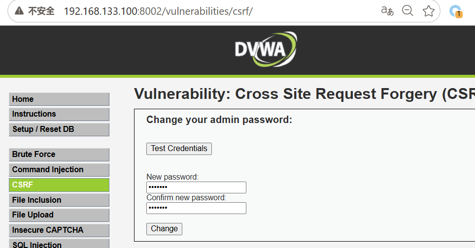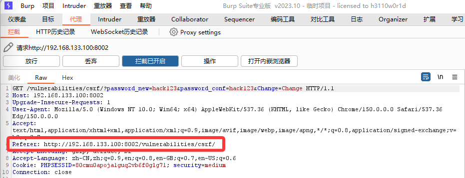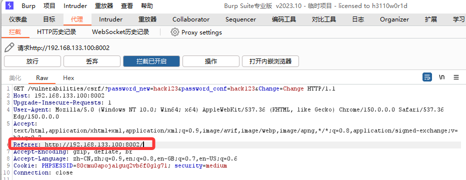
>
> 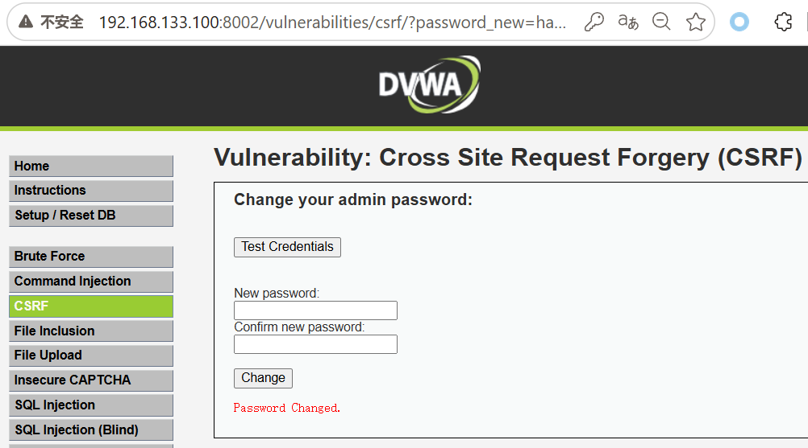
>
> *说明：BurpSuite Repeater中修改Referer头，绕过来源校验*

**后端代码：**
```php
<?php
if (strpos($_SERVER['HTTP_REFERER'], $_SERVER['SERVER_NAME']) !== false) {
    // 执行修改密码
} else {
    echo "Referer错误";
}
?>
```

---

### 3.3 High级别

**安全设置：** DVWA Security → **High**

**新增防御：** 加入 **CSRF Token**，每次请求需要携带随机令牌。

**绕过方法：**
1. 先访问修改密码页面，从页面源码中提取 `user_token`
2. 把token拼进攻击链接中

**步骤：**
1. 打开修改密码页面
2. F12查看源码，找到：
   ```html
   <input type="hidden" name="user_token" value="abc123def456">
   ```
3. 构造带token的请求：
   ```
   ?password_new=hack123&password_conf=hack123&Change=Change&user_token=abc123def456
   ```

> 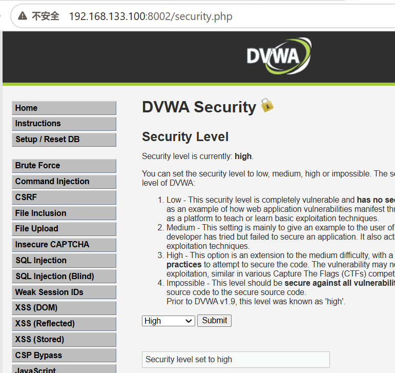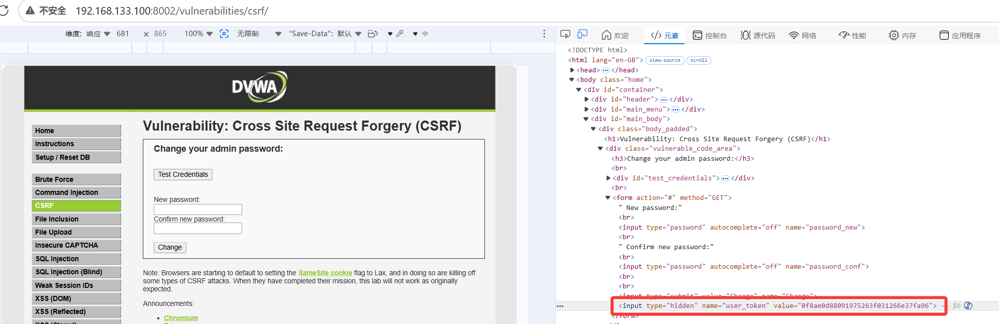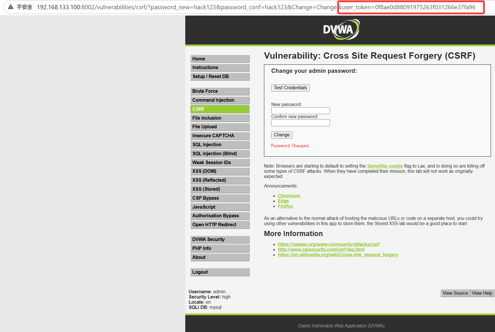
> *说明：从页面源码提取token，构造完整请求绕过Token校验*

**后端代码：**
```php
<?php
$token = $_GET['user_token'];
if ($token == $_SESSION['token']) {
    // 执行修改密码
} else {
    echo "Token错误";
}
?>
```

---

### 3.4 Impossible级别

**安全设置：** DVWA Security → **Impossible**

**防御机制：** 修改密码时需要输入**当前密码**。

**攻击结果：** ❌ 无法绕过，攻击者不知道当前密码。

> 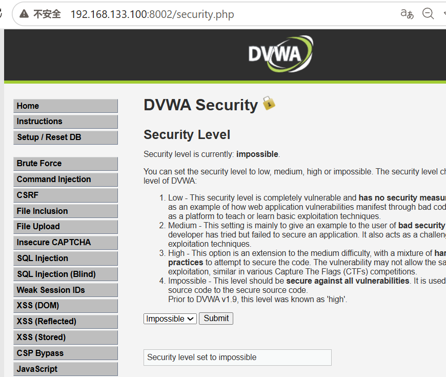
>
> 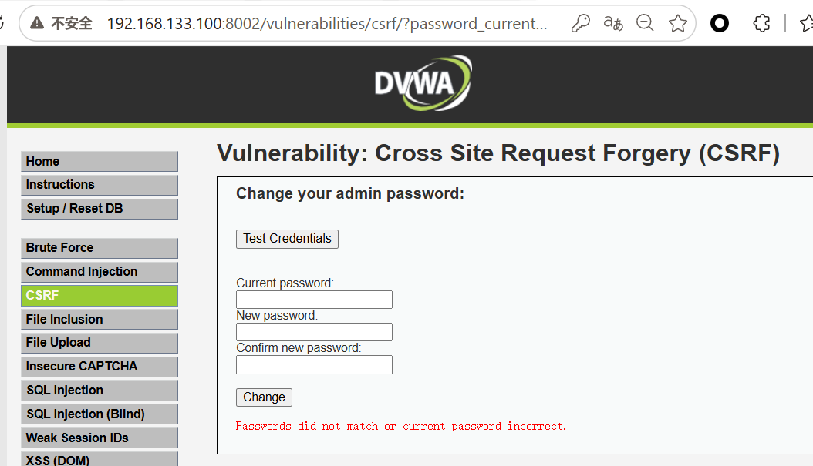
>
> *说明：需要输入当前密码才能修改，CSRF无法绕过*

**后端代码：**
```php
<?php
$current_pass = $_POST['password_current'];
// 先验证当前密码是否正确
if (password_verify($current_pass, $stored_hash)) {
    // 才允许修改密码
}
?>
```

---

## 四、CSRF防御方法

### 4.1 核心防御：CSRF Token

**原理：** 服务器生成随机Token，嵌入表单中，提交时校验。

```php
<?php
// 生成Token存入Session
$_SESSION['csrf_token'] = bin2hex(random_bytes(32));

// 表单中嵌入
?>
<form action="/change_password" method="POST">
    <input type="hidden" name="csrf_token" value="<?php echo $_SESSION['csrf_token']; ?>">
    <input name="password_new">
    <button type="submit">修改</button>
</form>
```

### 4.2 SameSite Cookie

```http
Set-Cookie: sessionid=xxx; SameSite=Strict;
```

| 值 | 行为 |
|----|------|
| `Strict` | 完全禁止跨站携带Cookie |
| `Lax` | 允许安全方法（GET）跨站，POST/DELETE禁止 |
| `None` | 允许跨站，但必须配合Secure（HTTPS） |

### 4.3 Referer/Origin校验

```php
<?php
if (parse_url($_SERVER['HTTP_REFERER'], PHP_URL_HOST) !== 'example.com') {
    die('非法来源');
}
?>
```

### 4.4 二次确认

敏感操作（转账、改密）需要：
- 短信验证码
- 图形验证码
- 重新输入密码

### 4.5 防御对比表

| 防御方法 | 原理 | 推荐度 |
|---------|------|--------|
| **CSRF Token** | 随机令牌校验 | ⭐⭐⭐⭐⭐ |
| **SameSite=Strict** | Cookie跨站限制 | ⭐⭐⭐⭐⭐ |
| **Referer校验** | 检查请求来源 | ⭐⭐⭐（可被绕过） |
| **二次确认** | 验证码/密码确认 | ⭐⭐⭐⭐ |

---

## 五、面试高频问题

### Q1：什么是CSRF？

> CSRF（跨站请求伪造）是指攻击者诱导已登录用户访问恶意链接或页面，浏览器自动携带目标网站的Cookie发送请求，导致用户在不知情的情况下执行非预期操作（如改密码、转账）。

### Q2：CSRF和XSS的区别？

> XSS是攻击用户浏览器，让浏览器执行恶意脚本（如窃取Cookie）；CSRF是伪造用户请求，利用浏览器自动携带Cookie的特性欺骗服务器。XSS需要注入脚本，CSRF不需要。

### Q3：CSRF的攻击条件？

> 1. 用户已登录目标网站且Cookie有效；2. 浏览器自动携带Cookie；3. 目标网站未校验请求来源（无Token/Referer校验）；4. 攻击者知道请求参数结构。

### Q4：如何防御CSRF？

> 最佳方案是使用CSRF Token：服务器生成随机Token嵌入表单，提交时校验。配合SameSite Cookie属性限制跨站携带，敏感操作加二次确认（验证码/密码）。

### Q5：SameSite Cookie的三个值有什么区别？

> Strict完全禁止跨站携带Cookie；Lax允许安全方法（如GET）跨站，禁止POST/DELETE；None允许跨站但必须配合Secure（HTTPS）。

### Q6：CSRF Token为什么能防御？

> 因为Token是随机生成的，攻击者无法预测。恶意请求中不带正确的Token，服务器拒绝执行。

### Q7：Referer校验能完全防御CSRF吗？

> 不能。Referer可以被篡改（用BurpSuite），有些浏览器/插件会禁用Referer发送，导致正常用户也被拦截。

### Q8：JSON接口怎么防御CSRF？

> 1. 校验Content-Type为application/json（简单请求无法自定义）；2. 加自定义请求头（如X-Requested-With）；3. 使用Token。

---

