# 逻辑漏洞完全指南

> 📅 整理时间：2026-07-17  
> 🎯 目标：掌握逻辑漏洞核心类型（越权、支付、验证码）、SRC案例分析、DVWA、Pikachu实战  
> 🏠 环境：DVWA +Pikachu+ phpStudy + 浏览器  
> 💼 适用：实习面试 / 初级渗透测试工程师

---

## 目录

- [一、逻辑漏洞基础概念](#一逻辑漏洞基础概念)
- [二、逻辑漏洞 vs 技术漏洞](#二逻辑漏洞-vs-技术漏洞)
- [三、核心类型详解](#三核心类型详解)
- [四、DVWA实战：Brute Force逻辑缺陷](#四dvwa实战brute-force逻辑缺陷)
- [五、SRC真实案例分析](#五src真实案例分析)
- [六、防御方法](#六防御方法)
- [七、面试高频问题](#七面试高频问题)

---

## 一、逻辑漏洞基础概念

### 1.1 什么是逻辑漏洞

**定义：** 应用程序在业务流程设计上存在缺陷，攻击者利用正常的业务功能，通过非正常手段达到恶意目的。

**核心：** 不是代码写错了，而是**流程设计错了**。

### 1.2 与技术漏洞的区别

| 对比项 | 技术漏洞（SQL注入/XSS） | 逻辑漏洞 |
|--------|------------------------|----------|
| **根源** | 代码缺陷（拼接SQL、未过滤） | 设计缺陷（权限校验缺失、流程绕过） |
| **检测方式** | 工具自动化（SQLMap、BurpScanner） | 手工测试 + 经验 |
| **利用方式** | 构造恶意Payload | 篡改业务参数、跳过流程步骤 |
| **修复难度** | 改一行代码（参数化查询） | 可能要改整个业务流程 |
| **典型场景** | 登录框注入、评论区XSS | 越权访问、0元购、验证码绕过 |

### 1.3 为什么逻辑漏洞难防

```
技术漏洞：输入 → [过滤函数] → 安全输出
逻辑漏洞：登录 → [没有校验权限] → 看到别人的数据
         ↑ 流程设计时就缺了这一步
```

---

## 二、逻辑漏洞 vs 技术漏洞

### 2.1 一句话区分

> **技术漏洞**：攻击者让系统执行了不该执行的代码。  
> **逻辑漏洞**：攻击者让系统按设计执行了不该执行的操作。

### 2.2 面试必背对比

| 面试官问法 | 技术漏洞回答 | 逻辑漏洞回答 |
|-----------|------------|------------|
| "怎么发现的？" | 用SQLMap扫出来的 | 手工改参数试出来的 |
| "危害是什么？" | 窃取数据库/执行恶意脚本 | 非授权操作/财产损失 |
| "怎么修复？" | 加过滤/参数化查询 | 加权限校验/流程校验 |

---

## 三、核心类型详解

### 3.1 越权访问（Broken Access Control）

#### 3.1.1 水平越权

**定义：** 同级用户之间互相访问对方的数据。

**典型场景：**
- 订单系统：`/order?id=1001` → 改成 `/order?id=1002` 看到别人的订单
- 用户资料：`/profile.php?id=1` → 改成 `id=2` 看到别人的信息
- 文件下载：`/download?file=user1_report.pdf` → 改成 `user2_report.pdf`

**攻击流程：**
```
用户A登录系统，Cookie有效
    ↓
访问自己的订单：/order?id=1001
    ↓
手动修改URL参数：/order?id=1002
    ↓
系统未校验"1002是否属于当前用户"
    ↓
成功看到用户B的订单详情
```

> 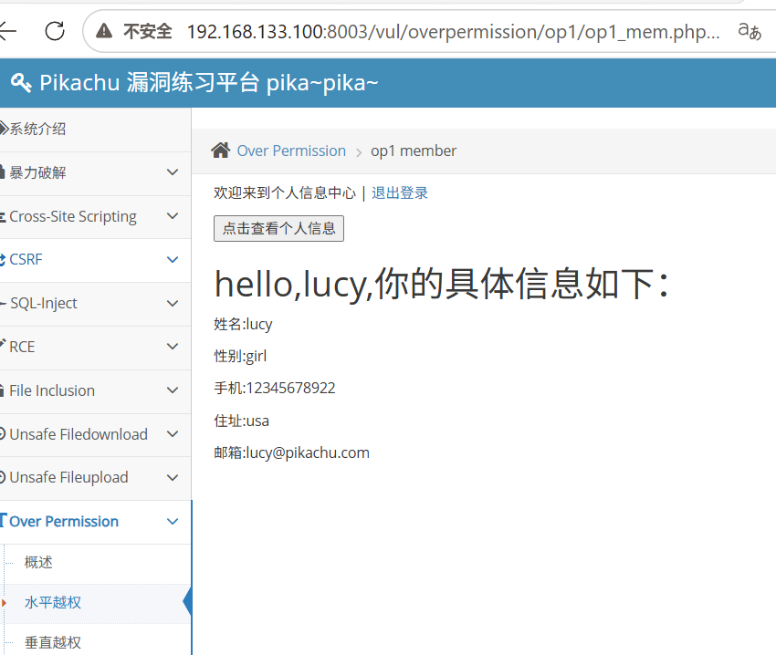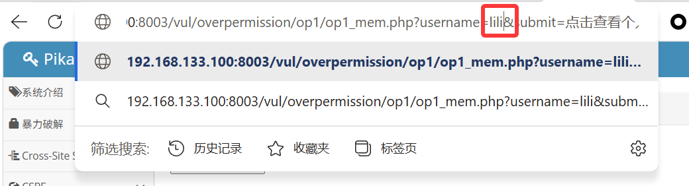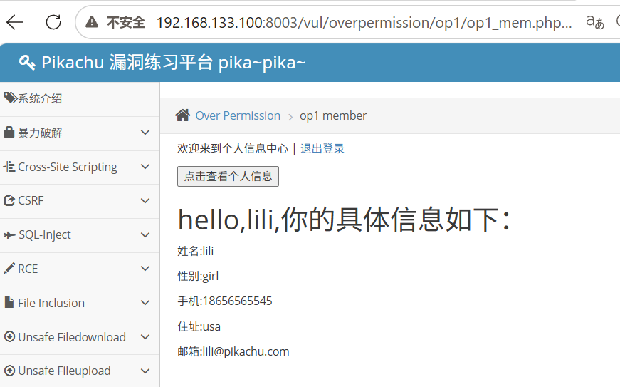
>
> 

**根本原因：** 后端只校验了"用户是否登录"，没校验"该用户是否有权访问这个ID的数据"。

---

#### 3.1.2 垂直越权

**定义：** 低权限用户访问高权限功能。

**典型场景：**
- 普通用户直接访问管理后台：`/admin/user-management`
- 普通用户调用管理员API：`/api/admin/delete-user`
- 通过修改响应包中的角色标识提升权限

**攻击流程：**
```
普通用户登录系统
    ↓
尝试访问管理员页面：/admin/
    ↓
系统未校验用户角色
    ↓
成功进入管理后台
```

> 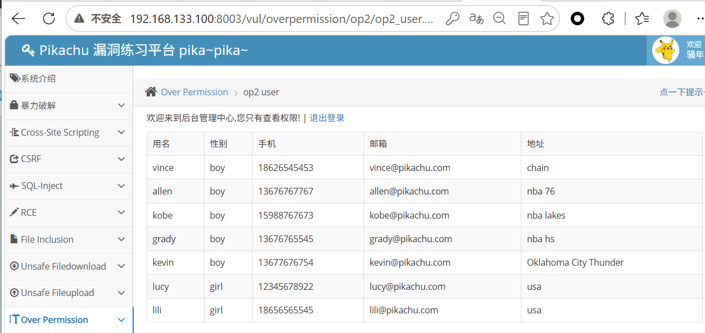
>
> 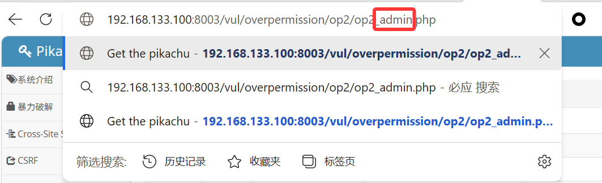
>
> 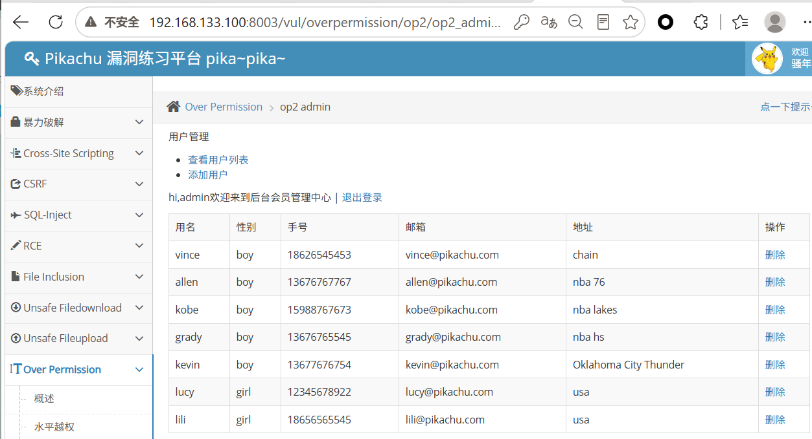

**根本原因：** 后端只在菜单层面隐藏了管理员入口，但接口层面没有校验权限。

---

#### 3.1.3 未授权访问

**定义：** 无需登录就能访问敏感功能或数据。

**典型场景：**
- API接口未鉴权：`/api/user/list` 直接返回所有用户信息
- 敏感文件暴露：`/backup/database.sql` 可直接下载
- 管理后台弱密码或无密码

> 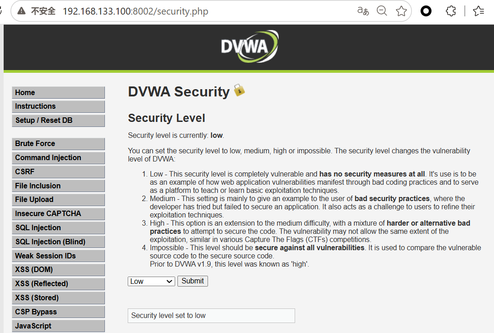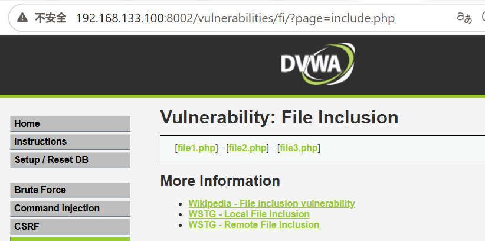
>
> ```
> http://192.168.133.100:8002/vulnerabilities/fi/?page=file:///C:/windows/system32/drivers/etc/hosts
> ```
>
> 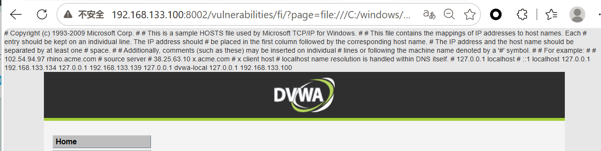


---

### 3.2 支付逻辑漏洞

#### 3.2.1 价格篡改

**原理：** 购物车/下单时，价格参数从前端传入，后端未二次校验。

**攻击方式：**
```
正常下单：price=100&quantity=1&total=100
    ↓
BurpSuite拦截请求
    ↓
修改为：price=0&quantity=1&total=0
    ↓
后端直接执行，0元购买
```

**根本原因：** 信任前端传入的价格，应该用商品ID查数据库价格。

**防御：** 服务端根据商品ID查询数据库价格，前端只传商品ID和数量。

---

#### 3.2.2 数量篡改

**原理：** 数量为负数或极大值，导致金额计算异常。

**攻击方式：**
```
quantity=-1 → 总价变成负数（系统倒给钱）
quantity=999999 → 库存扣成负数或溢出
```

**防御：** 校验数量范围（>0 且 ≤库存）。

---

#### 3.2.3 支付状态伪造

**原理：** 跳过支付步骤，直接修改支付状态为"已支付"。

**攻击方式：**
```
正常流程：下单 → 跳转支付页面 → 支付成功 → 回调修改状态
    ↓
攻击者直接访问：/order/confirm?order_id=123&status=paid
    ↓
订单状态直接变成已支付，无需实际付款
```

**防御：** 支付回调必须来自可信渠道（支付宝/微信官方回调），不可信任前端传入的状态。

#### 3.2.4 优惠券/积分逻辑**

**典型漏洞：**
- 优惠券重复使用：一张券用多次
- 积分负数支付：积分扣成负数
- 优惠券叠加限制绕过：同时使用多张互斥券

**防御：** 服务端校验优惠券状态、使用次数、互斥规则、有效期。

---

### 3.3 验证码绕过

#### 3.3.1 前端验证绕过

**原理：** 验证码只在JavaScript校验，没发到后端。

**攻击方式：**
```
正常流程：输入验证码 → JS校验通过 → 发送请求到后端
    ↓
攻击者直接抓包，不填验证码或填任意值
    ↓
后端根本不校验验证码
    ↓
绕过成功
```

> 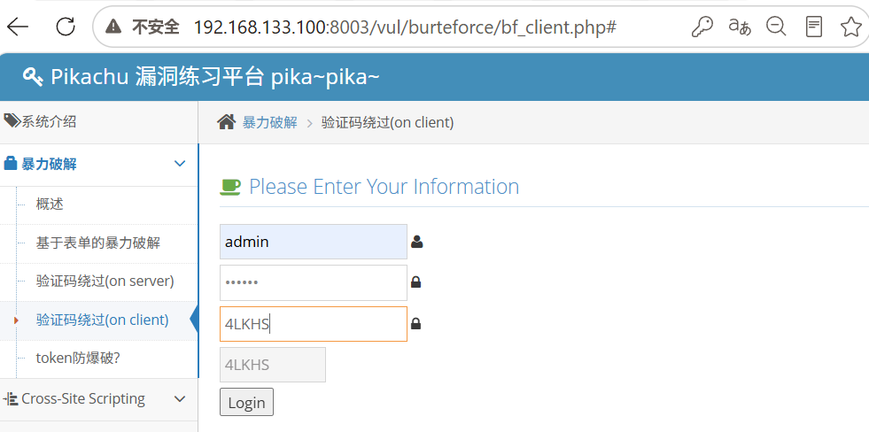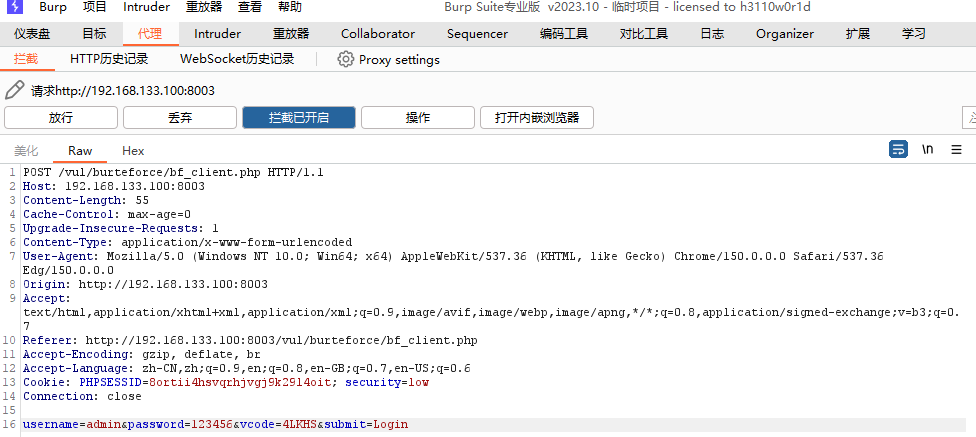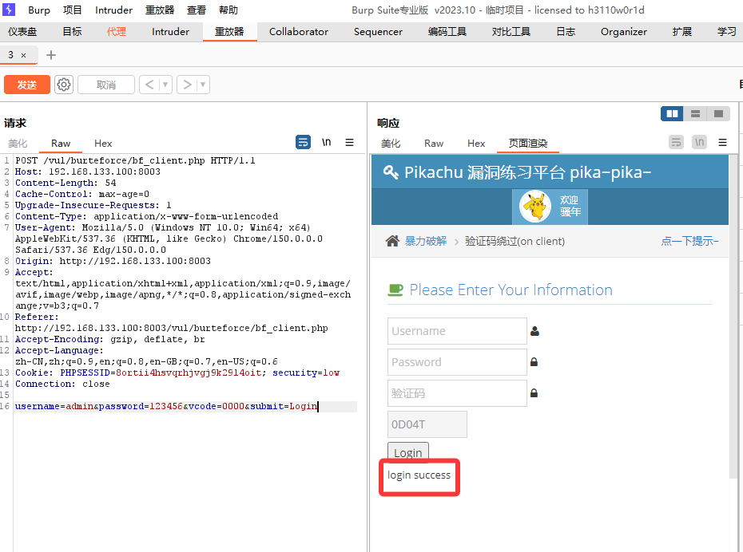

---

#### 3.3.2 验证码不刷新

**原理：** 验证码验证一次后，Session中不清除，可重复使用。

**攻击方式：**
```
第一次请求：code=1234 → 验证通过
    ↓
第二次请求：code=1234 → 仍然通过（同一个Session）
    ↓
用同一个验证码注册100个账号
```

**防御：**

- 验证成功后**立即从 Session 中删除验证码**
- 验证失败也刷新验证码，防止枚举

---

#### 3.3.3 验证码可预测

**原理：** 验证码生成有规律，如时间戳、自增数字、弱随机。

**攻击方式：**
```
验证码 = 当前时间戳后4位 → 可推算
验证码 = 0001, 0002, 0003... → 可遍历
```

**典型规律：**

- 时间戳后 4 位：`2026` → 可推算
- 自增数字：`0001, 0002, 0003...` → 可遍历
- 弱随机：`rand(1000,9999)` → 范围小可爆破

**防御：**

- 使用 `random_bytes()` 或 `mt_rand()` 生成
- 增加位数（6 位以上）
- 加入字母+数字混合

---

#### 3.3.4 删除验证码参数

**原理：** 后端只校验参数存在，不校验值是否正确。

**攻击方式：**
```
正常请求：POST /register {username=xxx, password=xxx, code=1234}
    ↓
删除code参数：POST /register {username=xxx, password=xxx}
    ↓
后端不校验 → 直接通过
```

---

### 3.4 密码重置/找回逻辑漏洞

#### 3.4.1 验证码爆破

**原理：** 短信/邮箱验证码位数少（4位），无次数限制，可暴力破解。

**攻击方式：**
```
BurpSuite Intruder → 设置0000-9999 → 自动爆破
4位验证码 = 10000种可能，无限制的话几分钟跑完
6 位数字 = 100 万种，配合多线程也可爆破
```

**防御：**

- 验证码 6 位以上，数字+字母混合
- 连续错误 5 次，锁定 30 分钟
- 设置验证码有效期（5-15 分钟）

---

#### 3.4.2 跳过验证步骤

**原理：** 密码重置分多步，但每步之间没有状态校验，可直接跳到最后一步。

**攻击方式：**
```
正常流程：输入手机号 → 发送验证码 → 验证通过 → 输入新密码
    ↓
攻击者直接访问最后一步的URL：/reset-password?step=3
    ↓
跳过验证码验证，直接改密码
```

**防御：**

- 每步之间用 Session 记录状态（如 `reset_step=2`）
- 直接访问 Step3 时校验 `reset_step` 是否等于 2
- 使用一次性 Token，Token 与步骤绑定

---

#### 3.4.3 修改响应包绕过**

**原理：** 前端数据响应判断步骤，修改响应可欺骗前端。

**攻击方式：**
```
输入错误验证码 → 后端返回 {"success": false}
    ↓
BurpSuite拦截响应，改为 {"success": true}
    ↓
前端以为验证通过，进入下一步
```

**防御：**

- 关键操作（改密码）必须在**服务端二次校验**
- 不能仅依赖前端判断
- 响应包加密或签名，防止篡改

---

## 四、DVWA实战：Brute Force逻辑缺陷

DVWA中没有专门的"逻辑漏洞"模块，但 **Brute Force（暴力破解）** 模块包含了典型的**验证码/登录逻辑缺陷**。

### 4.1 Low级别

**安全设置：** DVWA Security → **Low**

**漏洞点：** 登录无验证码、无失败次数限制、无账户锁定。

**攻击方式：**
1. 用BurpSuite拦截登录请求
2. 发送到Intruder，设置用户名和密码为爆破点
3. 加载字典，开始爆破

> 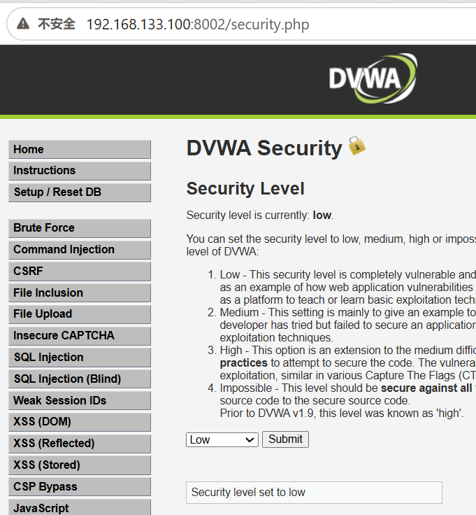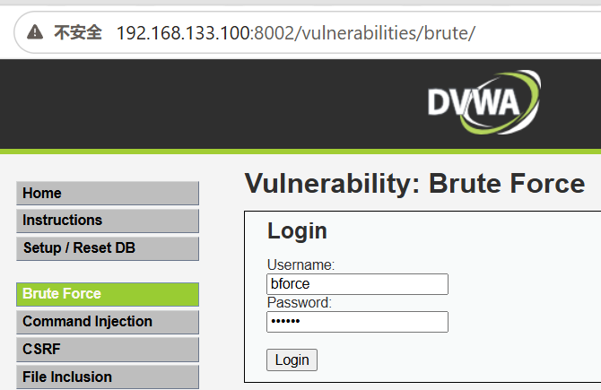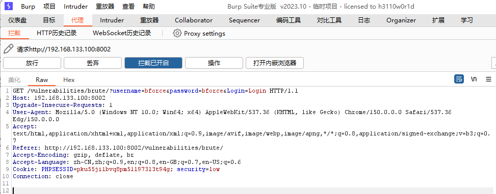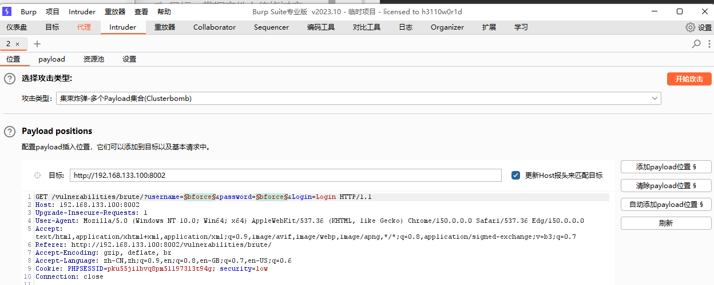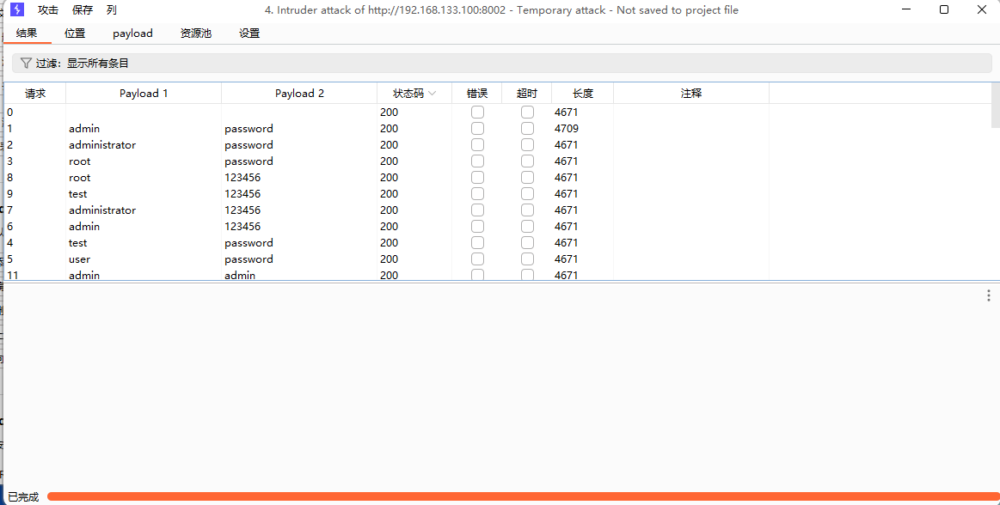

**后端代码：**
```php
<?php
$user = $_GET['username'];
$pass = $_GET['password'];
$query = "SELECT * FROM users WHERE user='$user' AND password='$pass'";
// 无验证码、无失败限制、无SQL注入防护
?>
```

---

### 4.2 Medium级别

**安全设置：** DVWA Security → **Medium**

**新增防御：** 登录失败时Sleep 2秒，增加爆破时间成本。

**绕过方法：** 攻击方式与low级别相同，虽然慢了，但仍然可以爆破，只是耗时更长。

**原理：**"Medium 级别增加了 `sleep(2)` 延迟，每次登录失败等待2秒，增加爆破时间成本。但字典足够大时仍能成功，只是速度慢。防御思路是增加攻击成本，但无法根本阻止爆破。"

### High 级别

**后端代码：**
```php
<?php
if (login_failed) {
    sleep(2); // 延迟2秒
}
?>
```

---

### 4.3 High级别

**安全设置：** DVWA Security → **High**

**新增防御：** 加入CSRF Token，每次请求需要携带随机Token。

**绕过方法：**
1. 先获取登录页面的Token
2. 把Token拼进每次爆破请求中

**原理：**"High 级别加入了 **CSRF Token**，每次请求需要携带随机生成的 Token。攻击者必须先访问页面获取最新 Token，再构造请求。BurpSuite 可以通过 Recursive Grep 自动提取 Token 实现爆破，但由于 Token 机制，实际防御效果比 Medium 好很多。不过如果 Token 生成逻辑有缺陷（如可预测），仍可能被绕过。"

**后端代码：**
```php
<?php
$token = $_GET['user_token'];
if ($token != $_SESSION['token']) {
    die("Token错误");
}
?>
```

---

### 4.4 Impossible级别

**安全设置：** DVWA Security → **Impossible**

**防御机制：**
1. 登录失败3次，账户锁定15分钟
2. 使用PDO参数化查询防SQL注入
3. 密码使用password_hash加密存储

> 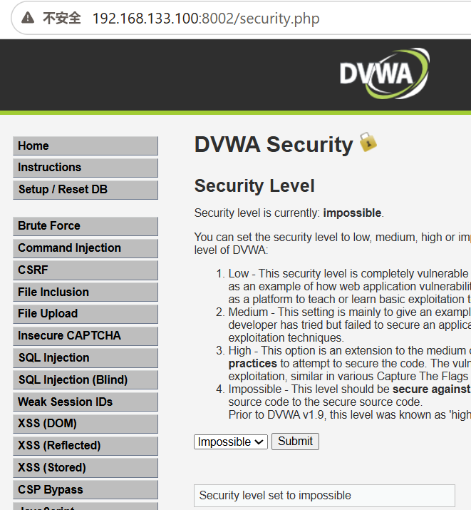
>
> 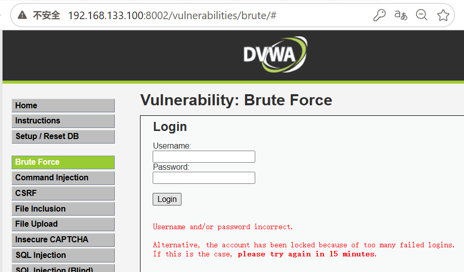

**后端代码：**
```php
<?php
// 检查失败次数
if ($_SESSION['failed_login'] >= 3) {
    if (time() - $_SESSION['last_login_time'] < 900) {
        die("账户已锁定，请15分钟后重试");
    }
}

// 参数化查询
$stmt = $pdo->prepare("SELECT * FROM users WHERE user = ?");
$stmt->execute([$user]);

// 密码哈希校验
if (password_verify($pass, $hash)) {
    // 登录成功，重置失败次数
    $_SESSION['failed_login'] = 0;
} else {
    // 登录失败，计数+1
    $_SESSION['failed_login']++;
    $_SESSION['last_login_time'] = time();
}
?>
```

---

## 五、SRC真实案例分析

### 案例：电商0元购

**漏洞场景：** 下单接口接收价格参数，后端未校验。

**利用步骤：**
```
1. 正常添加商品到购物车
2. BurpSuite拦截提交订单请求
3. 修改 price=0 或 quantity=-1
4. 订单总价变为0或负数
5. 支付0元，成功购买
```

**零元购漏洞测试：**

这次零元购的目标是一个卖会员的一个专营店，然后也是对这个目标站点进行一个测试

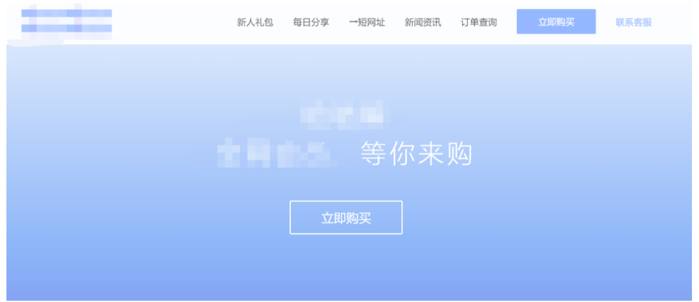

这里经过多个功能点测试，发现这里支付会员的功能点页面可能存在一个零元购（像这样的站点高低得测下零元购）

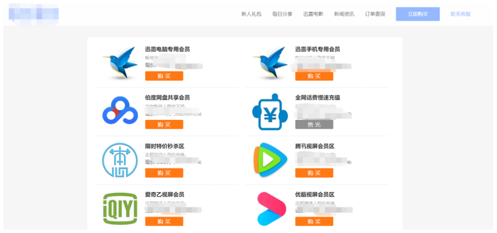

点击购买，选择，然后输入购买数量和联系方式

这里为了给大家展示漏洞零元购的效果和危害，直接选择一年会员，168元，然后后面再零元购成功，让大家感受下这个漏洞的危害

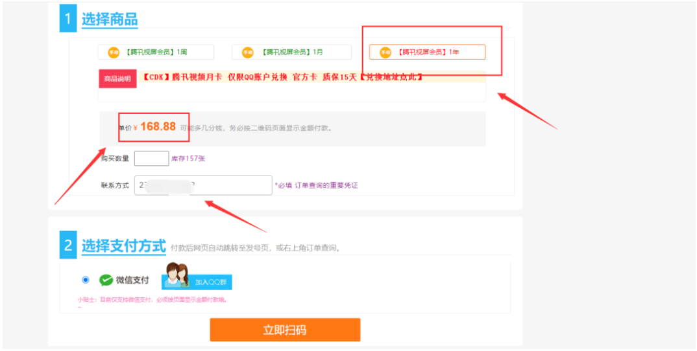

这里把所以的信息都填好以后，然后使用bp进行一个零元购的测试

直接使用bp抓包，然后进行订单的金额修改，把下面的168元都改成0.00元，然后再放包

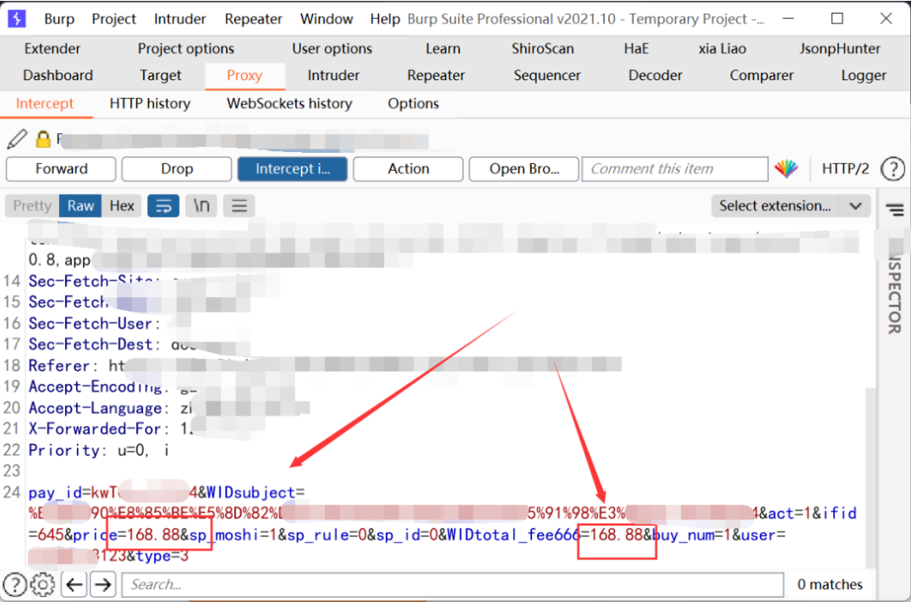

bp放包后，成功只需要0.10元（修改的是0.00应该是进一了）这里直接零元购成功了

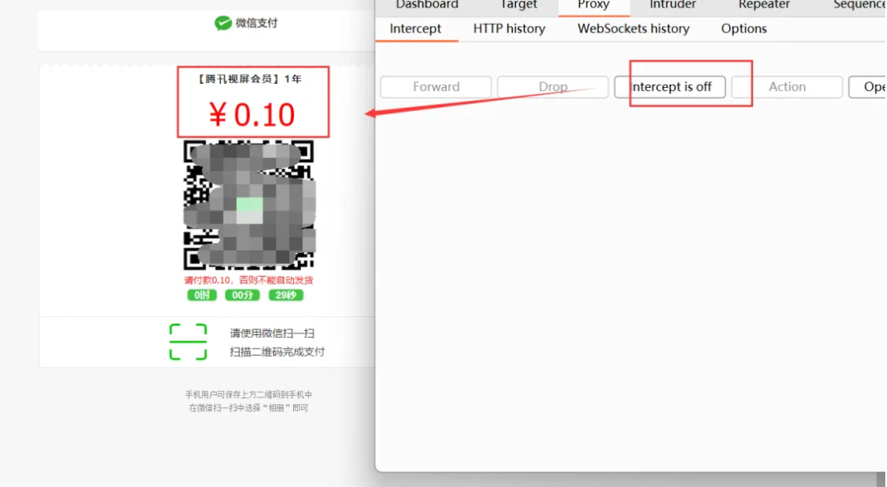

支付成功以后，还可以查询到自己订阅的订单号

这里说明我们已经成功修改支付金额为0.10元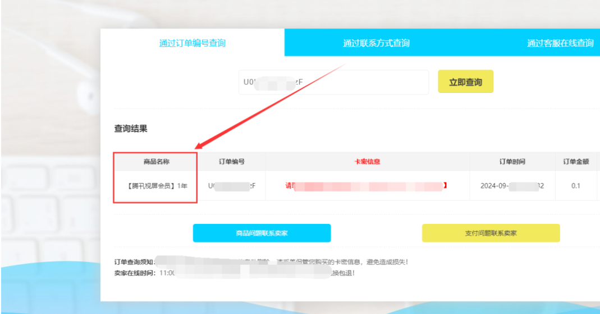


**修复方案：**

- 服务端根据商品ID查询数据库价格
- 前端只传商品ID和数量，不传价格
- 总价由服务端计算

---

## 六、防御方法

### 6.1 越权防御

| 防御措施 | 实现方式 |
|---------|---------|
| **数据归属校验** | 每次查询数据时，校验`当前用户ID == 数据所有者ID` |
| **不可预测ID** | 用UUID代替自增数字ID |
| **接口权限校验** | 每个敏感接口都校验用户角色 |
| **最小权限原则** | 用户只能访问自己的数据 |

```php
<?php
// 错误：直接查询
$order = query("SELECT * FROM orders WHERE id = ?", [$order_id]);

// 正确：加上用户归属校验
$order = query("SELECT * FROM orders WHERE id = ? AND user_id = ?", 
               [$order_id, $_SESSION['user_id']]);
?>
```

---

### 6.2 支付逻辑防御

| 防御措施 | 实现方式 |
|---------|---------|
| **服务端定价** | 前端只传商品ID和数量，价格从数据库查 |
| **数量校验** | 校验 `quantity > 0` 且 `quantity <= 库存` |
| **金额二次计算** | 服务端重新计算总价，不信赖前端传来的total |
| **支付状态校验** | 支付回调必须来自可信渠道（支付宝/微信） |
| **优惠券校验** | 校验优惠券状态、使用次数、互斥规则 |

```php
<?php
// 错误：信任前端价格
$total = $_POST['price'] * $_POST['quantity'];

// 正确：服务端查价格
$product = query("SELECT price FROM products WHERE id = ?", [$_POST['product_id']]);
$total = $product['price'] * $_POST['quantity'];
if ($total < 0 || $_POST['quantity'] <= 0) {
    die("非法参数");
}
?>
```

---

### 6.3 验证码防御

| 防御措施 | 实现方式 |
|---------|---------|
| **后端校验** | 验证码验证逻辑必须放在服务端 |
| **一次有效** | 验证后立即从Session中删除 |
| **错误限制** | 连续错误5次，锁定15分钟 |
| **随机生成** | 使用 `random_bytes()` 或 `mt_rand()` |
| **图形验证码** | 复杂图形 + 干扰线 + 扭曲变形 |

```php
<?php
// 生成验证码
$_SESSION['captcha'] = bin2hex(random_bytes(3)); // 6位随机

// 校验验证码
if ($_POST['captcha'] !== $_SESSION['captcha']) {
    die("验证码错误");
}
unset($_SESSION['captcha']); // 立即删除，一次有效
?>
```

---

### 6.4 密码重置防御

| 防御措施 | 实现方式 |
|---------|---------|
| **验证码复杂度** | 6位以上数字+字母，或图形验证码 |
| **错误次数限制** | 连续错误5次，锁定30分钟 |
| **Token机制** | 重置链接带一次性Token，有效期15分钟 |
| **多因素验证** | 短信 + 邮箱 + 安全问题 |
| **步骤状态校验** | 每步之间用Session记录状态，不能跳过 |

---

### 6.5 防御总结表

| 漏洞类型 | 核心防御 | 辅助防御 |
|---------|---------|---------|
| 越权 | 数据归属校验 + 角色校验 | UUID + 日志审计 |
| 支付篡改 | 服务端定价 + 数量校验 | 金额签名 + 风控系统 |
| 验证码绕过 | 后端校验 + 一次有效 | 图形验证码 + 频率限制 |
| 密码重置 | Token + 错误限制 | 多因素验证 + 步骤校验 |
| 暴力破解 | 账户锁定 + 验证码 | IP限制 + 行为分析 |

---

## 七、面试高频问题

### Q1：什么是逻辑漏洞？和技术漏洞有什么区别？

> 逻辑漏洞是业务流程设计上的缺陷，攻击者利用正常功能达到恶意目的。与技术漏洞（SQL注入/XSS）的区别在于：技术漏洞是代码写错了（如拼接SQL），逻辑漏洞是流程设计错了（如没校验权限）。技术漏洞可用工具自动化检测，逻辑漏洞主要靠手工测试。

### Q2：什么是水平越权和垂直越权？

> 水平越权是同级用户间的数据越界，如把订单ID从1001改成1002看到别人的订单。垂直越权是低权限用户访问高权限功能，如普通用户访问管理后台。根本原因是后端没有校验当前用户是否有权访问该数据或功能。

### Q3：支付逻辑漏洞有哪些类型？怎么防御？

> 主要有价格篡改、数量篡改、支付状态伪造、优惠券逻辑漏洞。防御关键是：所有金额由服务端根据商品ID从数据库查询并计算，前端只传商品ID和数量；校验数量范围；支付回调必须来自可信渠道。

### Q4：验证码绕过有哪些常见手法？

> 常见手法有：前端验证绕过（只在前端JS校验）、验证码不刷新（一次验证后永久有效）、验证码可预测（有规律）、删除验证码参数（后端只校验存在不校验值）。防御必须在后端校验、一次有效、随机生成、限制错误次数。

### Q5：密码重置漏洞有哪些？

> 主要有验证码爆破（4位数字无限制）、跳过验证步骤（直接访问最后一步URL）、修改响应包（把false改成true）。防御需要：复杂验证码、错误次数限制、Token机制、多因素验证、步骤间状态校验。

### Q6：DVWA Brute Force四个级别分别怎么防御？

> Low无任何防御；Medium加了2秒延迟；High加了CSRF Token；Impossible加了账户锁定（3次失败锁定15分钟）、参数化查询防SQL注入、密码哈希存储。

### Q7：SRC中逻辑漏洞占比高吗？

> 非常高。在补天、漏洞盒子等平台上，逻辑漏洞（越权、支付、验证码）的提交量常年排前三。因为逻辑漏洞不需要复杂技术，发现门槛低，但危害大（0元购、信息泄露）。

### Q8：你在SRC上提交过逻辑漏洞吗？

> （如果有）我曾在XX平台发现某电商的价格篡改漏洞，通过BurpSuite修改价格参数实现0元购，已提交并修复。  
> （如果没有）我正在学习SRC案例，计划在掌握基础后开始实战提交。

---

## 附录：学习资源

| 资源 | 链接 | 用途 |
|------|------|------|
| 补天平台 | https://www.butian.net | SRC案例学习 |
| 漏洞盒子 | https://www.vulbox.com | SRC案例学习 |
| DVWA | 本地搭建 | 逻辑缺陷练习 |
| OWASP Top 10 | https://owasp.org/Top10 | 官方定义 |
| IDOR漏洞详解 | 搜索"IDOR vulnerability" | 越权专项 |

---

> 💡 **提示：** 逻辑漏洞的核心是**细心观察业务流程**。每次遇到表单、URL参数、响应数据时，问自己三个问题：
> 1. 这个参数我能改吗？改了会怎样？
> 2. 这个接口没登录能访问吗？
> 3. 这个步骤能跳过吗？

